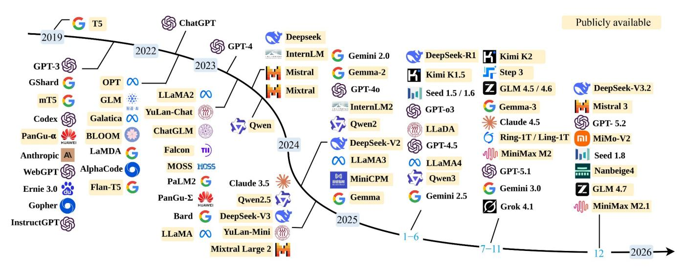
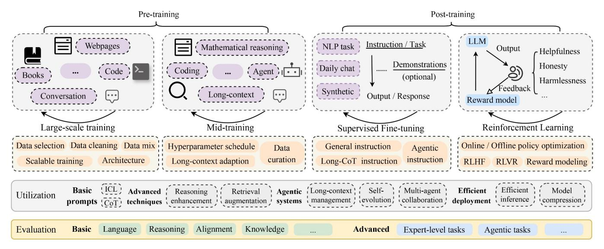
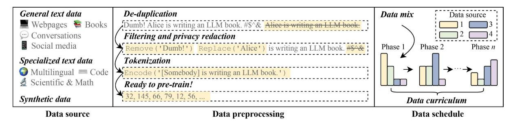
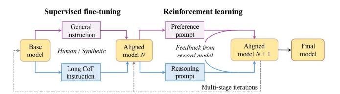
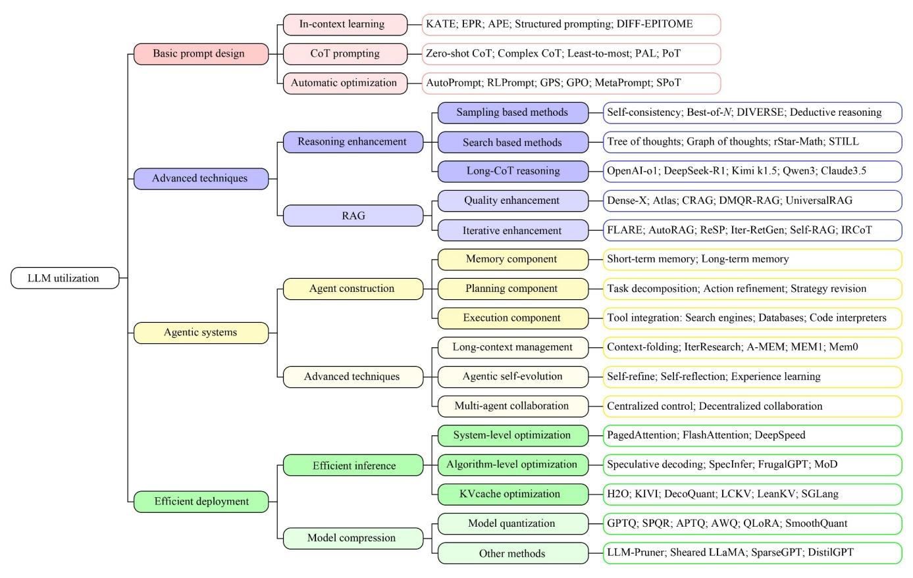
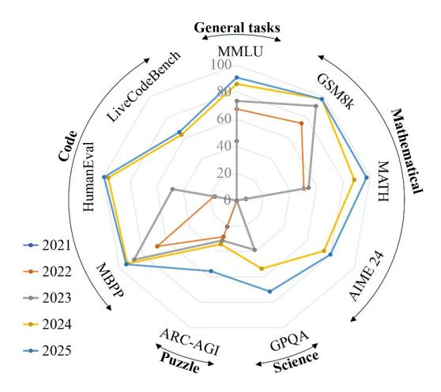

# A Survey of Large Language Models

Wayne Xin Zhao¹, Kun Zhou²\*, Junyi Li¹\*, Tianyi Tang¹, Zican Dong¹, Yupeng Hou¹, Beichen Zhang¹, Yingqian Min¹, Junjie Zhang¹, Peiyu Liu¹, Xiaolei Wang¹, Yifan Du¹, Chen Yang¹, Yushuo Chen¹, Zhipeng Chen¹, Jinhao Jiang¹, Ruiyang Ren¹, Yifan Li¹, Xinyu Tang¹, Zikang Liu¹, Yiwen Hu¹, Jian-Yun Nie³, Ji-Rong Wen¹ ⊠

- 1. Gaoling School of Artificial Intelligence, Renmin University of China, Beijing 100872, China
- 2. School of Information, Renmin University of China, Beijing 100872, China
- 3. Department of Computer Science, Université de Montréal, Montréal H3T 1J4, Canada

Received February 14, 2026; accepted March 17, 2026

E-mail: jrwen@ruc.edu.cn. \* These authors contributed equally to this work.

© The Author(s) 2026. This article is published with open access at link.springer.com and journal.hep.com.cn

#### Abstract

The rapid evolution of large language models (LLMs) has driven a transformative shift in artificial intelligence (AI), reshaping both research paradigms and practical applications. Distinguished from their predecessors by unprecedented scale and advanced capabilities, LLMs necessitate new frameworks for understanding their development, behavior, and societal impact. This survey systematically reviews recent advancements in LLM techniques across four key dimensions: (1) *pre-training* methodologies, which establish core model capabilities through large-scale self-supervised training, architectural innovations, and data curation strategies; (2) *post-training* techniques, including supervised fine-tuning and reinforcement learning, which adapt foundational models to downstream tasks and enhance their alignment and safety; (3) *utilization* strategies, such as in-context learning, prompt engineering, and agentic reasoning, that optimize real-world deployment and enable effective interaction with external environments; and (4) *evaluation* methods, encompassing benchmarks for key ability dimensions such as core language capabilities, reasoning, and safety, which support comprehensive and reliable assessment of model performance. Additionally, we identify critical research issues, including those concerning theoretical foundations, efficient scaling, alignment, and agentic capability, and highlight the open challenges they present. By synthesizing state-of-the-art insights and emerging trends, this survey aims to provide a systematic and comprehensive framework for understanding the trajectory, current limitations, and future directions of LLM progress.

### Keywords

Large language models; Pre-training; Post-training; Utilization; Evaluation

### ■ 1 Introduction

Language is a foundational human ability, essential to communication and expression. It emerges in early childhood and continues to evolve throughout life [1]. For machines, however, this capacity is not innate; without sophisticated artificial intelligence (AI) algorithms, they cannot naturally process or generate human language. Thus, enabling machines to read, write, and communicate in a human-like manner has remained a central and enduring challenge for AI research [2].

At the technical core of this endeavor lies *natural language modeling*, which serves as a cornerstone of machine intelligence for language. It works by modeling the generative likelihood of word sequences, predicting the probabilities of upcoming or missing tokens. Research in this field has attracted immense attention, and its historical progress can be organized into four main developmental stages:

- Statistical language models (SLMs) [3,4], commonly referred to as *n*-gram models, emerged in the 1990s. Based on statistical learning methods, they operate under the Markov assumption, predicting each word based on only a limited window of preceding context. Although widely adopted in information retrieval (IR) and natural language processing (NLP), SLMs suffer from the curse of dimensionality, which complicates reliable estimation of word transition probabilities. To address the resulting data sparsity, smoothing techniques (e.g., back-off and Good-Turing estimation) were often employed.
- Neural language models (NLMs) [5,6] leverage neural networks (e.g., multilayer perceptron) to model word sequence probabilities. The seminal work by Bengio et al. [5] introduced *distributed word representations* and established a word prediction framework conditioned on aggregated contextual features. Subsequent advances, such as the unified neural architecture [7], extended NLMs to diverse

**Fig. 1** A timeline of representative LLMs released in recent years. Models with publicly available checkpoints are highlighted in yellow

NLP tasks. Pivotal work like word2vec [[8](#page-26-7),[9](#page-26-8)] later demonstrated that even shallow neural networks could learn highly effective word embeddings. Collectively, these advances shifted the focus of language modeling from sequence prediction alone to robust, distributed text representation learning.

- Pre-trained language models (PLMs)[[10,](#page-26-9)[11](#page-26-10)] are developed through self-supervised learning on carefully designed pre-text tasks, enabling them to acquire the contextual semantic representations of natural language texts. The ELMo model [[10\]](#page-26-9) pioneered this learning paradigm using bidirectional LSTMs, while BERT [[11\]](#page-26-10) significantly advanced the approach by employing the highly parallelizable Transformer architecture [\[12](#page-26-11)]. This evolution established the influential "*pre-train + fine-tune*" paradigm, in which models first learn a broad understanding of language and are subsequently adapted to specific downstream tasks via task-specific fine-tuning.
- Large language models (LLMs)[[13\]](#page-26-12) achieve substantially enhanced capabilities by scaling up model size, training data, and computational resources in accordance with established scaling laws [\[14\]](#page-26-13). Pioneering examples include GPT-3 (175B parameters)[[13\]](#page-26-12) and PaLM (540B parameters)[[15\]](#page-26-14), which delivered significant performance gains over their predecessors, such as BERT [\[11](#page-26-10)] and GPT-1 [\[16](#page-26-15)]. Notably, GPT-3 excels at few-shot tasks through *incontext learning*, a capability absent in GPT-2. This leap in capability led the research community to formalize the term "*large language models*" [\[17](#page-26-16),[18\]](#page-26-17), distinguishing them from conventional pre-trained language models. The transformative potential of LLMs became widely recognized with the launch of ChatGPT, an advanced dialogue-oriented model that sparked global interest in generative AI.

Today, LLMs have transformed both AI research and industry, driving a paradigm shift from task-specific models toward generalpurpose foundation models. Beyond merely improving upon traditional benchmarks, LLMs now act as accelerators for scientific discovery—synthesizing literature, generating code to lower barriers, and aiding hypothesis formation—thus becoming indispensable tools for research work. In industry, LLMs leverage their extensive world knowledge and advanced capabilities, such as planning, reasoning, and tool use, to serve as versatile intelligent assistants. This technological leap has catalyzed a rapidly growing application ecosystem. LLMs now form the core of advanced enterprise search platforms, AI-driven data analysis tools, automated customer support systems, and sophisticated content creation suites, demonstrating their deep integration into professional and operational workflows. Given their expanding role, LLM development has accelerated markedly, with numerous models now emerging and being integrated into daily life, as shown in the evolution timeline [\(Fig. 1](#page-1-0)).

Overall, the development and deployment of modern language models [\(Fig. 2](#page-2-0)) involves substantially greater complexity than earlier generations. This complexity is driven by the increasing scale and capabilities of these models, and is manifested in a multi-stage pipeline. The foundational pre-training stage requires the meticulous orchestration of data, architecture, and large-scale optimization, balancing performance goals with practical constraints. An optional mid-training phase then further refine advanced capabilities. Subsequently, rigorous post-training has become indispensable, enhancing instruction following, complex reasoning, and task performance while aligning models with human values and addressing critical safety concerns. To leverage these models effectively in practice, they are typically used with prompt engineering techniques and are often deployed within agentic frameworks designed to enhance both usability and performance. Finally, establishing reliable and challenging evaluation benchmarks is essential for steering the future development of LLMs.

The remarkable advancement of LLMs has brought both transformative capabilities and significant new challenges. As these systems demonstrate increasingly sophisticated capacities, the research community requires authoritative frameworks to navigate this rapidly evolving and complex technical pipeline. This survey addresses this necessity by providing a structured overview and analysis of four critical, interconnected stages of the LLM lifecycle: *pre-training* (developing capable base models), *post-training* (optimizing models for alignment and task-oriented adaptation), *utilization* (effective strategies for deployment and downstream use),

**Fig. 2** An overview of pre-training, post-training, utilization and evaluation for LLMs

and *evaluation* (robust assessment of capabilities and risks). Our contribution is twofold: we offer a systematic introduction to the fundamental techniques driving LLM development, while synthesizing current research to highlight advanced topics and technical challenges. Through a rigorous review of the literature, we consolidate key findings, methodologies, and technical approaches across the field. To support ongoing research, we also maintain a curated GitHub repository of essential LLM resources and supplementary materials, accessible at the website of github.com/ RUCAIBox/LLMSurvey. This survey is a concise, self-contained review. It is an updated and refined version of our earlier arXiv article[[19\]](#page-26-18) (now expanded into a comprehensive book [\[20](#page-26-19)]). The content and presentation have been substantially revised to better suit the format of a journal review paper and to reflect the current state of the field.

The remainder of this survey is organized as follows: [Section 2](#page-2-1) introduces the background for LLMs. [Section 3](#page-3-0), [4](#page-11-0), [5](#page-17-0), and [6](#page-22-0) review and summarize the recent progress from the four aspects of pretraining, post-training, utilization, and evaluation, respectively. Finally, [Section 7](#page-24-0) discusses the remaining challenges and open issues, and [Section 8](#page-25-0) concludes this survey.

## **■ 2 Key concepts and background**

In contemporary literature [\[13](#page-26-12),[15\]](#page-26-14), large language models (LLMs) primarily refer to Transformer-based neural networks with parameter counts in the billions or more. Typically, these models are pre-trained on vast amounts of unlabeled natural language text and then posttrained to adapt to real-world applications and ensure safe deployment. While there is no universally accepted criterion for parameter threshold for LLMs, this survey focuses on models with at least several billion parameters, thereby distinguishing modern LLMs from earlier, smaller-scale language models such as BERT and BART. This section introduces key concepts and background necessary for understanding and building LLMs.

**Transformer architecture.** Transformer [\[12](#page-26-11)], a neural network architecture built entirely on attention mechanisms, has become the cornerstone of LLMs. In contrast to traditional recurrent and convolutional neural networks, Transformers explicitly model pairwise relationships between all elements in a sequence, leading to significantly enhanced expressive power. This design yields two critical benefits: (1) *inherent parallelizability* that leverages modern parallel computing infrastructure, and (2) *exceptional scalability* to billions of parameters—both indispensable for cutting-edge language model development. While the original Transformer employs an encoder-decoder structure, used by early models like T5[[21\]](#page-26-20) and BART [[22\]](#page-26-21), most contemporary LLMs (e.g., the GPT family) adopt a causal decoder-only architecture [\[13](#page-26-12)[,16](#page-26-15)]. An intermediate alternative, known as the *prefix decoder* (or *non-causal decoder*) [\[23](#page-26-22),[24\]](#page-26-23), modifies the causal decoder to enable bidirectional attention on prefix tokens while maintaining unidirectional masking for autoregressive generation. Despite extensive earlier exploration of alternative designs, the causal decoder architecture has now become the de facto standard for LLM development.

**Training paradigm.** The predominant training approach for modern language models is autoregressive language modeling, which sequentially predicts each token in a text via *next-token prediction* [[16\]](#page-26-15). Despite its conceptual simplicity, this formulation offers a powerful and generalizable method for learning from large-scale unlabeled text. Resembling multitask learning, accurately predicting each token encourages the development of diverse abilities and knowledge. When trained on vast and varied datasets, this approach enables LLMs to acquire versatile, transferable skills applicable to a broad spectrum of real-world scenarios [\[21](#page-26-20)], underscoring the critical role of data engineering in the pre-training process. In this framework, task-solving is framed as a *text completion* problem, where a response is generated based on the given input. When scaled sufficiently, this approach allows language models to address a wide range of downstream tasks by learning to accurately reconstruct and produce natural language. Following pre-training, an optional *midtraining* phase can be applied to further strengthen the model's foundational capabilities, improving subsequent adaptation. To bridge the gap between foundational training and practical

Fig. 3 An illustration of a typical data preparation pipeline for pre-training LLMs

deployment, a standard *post-training* stage is then conducted. This stage serves two main purposes: eliciting the model's underlying capabilities and aligning its outputs with human expectations and values [25]. The combination of pre-training (optionally enhanced by mid-training) and post-training has established the prevailing methodology for developing capable and aligned LLMs [26,27].

Scaling law. Scaling has been a pivotal factor in the success of modern language models. Early research formalized these scaling effects through train-time scaling laws, modeling performance as a function of three key variables: model size (N), dataset size (D), and training compute (C), for neural language models [14,18]. Given a fixed compute budget, these studies empirically fit a power-law relationship:  $L(X) = C_X X^{-\alpha_X}$ , where  $L(\cdot)$  denotes the cross entropy loss in nats and  $X \in \{N, C, D\}$ . Initial scaling laws [14] favored allocating more resources toward increasing model size over data size. Subsequent work [18] refined this view by advocating for a more balanced scaling of model and dataset sizes. In practice, expanding dataset size has often proven highly effective—even relatively small models show substantial improvements when trained on large, high-quality corpora [26]. Nevertheless, continued scaling faces significant challenges due to escalating computational costs and the scarcity of high-quality data. This has shifted research focus toward test-time scaling approaches (e.g., OpenAI's o1 [28] and DeepSeek-R1 [29]), where enhanced model performance is achieved through strategic allocation of additional inference-time computation essentially trading efficiency for enhanced capability.

Representative abilities. Unlike previous-generation models (e.g., BERT, BART), modern language models exhibit a broader and more robust set of capabilities. These include general competencies such as in-context learning (ICL) [13], chain-of-thought (CoT) [17] reasoning, and instruction following [25], as well as task-specialized skills like mathematical reasoning [30]. Early literature often described such capabilities as emergent abilities, defined as "capabilities absent in smaller models but present in larger ones" [31]. However, this view has increasingly been questioned. Several recent studies suggest that the performance jumps originally highlighted as "emergent" largely result from measurement choices and limited scale, rather than from a fundamental qualitative shift [32,33]. Moreover, well-optimized smaller models (e.g., Qwen2.5-1.5B) can achieve proficiency comparable to early LLMs, indicating that sheer scale is not strictly necessary for these competencies. Therefore, we propose using the terms representative abilities or typical abilities to refer to these core proficiencies of modern LLMs.

As the field advances, these capabilities continue to expand in both scope and sophistication, progressively redefining the perceived limits of language models.

### ■ 3 Pre-training

In this section, we examine the fundamental components that enable effective pre-training of LLMs. We begin with data preparation (Section 3.1), discussing the collection, curation, and processing of training corpora, as data quality and scale directly govern model capability. Next, we review model architectures (Section 3.2), focusing on design choices that balance expressivity, efficiency, and scalability. We further explore training techniques (Section 3.3), including optimization strategies, parallelism, and stabilization methods that ensure stable and efficient learning at scale. Finally, we discuss mid-training techniques (Section 3.4), including data and optimization strategies. Together, these elements form the core technical pipeline for building capable base models.

### ■ 3.1 Data preparation

The performance of LLMs is fundamentally dependent on the quality of their pre-training data. Given this critical dependency, the following section details the data preparation process for LLM pre-training, which is illustrated in Fig. 3.

### ■ 3.1.1 Data source

Developing a capable LLM requires a diverse mixture of text datasets as the pre-training corpus. These datasets generally fall into the following three categories.

General text data, such as webpages and books, is utilized by most LLMs [13,15] due to its large-scale, diverse, and accessible nature. In particular, webpages have become the primary source of pre-training data, enabling LLMs to acquire rich linguistic and factual knowledge. Existing studies primarily extract and clean webpages from CommonCrawl, such as FineWeb [34]. Additionally, high-quality books (e.g., the Books3 and Bookcorpus2 datasets from the Pile [35]) provide formal long-form texts, which are particularly beneficial for modeling long-term dependencies and generating coherent outputs. Other sources include conversational or social media data.

**Specialized text data** enhances LLM capabilities by incorporating domain-specific or task-related sources, particularly those involving scientific reasoning and code [26,29]. Scientific text drawn from arXiv papers, textbooks, and mathematical resources significantly improve LLMs' performance on scientific reasoning tasks [36]. Code

data (e.g., from Stack Exchange and GitHub) substantially enhances program synthesis capabilities[[37,](#page-27-9)[38\]](#page-27-10). Recent trends show an increasing incorporation of reasoning-focused data in pre-training [\[26,](#page-26-25)[39,](#page-27-11)[40\]](#page-27-12) (e.g., LLaMA-3.1).

**Synthetic text data** offers a practical way to enhance pre-training, a method that has gained widespread adoption in model development. Typically, it is used to improve reasoning, mathematical, and agentic capabilities (e.g., coding), as well as to expand the knowledge coverage and linguistic diversity of existing corpora. This kind of data can be generated in either document form or as question-answer pairs by prompting capable language models, which may be general-purpose or specifically fine-tuned for the task [\[41\]](#page-27-13). For enhancing the reasoning ability, large-scale CoT trajectories will be collected from well-trained LLMs, then integrated into the training corpus after quality filtering. Furthermore, synthetic data can be applied to refine existing text resources, such as by adding natural language descriptions to code snippets or mathematical problems [\[26\]](#page-26-25), or by enriching CoT explanations and reflective annotations through the reuse of existing reasoning models [\[41](#page-27-13)].

## **■ 3.1.2 Data preprocessing**

The preprocessing pipeline typically includes the following steps.

**De-duplication** eliminates duplicate content from the pre-training data and can be applied at various granularities, including URL-level, document-level, and sentence-level [[39\]](#page-27-11). This process often leverages efficient similarity measurement algorithms such as MinHash.

**Filtering and privacy reduction** aim to remove low-quality, toxic, and replace personally identifiable information (PII). Approaches include both trained classifiers[[13,](#page-26-12)[15\]](#page-26-14) and human-designed heuristics (e.g., statistical indicators and PII-detective regular expressions)[[39\]](#page-27-11). Due to the vast amount of data, the process typically involves a combination of powerful classifiers (e.g., finetuned LLMs) and lightweight classifiers (e.g., FastText).

**Tokenization** converts raw text into model-readable tokens. The most widely adopted method is byte-pair encoding (BPE) [\[42](#page-27-14)], which iteratively merges frequent byte sequences into single tokens. Specialized tokenization strategies can further enhance performance in targeted domains—for example, digit-level tokenization has been shown to improve mathematical reasoning[[43\]](#page-27-15). In practice, the vocabulary size of LLMs typically ranges from 100K to 256K [\[44](#page-27-16)]. For instance, GPT-4o employs a vocabulary of 200K tokens, and Gemma 2 uses 256K tokens [[45\]](#page-27-17).

## **■ 3.1.3 Data schedule**

After preprocessing, it is essential to determine two key elements: the overall proportion of each data source, referred to as the *data mix*, and the order and relative weighting with which they are introduced across multiple training phases, known as the *data curriculum*. In the following, we detail the specific techniques used to configure these components.

**Data mix.** During data preparation, we collect training data from multiple datasets across various categories. Consequently, selecting an appropriate distribution for combining these sources becomes crucial. Common strategies emphasize enhancing data diversity while specializing in targeted capabilities[[26,](#page-26-25)[39](#page-27-11)[,41](#page-27-13)]. Recent LLMs particularly prioritize reasoning-focused capabilities, allocating a significant proportion of their training data to such content. LLaMA-3.1 allocates 25% of its tokens to mathematical and reasoning tasks and 17% to code-related content. As current approaches remain largely heuristic, there is growing interest in quantitatively optimizing data mixtures [[46,](#page-27-18)[47\]](#page-27-19). The central idea is to optimize the mixture via proxy models, which are typically much smaller in size. Moreover, the performance associated with different data ratios can be extrapolated using scaling laws, fitted either from limited data, smaller models, or observed mixture ratios [\[48](#page-27-20)]. A more recent and efficient approach reframes model merging as a direct proxy for mixture optimization [\[49](#page-27-21)]. This method interprets the merging weights of domain-specialized models as optimal coefficients for the data mixture, enabling lightweight mixture search and substantially reducing the computational cost of mixture optimization.

**Data curriculum.** In addition to establishing a global data mixture (i.e., the distribution across the entire pre-training dataset), it is essential to determine an appropriate schedule for presenting the prepared data during model pre-training. We next introduce two kinds of pre-training curriculum.

- General pre-training curriculum. A common strategy involves dividing the pre-training process into multiple phases (e.g., 27 phases of 40B tokens for YuLan-Mini [\[41](#page-27-13)]) while systematically varying the proportions of different data sources across these phases. Generally, data should be sequenced according to its inherent complexity, with reasoning-focused data predominantly utilized in later phases. These phase-specific data distributions can be refined through empirical evaluations on development datasets or optimized using specialized models. Crucially, the data distribution should change only gradually between training phases to ensure stability. In addition to curricula that rely on manually designed proxy metrics (such as data complexity), recent work has explored approaches driven by training signals. For instance, In-Run Data Shapley approximates the loss difference before and after training via a Taylor expansion, enabling real-time estimation of each data point's contribution with little additional training overhead[[50\]](#page-27-22). Motivated by this idea, OPUS introduces a step-wise, optimizer-aware data curriculum and leverages soft sampling to maintain diversity while mitigating redundancy[[51\]](#page-27-23). To further enhance base model performance, researchers have introduced an annealing strategy that incorporates specially curated data (e.g., instruction data) during the final stages of pre-training while employing a decaying learning rate [[52\]](#page-27-24). Empirical evidence demonstrates that this annealing approach can substantially improve model evaluation performance[[39,](#page-27-11)[41](#page-27-13)[,52](#page-27-24)]. Similar curriculum-based strategies can be effectively applied to continual pre-training scenarios (e.g., adapting a code model for specialized math domains through increased exposure to mathematical data [[30\]](#page-27-2)).
- Long-context pre-training curriculum. The deployment of LLMs requires handling very long input contexts, whether in multi-turn dialogues, lengthy documents, or even book-length inputs. Regarding efficient long-context training, it typically adopts a curriculum learning strategy by progressively increasing context length. For

example, Qwen2.5-1M[[26\]](#page-26-25) follows a four-stage schedule (i.e., 32K → 65K → 131K → 262K) while maintaining a mix of 40% fulllength and 60% short sequences in each batch to prevent catastrophic forgetting. At each stage, specific text data of the expected length should be prepared accordingly. Typically, existing work upsamples natural long texts or concatenates short text data from the same distribution as the pre-training dataset to form long texts [\[53](#page-27-25),[54\]](#page-27-26). To enhance the quality of long data, some metrics (e.g., attention scores, perplexity and information gain) have been proposed to further select texts with long-range dependencies [[55](#page-27-27)[,56](#page-27-28)]. Additionally, achieving long-context modeling at scale requires architectural adaptations, where position encodings (discussed in [Section 3.2.2\)](#page-7-0) should be adjusted to support the corresponding context length.

## **■ 3.1.4 Effect of pre-training data on LLMs**

In this part, we discuss how the pre-training corpus potentially influences the performance of LLMs.

**Data scaling.** While the optimal allocation of resources to balance model and data scaling has been explored [\[18](#page-26-17)], recent empirical evidence from leading language models strongly suggests that access to a substantially large volume of high-quality pre-training data is essential for advancing overall model capability. As documented in their respective technical reports [\[39](#page-27-11),[40,](#page-27-12)[57\]](#page-27-29), prominent open-source models are typically trained on datasets ranging from 15 to 30 trillion tokens, with commercial proprietary models likely utilizing even larger quantities. However, the global supply of suitable pre-training data is inherently limited. Growing concerns suggest that LLM pretraining may be approaching a ceiling as available high-quality data sources near exhaustion [\[58](#page-27-30)]. While synthetic data offers a promising solution, it risks causing model collapse or stagnation due to the progressively limited new information introduced during iterative distillation [\[59](#page-28-0)]. Recent advances presented in the seminal work "*The Era of Experiences*" [\[60](#page-28-1)] propose a novel perspective where training data can be generated by enabling LLM-based agents to interact with real-world environments. Ultimately, securing sufficient quantities of novel, high-quality data remains crucial to meet the escalating demands of state-of-the-art LLMs.

**Data curation.** LLMs are particularly vulnerable to performance degradation from low-quality data containing spam, noise, and duplicates[[61](#page-28-2)[,62](#page-28-3)]. Consequently, implementing a rigorous data curation process (as discussed in [Section 3.1.2\)](#page-4-0) becomes essential to ensure data quality, a practice well-documented in mainstream LLMs' technical reports [\[39](#page-27-11),[40\]](#page-27-12). These preprocessing steps are crucial for eliminating low-quality expressions and enhancing the overall quality and robustness of pre-training data. Beyond surfacelevel issues, attention must also be paid to potential ethical biases regarding gender, race, and opinions present in the source material [\[63,](#page-28-4)[64\]](#page-28-5). Additionally, privacy concerns arise as specific prompts may reveal sensitive information about individuals or organizations, necessitating careful removal during pre-training. Copyright protection has emerged as another critical consideration for commercial LLM development, particularly as data has become a protected asset for content producers (e.g., The New York Times' newspaper content). Establishing transparent, well-controlled

mechanisms that balance copyright protection with reasonable data sharing for LLM advancement remains an ongoing challenge requiring careful attention.

## **■ 3.2 Architecture**

The Transformer architecture serves as the foundation of modern language models. This section reviews recent advances across its core components and alternative designs, with representative advances summarized in [Table 1](#page-6-0).

## **■ 3.2.1 Attention**

The core of the attention mechanism lies in its ability to explicitly model relationships between any two tokens in a sequence, enabling it to capture sequence semantics more effectively. Its expressive power is further enhanced through multi-head projections, which map hidden states into queries, keys, and values across multiple subspaces. However, the original implementation suffers from quadratic complexity with respect to sequence length, and storing the full key-value (KV) cache for all attention heads imposes significant memory overhead. We now turn to discuss important improvements to the original Transformer architecture.

O(1) **Sparse attention.** Attention modules in LLMs exhibit inherent sparsity, with most attention concentrated on a limited set of tokens. To leverage this property, sparse attention mechanisms have been developed, allowing each query to attend to only a selected subset of keys and values instead of the entire sequence. In particular, locationbased sparse attention restricts each token's attention to specific positions, such as initial tokens and those within a recent sliding window, achieving inference and memory overhead [[68](#page-28-6)[,77](#page-28-7)]. To address the limitation of location-based methods in capturing longrange dependencies, another approach partitions sequences into blocks and selects those most relevant to the current token for attention computation, as seen in methods such as MoBA [[69\]](#page-28-8), NSA [[70\]](#page-28-9), DSA [\[78](#page-28-10)], and HySparse [\[79](#page-28-11)]. Sparse attention is now widely integrated into LLMs to enhance computational efficiency, including models like MiniCPM4 [[80\]](#page-28-12), Kimi [\[69](#page-28-8)], and DeepSeek V3.2 [\[78](#page-28-10)].

**Attention grouping and compression.** Another line of research focuses on grouping or compressing attention heads to reduce computational and memory demands. Intra-layer attention grouping methods (e.g., GQA [\[65](#page-28-13)], MQA [[66\]](#page-28-14)) typically partition the attention heads within a layer into several groups, with heads in the same group sharing their key and value projection matrices and the associated KV cache. Additionally, cross-layer attention grouping approaches reuse the KV cache or even the attention scores from earlier layers in subsequent layers, further reducing memory and computational costs [\[81](#page-28-15),[82\]](#page-28-16). Attention decomposition techniques, such as MLA [\[67](#page-28-17)], TPA[[83\]](#page-28-18), and MFA [\[84](#page-28-19)], apply low-rank or tensor decompositions to queries, keys, and values, achieving a balance between efficiency and performance. For example, GQA has been adopted by LLaMA-3.1 and Qwen2, while MLA has been employed in DeepSeek-V3.

**Linear attention.** As the required context length continues to grow, linear attention (LA) [\[71](#page-28-20)] has re-emerged as an attractive attention alternative with sub-quadratic complexity. Throughout both training and inference, linear attention maintains only a fixed-size

**Table 1** Detailed formulations for the representative network configurations of LLMs. Here,  $\bar{\mathbf{k}}_b = \frac{1}{B} \sum_{j=bB}^{(b+1)B-1} \mathbf{k}_j$  for MoBA and  $\bar{\mathbf{k}}_b = \text{MLP}(\mathbf{k}_{bB:(b+1)B-1})$  for NSA, where B is the block size and b is the block index,  $g_t^1, g_t^2, g_t^3 \in (0,1)$  are token-wise scores that control the ratio of each attention in NSA, d denotes the size of hidden states,  $\mathbf{p}_i$  denotes position embedding at position i,  $A_{ij}$  denotes the attention score between a query and a key,  $r_{i-j}$  denotes a learnable scalar based on the offset between the query and the key, and  $\mathbf{R}_{\Theta,t}$  denotes a rotary matrix with rotation degree  $t \cdot \Theta$ . Here, we use bold upper and bold lower fonts for matrices and vectors, respectively

| Configuration                      | Method        | Equation                                                                                                                                                                                                                                             |  |  |  |  |
|------------------------------------|---------------|------------------------------------------------------------------------------------------------------------------------------------------------------------------------------------------------------------------------------------------------------|--|--|--|--|
| Attention grouping and compression | MHA [12]      | $HEAD_i = Attn(\mathbf{X}\mathbf{W}_i^Q, \mathbf{X}\mathbf{W}_i^K, \mathbf{X}\mathbf{W}_i^V)$                                                                                                                                                        |  |  |  |  |
|                                    | GQA [65]      | $\mathrm{HEAD}_i = \mathrm{Attn}(\mathbf{X}\mathbf{W}_i^Q, \mathbf{X}\mathbf{W}_{\lfloor i/g \rfloor}^K, \mathbf{X}\mathbf{W}_{\lfloor i/g \rfloor}^V)$                                                                                              |  |  |  |  |
|                                    | MQA [66]      | $HEAD_i = Attn(\mathbf{X}\mathbf{W}_i^Q, \mathbf{X}\mathbf{W}^K, \mathbf{X}\mathbf{W}^V)$                                                                                                                                                            |  |  |  |  |
|                                    | MLA [67]      | $HEAD_i = Attn(\mathbf{X}\mathbf{W}_i^Q, \mathbf{X}^{KV}\mathbf{W}_i^K, \mathbf{X}^{KV}\mathbf{W}_i^V), \mathbf{X}^{KV} = \mathbf{X}\mathbf{W}^{KV}$                                                                                                 |  |  |  |  |
| Sparse attention                   | SDPA [12]     | $Attn_{SDPA} = \sum_{j \leq i} softmax \left( \frac{\mathbf{q}_i \mathbf{k}_j^T}{\sqrt{d_k}} \right) \mathbf{v}_j$                                                                                                                                   |  |  |  |  |
|                                    | SWA [68]      | $Attn_{SWA} = \sum_{0 \le i-j \le w} softmax \left( \frac{\mathbf{q}_i \mathbf{k}_j^T}{\sqrt{d_k}} \right) \mathbf{v}_j$                                                                                                                             |  |  |  |  |
|                                    | MoBA [69]     | $Attn_{MoBA} = \sum_{b \in TopK((\mathbf{s}_n))} \sum_{j=bB}^{(b+1)B-1} softmax \left(\frac{\mathbf{q}_i \mathbf{k}_j^T}{\sqrt{d_k}}\right) \mathbf{v}_j, \mathbf{s}_n = \mathbf{q}_i \bar{\mathbf{k}}_b^T$                                          |  |  |  |  |
|                                    | NSA [70]      | $Attn_{NSA} = g_t^1 Attn_{MoBA} + g_t^2 Attn_{Comp} + g_t^3 Attn_{SWA}, Attn_{Comp} = \sum_{j \le i} softmax \left( \frac{\mathbf{q}_i \bar{\mathbf{k}}_b^T}{\sqrt{d_k}} \right) \bar{\mathbf{v}}_b$                                                 |  |  |  |  |
| Linear attention                   | LA [71]       | $\mathbf{S}_t = \mathbf{S}_{t-1} - \nabla_{\mathbf{S}_{t-1}} (-\mathbf{v}_t^T (\mathbf{S}_{t-1} \mathbf{k}_t)) = \mathbf{S}_{t-1} - \mathbf{v}_t \mathbf{k}_t^T$                                                                                     |  |  |  |  |
|                                    | Mamba [72]    | $\mathbf{S}_{t} = \mathbf{S}_{t-1} - \nabla_{\mathbf{S}_{t-1}} \left( -\mathbf{v}_{t}^{T} (\mathbf{S}_{t-1} \mathbf{k}_{t}) + \frac{1-\gamma}{2}   \mathbf{S}_{t-1}  _{F}^{2} \right) = \gamma \mathbf{S}_{t-1} - \mathbf{v}_{t} \mathbf{k}_{t}^{T}$ |  |  |  |  |
|                                    | DeltaNet [73] | $\mathbf{S}_{t} = \mathbf{S}_{t-1} - \nabla_{\mathbf{S}_{t-1}} \left( \frac{1}{2}   \mathbf{S}_{t-1} \mathbf{k}_{t} - \mathbf{v}_{t}  ^{2} \right) = \mathbf{S}_{t-1} - (\mathbf{S}_{t-1} \mathbf{k}_{t} - \mathbf{v}_{t}) \mathbf{k}_{t}^{T}$       |  |  |  |  |
| Positional encodings               | Absolute [12] | $\mathbf{x}_i = \mathbf{x}_i + \mathbf{p}_i$                                                                                                                                                                                                         |  |  |  |  |
|                                    | Relative [21] | $A_{ij} = \mathbf{W}_q \mathbf{x}_i \mathbf{x}_j^T \mathbf{W}_k^T + r_{i-j}$                                                                                                                                                                         |  |  |  |  |
|                                    | RoPE [74]     | $A_{ij} = \mathbf{W}_q \mathbf{x}_i \mathbf{R}_{\Theta,i-j} \mathbf{x}_j^T \mathbf{W}_k^T = (\mathbf{W}_q \mathbf{x}_i \mathbf{R}_{\Theta,i}) (\mathbf{W}_k \mathbf{x}_j \mathbf{R}_{\Theta,j})^T$                                                   |  |  |  |  |
|                                    | ALiBi [75]    | $A_{ij} = \mathbf{W}_q \mathbf{x}_i \mathbf{X}_j^T \mathbf{W}_k^T - m(i-j)$                                                                                                                                                                          |  |  |  |  |
|                                    | CoPE [76]     | $A_{ij} = \mathbf{W}_q \mathbf{x}_i (\mathbf{x}_j^T \mathbf{W}_k^T + \mathbf{e}_{i,j})$                                                                                                                                                              |  |  |  |  |

matrix-valued recurrent state, which is updated recurrently to learn the mapping from keys to values. From an online-learning perspective, these models can be broadly categorized into three progressive generations. The first generation, including RetNet [85], Lightning Attention [86,87], and RWKV-4 [88], updates the state using a data-independent forget gate. This is equivalent to adding a Frobenius-norm penalty on the state to the online-learning objective. Building on this, the second-generation models such as Mamba [72] and Mamba-2 [89] employ a data-dependent forget gate, which helps mitigate the forgetting dilemma. Most recently, the third generation [90–93] adopts the delta rule as the state-update equation: old memory is first removed from the state, and then new memory is added [73]. This corresponds to changing the online-learning objective from an inner-product loss to a squared loss, thereby preventing the state from diverging to infinity. Despite successive generations of development, linear attention still faces a fundamental trade-off between memory capacity and expressiveness. As a result, most models, such as MiniMax-M1 [94], Qwen3-Next [95], and Kimi Linear [92], mix linear attention with full attention at a fixed

ratio, typically 3:1. Recently, an alternative line of research has sought to enhance expressiveness through nonlinear RNN-based models [96–98], which remain less widely adopted in practice due to the additional effort required to attain computational efficiency.

Other enhancement techniques. Beyond efficiency-focused variants, another technical direction seeks to address inherent limitations within the attention mechanism itself, aiming to enhance its expressive capability. Existing research has identified issues such as *attention sinks* — a tendency for attention to disproportionately focus on a small set of initial tokens [77]. To mitigate this, approaches like learnable sink tokens, query-key normalization, and element-wise sigmoid gating have been proposed [99,100]. Another important challenge is *attention dilution*, where attention weights become diffused across irrelevant tokens as context length grows. To counteract this, recent work introduces techniques such as length-dependent scaling and modified attention-scoring functions [101,102], focusing on critical information and promoting the emergence of sparse attention patterns.

## **■ 3.2.2 Positional encoding (PE)**

To capture positional information, vanilla Transformer uses absolute PEs, which are added to the input token embeddings. However, absolute PEs struggle to represent relative positions and generalize to longer sequences. This limitation has prompted research into improved methods for PEs, as discussed below.

**Rotary PE (RoPE).** RoPE [\[74](#page-28-27)] is a fundamental component widely adopted in modern language models, employing specific rotary matrices based on the absolute position of each key or query. It allows scores between keys and queries to be computed using relative position information. Furthermore, the context windows of RoPE-based models can be extended by preventing out-ofdistribution rotary angles. Some methods, such as PI [\[103\]](#page-29-12) and SelfExtend [[104](#page-29-13)], reorganize positional indices to ensure they remain within context lengths. Meanwhile, another line of research, including ABF[[105](#page-29-14)], YaRN [\[101\]](#page-29-10), and LongRoPE [\[106\]](#page-29-15), modifies the basis of rotary matrices to achieve different interpolation ratios across dimensions, enabling longer context windows. For example, Qwen2.5-7B adopts RoPE and further employs ABF to support a context window of 128K tokens.

**Length extrapolation PE.** Relative PEs [[21\]](#page-26-20) typically incorporate position-based biases into attention values, enabling models to process text beyond their original context length, a capability known as *length extrapolation*. To further enhance this ability, various PE methods introduce a linear penalty factor proportional to the relative distance to adjust the attention scores, encouraging greater reliance on local information (e.g., ALiBi[[75\]](#page-28-28) and KERPLE[[107](#page-29-16)]). For example, ALiBi has been adopted by BLOOM[[108](#page-29-17)] for achieving strong extrapolation capabilities. However, research has demonstrated that these methods approximate sliding-window attention, which still struggles to utilize long-range information from previous contexts[[109](#page-29-18)]. Thus, designing better PE—both theoretically and empirically—to achieve effective length extrapolation and efficient utilization of global information under an infinite context window remains a key challenge for future research.

**Contextualized PE.** To achieve more powerful representational capacities, recent research has proposed contextualized PE that incorporate semantic information. One class of methods builds upon relative PE by integrating positional and semantic information to compute bias values and vectors[[76\]](#page-28-29). Alternatively, another approach treats PEs as hidden states, which are dynamically updated through interactions with semantic representations [\[110\]](#page-29-19).

## **■ 3.2.3 Mixture-of-Experts (MoE)**

Benefiting from efficient parameter scaling, the MoE architecture has been widely adopted as a replacement for standard feed-forward network (FFN) modules in LLMs. Typically, each MoE layer consists of a gating function, commonly referred to as a *router*, and a set of expert sub-networks. During each forward pass, the router dynamically selects a sparse subset of experts for activation and computation. In the following, we discuss how this architecture can be adapted and optimized for LLM development.

**Gating function.** Given an input token representation, the gating function maps it to a gating value for each expert and selects the

*k k p* experts with the highest values for activation. Notably, early large MoE models, like Mixtral[[111](#page-29-20)], typically chose top- experts and employed the softmax function to compute the final gating values. To reduce communication when distributing experts across different devices using expert parallelism, device-limited routing has been introduced[[67\]](#page-28-17), which first selects a small number of devices and then applies top- selection only to the experts on those devices. Additionally, some research employs the top- sampling, also called *nucleus sampling*, to dynamically allocate the number of activated experts per token[[112](#page-29-21)]. Beyond the selection strategy, new activation functions of the router (e.g., sigmoid) have been proposed to avoid expert competition and achieve improved performance [[113](#page-29-22)].

**Expert.** MoE models typically activate a relatively small number of routed experts (e.g., 8 experts in Mixtral [\[111\]](#page-29-20)) per layer, with each expert being an FFN. To reduce redundancy among experts, some recent MoE models (e.g., DeepSeek-V3 [[40\]](#page-27-12)) introduce shared experts and replace large experts with multiple smaller fine-grained experts. Additionally, since shallow layers are more general than deep layers, allocating more experts to the deep layers can effectively enhance the model's performance [[114](#page-29-23)]. In addition to using FFNs as experts, some research explores constant vectors or memory layers, which help reduce computation and improve performance [\[115\]](#page-29-24).

**Load balancing.** During MoE training, it is important to balance the training across experts to ensure they are sufficiently trained. For this purpose, an auxiliary loss is commonly introduced to achieve load balancing among experts, typically minimizing the product of activation frequency and average gating scores across all experts [[111](#page-29-20)]. Such an auxiliary loss can be applied at different granularities (e.g., at mini-batch, device, and sequence levels [\[40](#page-27-12)[,67](#page-28-17)]), thereby improving communication efficiency. However, excessive auxiliary losses at the mini-batch level may harm the model's performance. To mitigate this negative impact, some work expands the auxiliary loss from the mini-batch level to the global-batch level [\[116\]](#page-29-25). Additionally, an auxiliary-loss-free load balancing method has been proposed, which dynamically adjusts a bias term and combines it with the gating value to determine routing [\[40](#page-27-12)]. Apart from these routing strategies, recent studies also suggest that certain optimizers, such as Muon [[117](#page-29-26)], may implicitly assist in load balancing [[118](#page-29-27)].

## **■ 3.2.4 Alternative architecture design**

Beyond standard architectural enhancements, the recent literature has introduced a number of emerging designs aimed at improving Transformer performance.

● Residual connection. Typically, existing LLMs use residual connections to create direct pathways for gradients and representations during training, thereby improving optimization [[119](#page-29-28)[,120\]](#page-30-0). However, recent work finds that the design of the vanilla residual connection may cause unstable training in deep networks [[99,](#page-29-8)[121](#page-30-1)]. Thus, they add a scaling factor to the residual stream or adjust the placement of normalization within the residual [[12,](#page-26-11)[122](#page-30-2),[123](#page-30-3)]. In addition, a recent line of work (e.g., Hyper-Connections [[124](#page-30-4)] and mHC [[125](#page-30-5)]) has identified the phenomenon of representation collapse in existing residual designs and expanded the width of the residual stream. These approaches maintain multiple independent streams, dynamically combine them as input, and update them based on layer outputs, which significantly enhances model performance.

- *n* ● Memory augmentation. To scale model capacity under limited computational budgets, memory-augmented architectures offer an alternative to standard MoE. These methods maintain large parameterized KV pairs and activate subsets dynamically according to the current hidden state[[126](#page-30-6)–[128](#page-30-7)]. Other approaches integrate embedding modules in each layer and trigger them based on the current token and local -grams[[129](#page-30-8)[,130\]](#page-30-9). Such embeddings can reside on CPU memory and be transferred to the GPU only upon activation, keeping device memory usage low.
- Looped Transformer. As an important extension, recurrent mechanisms have been incorporated into Transformer architectures [\[131](#page-30-10)[–133\]](#page-30-11) by reusing weights across layers. This approach has been shown to improve the performance of smaller models on certain reasoning tasks such as ARC-AGI. However, existing looped Transformer methods generally remain less competitive on standard benchmarks. Extending looped designs to larger-scale models represents a promising direction for further advancing the reasoning capabilities of LLMs.
- Diffusion language models. In addition to the autoregressive (AR) paradigm, the training objective of masked language models has been successfully adapted to natural language modeling, giving rise to diffusion language models (DLMs)[[134](#page-30-12)]. DLMs inherently support high computational parallelism in predicting multiple tokens at one time, but they are often compute-bound during decoding, requiring more FLOPs per token and thus limiting their practical efficiency. To address this issue, block based diffusion[[135](#page-30-13)] has gained attention in the literature, which combines the strengths of both AR and diffusion approaches with in-block parallel and crossblock AR decoding.

## **■ 3.3 Training techniques**

For pre-training, the collected text data is first tokenized and packed into sequences of a predefined context length. Model parameters are then initialized and optimized over the training data using language modeling loss. Throughout training, maintaining *training stability* while improving *training efficiency* are crucial issues that distinguish LLM pre-training from conventional model training. This subsection first introduces general training configurations, then discusses efficient training strategies designed to address these challenges.

## **■ 3.3.1 Training configuration**

Compared with small models, pre-training LLMs are more challenging, as abnormal optimization issues may frequently occur during the process. To address this, we must carefully configure the optimization settings and adopt stabilization techniques for training.

**Optimization configurations.** Based on extensive studies, empirical guidance has accumulated for setting hyperparameter configurations, including batch size, learning rate, and optimizer choice. For batch training, existing studies [\[140\]](#page-30-14) typically implement a dynamic schedule that gradually increases the batch size, eventually

6×10−5 µ reaching a scale of millions of tokens. For learning rate, LLMs commonly adopt a combination of warm-up and decay strategies. In earlier work, researchers often selected the batch size and learning rate based on empirical observations (e.g., a batch size of 3.2M and a learning rate of [[13\]](#page-26-12)). More recently, researchers have explored scaling laws for batch size and learning rate, deriving formal relationship functions to determine these parameters based on model size and dataset size [[141](#page-30-15)]: a recent study has found that the optimal learning rate follows a power law with respect to model and dataset size, while the optimal batch size primarily depends on dataset size. Another commonly used optimization strategy is the P parameterization (Maximal Parameterization Update), which allows hyperparameters (e.g., learning rate) tuned on small-sized models to be directly transferred to larger models [[142](#page-30-16),[143](#page-30-17)].

β1 = 0.9 β2 = 0.95 ϵ = 10−8 µ **Optimizers.** Regarding the optimizer, Adam and AdamW are commonly used in LLM training, typically with the following hyperparameters[[27\]](#page-26-26): , , and . Additionally, efforts have been made to improve the efficiency and reduce the memory consumption of Adam, leading to improved optimizers such as Adafactor [\[144\]](#page-30-18) and Adam-mini [[145](#page-30-19)]. Recently, a new class of spectral-norm based optimizers has been increasingly adopted in large-scale training (e.g., Shampoo[[146](#page-30-20)], SOAP [\[147\]](#page-30-21), and Muon [[117](#page-29-26),[148](#page-30-22)]). Shampoo and Muon share similar designs in their update rules, and Muon introduces Newton–Schulz iterations to avoid the expensive SVD computation. Prior work typically treats optimization hyperparameters and optimizer configurations as independent design choices. A promising co-design direction is to adjust model parameters during optimization updates to satisfy the P condition [[142](#page-30-16)]. Building on this idea, the SSO optimizer retracts each Muon update onto the spectral sphere of the parameter weights [[118](#page-29-27)]. This retraction effectively imposes a soft manifold constraint, thereby ensuring stable training dynamics.

*z* **Stabilization techniques.** During training, LLMs often encounter abnormal training issues such as loss spikes or collapse. It is key to adopt suitable techniques for stabilizing the model training. First, model initialization plays an important role in training stability. It is recommended to initialize each module's parameters using distinct scaling factors, taking into account accumulation and model depth [[13,](#page-26-12)[41\]](#page-27-13). Furthermore, weight decay and gradient clipping are widely adopted [[40\]](#page-27-12). In most existing LLMs, gradient clipping is commonly set with a threshold of 1.0, while the weight decay rate is typically set to 0.1. Moreover, techniques such as sequence length warm-up and -loss regularization have also been shown to mitigate abnormal gradient behavior and enhance training stability[[41\]](#page-27-13). In addition, researchers propose building a predictable framework for training LLMs [\[44](#page-27-16)]. Specifically, pre-training can be started with a smallsized model and a subset of the dataset, and the training of LLMs can be monitored by referring to the extrapolated performance according to the fitted scaling laws.

## **■ 3.3.2 Scalable training**

As model and data scales increase, efficiently training LLMs poses significant challenges. In particular, two key issues must be addressed: fitting large models into GPU clusters and improving

| Table 2 Training details of LLMs. CL refers to context length. DP, PP, TP, MP, CP, and EP denote data, pipeline, tensor, model, context, |  |  |  |  |  |
|---------------------------------------------------------------------------------------------------------------------------------------------|--|--|--|--|--|
| and expert parallelism, respectively. The numbers preceding each type of parallelism indicate the degree of parallelism used                |  |  |  |  |  |

| Model                | Architecture | #Parameter | #Token | CL   | Precision | Hardware    | Parallel training |
|----------------------|--------------|------------|--------|------|-----------|-------------|-------------------|
| GPT-3 [13]           | Dense        | 175B       | 300B   | 2K   | FP16      | V100        | MP                |
| PaLM [15]            | Dense        | 540B       | 780B   | 2K   | BF16      | 6144 TPUv4  | 512DP+12MP        |
| Mixtral [111]        | MoE          | 47B        | 1.5T   | 32K  | BF16      | −           | MP+EP             |
| LLaMA-3.1 [39]       | Dense        | 405B       | 15T    | 128K | BF16      | 16K H100    | 8DP+8TP+16PP+16CP |
| Qwen2.5 [26]         | Dense        | 72B        | 18T    | 128K | BF16      | −           | −                 |
| DeepSeek-V3 [40]     | MoE          | 671B       | 14.8T  | 128K | FP8       | 2048 H800   | 16PP+64EP         |
| Gemma 3 [136]        | Dense        | 27B        | 14T    | 128K | BF16      | 6144 TPUv5p | 24DP+32MP+8CP     |
| Qwen 3 [57]          | MoE          | 235B       | 36T    | 128K | FP8       | −           | −                 |
| Step 3.5 Flash [137] | MoE          | 196B       | 17.2T  | 128K | BF16      | 4096 H800   | DP+8PP+8EP        |
| GLM 4.5 [138]        | MoE          | 355B       | 23T    | 128K | BF16      | −           | −                 |
| Kimi K2 [139]        | MoE          | 1T         | 15.5T  | 128K | BF16      | H800        | DP+16PP+16EP      |

training throughput. We summarize the training details of several representative LLMs in [Table 2](#page-9-0). In the following, we review several key techniques that tackle these challenges.

**Parallel training.** To scale the training of LLMs across hardware clusters, various forms of parallelism have been developed, each targeting different computational or memory bottlenecks [\[149,](#page-30-23)[150](#page-30-24)]. These include data parallelism, which replicates models across devices and distributes input batches; tensor parallelism, which splits parameter matrices across devices; pipeline parallelism, which assigns consecutive layers to different devices; model parallelism, which refers to the combination of pipeline parallelism and tensor parallelism; context parallelism, which partitions long input sequences for distributed attention computation [[151](#page-30-25),[152](#page-30-26)]; and expert parallelism, which distributes MoE experts across devices for parallel execution. These parallelism strategies are typically supported by libraries such as DeepSpeed and Megatron. Additionally, specialized strategies can be developed according to GPU properties. For example, DeepSeek-V3 [\[40](#page-27-12)] introduces DualPipe, a technique that reduces pipeline bubbles by overlapping forward and backward computation with communication phases. Additionally, the collaborative hardware and software design is also necessary to further break the bottleneck for training and inference acceleration [\[153\]](#page-31-0).

**ZeRO.** The zero redundancy optimizer (ZeRO) [[154](#page-31-1)] addresses the problem of memory redundancy in data parallelism. It retains only a fraction of model and optimizer parameters on each GPU, while the rest can be retrieved from other GPUs when required. Specifically, ZeRO introduces three optimization levels based on which components are partitioned: optimizer state partitioning (ZeRO-1), gradient partitioning (ZeRO-2), and parameter partitioning (ZeRO-3), which provides increasing levels of memory savings. ZeRO-1 and ZeRO-2 introduce minimal additional communication overhead, while ZeRO-3 incurs about 50% more communication cost but yields greater memory efficiency. In scenarios with limited GPU memory, additional strategies such as offloading [\[155\]](#page-31-2) and ZeRO-Infinity [[156](#page-31-3)] can be employed. These approaches offload computation-light optimizer states to CPU memory and high-speed storage, respectively, to further reduce GPU memory usage. Note that, unlike Adam, optimizers based on gradient spectral norms (e.g., Muon) require full matrix representations, which necessitates additional parameter sharding strategies in their corresponding ZeRO implementations [[148](#page-30-22)].

**Communication optimization.** As the scale of GPU clusters increases, inter-GPU communication in distributed training becomes a dominant contributor to end-to-end training time. Most communications are handled by highly optimized collective communication libraries (such as NCCL[[157](#page-31-4)]) and can be further optimized through operator selection and computation overlapping. For example, changing the MoE communication operator from allgather to all-to-all can avoid redundant data distribution, thereby reducing communication volume [\[150](#page-30-24)[,158\]](#page-31-5). Furthermore, training efficiency can be improved by overlapping computation and communication in specific scenarios, such as general matrix multiplication (GEMM) and all-to-all sequence in expert parallelism [[159](#page-31-6)], or GEMM followed by AllReduce and ReduceScatter in tensor parallelism[[149](#page-30-23)]. However, collective communication is typically initiated by the CPU and operates at a coarse granularity, leading to suboptimal efficiency. Leveraging NVIDIA InfiniBand GPUDirect Async (IBGDA [\[160\]](#page-31-7)), DeepEP implements a GPU-initiated, tokenlevel communication method for expert parallelism. This approach enables fine-grained communication without the need to wait for the completion of the entire token packing process [\[161\]](#page-31-8).

**Kernel optimization.** To mitigate the performance bottlenecks in dynamic graph execution, many deep learning systems leverage lowlevel GPU programming libraries and languages (e.g., CUDA [\[162\]](#page-31-9), Triton [\[163\]](#page-31-10), TileLang[[164](#page-31-11)], and CUTLASS [\[165\]](#page-31-12)) to implement their most performance-sensitive kernels. These kernel optimizations combine the strengths of such tools to better exploit GPU memory bandwidth and computational resources. For example, FlashAttention [\[166](#page-31-13)[–167\]](#page-31-14) uses CUDA kernels that fuse block-wise matrix multiplication with an online softmax computation, to reduce the quadratic time and memory complexity in the sequence length of vanilla self-attention. To further enhance computational utilization, the kernel pipeline is subsequently redesigned to overlap non-GEMM operations within the softmax layer with the asynchronous WGMMA instructions for GEMM[[168](#page-31-15)]. Furthermore, DeepGEMM [\[169\]](#page-31-16) improves matrix multiplication utilization by taking advantage of architectural advancements in Hopper. Other popular training kernels [\[170](#page-31-17)[–173\]](#page-31-18) also markedly speed up specific algorithms like MLA and Linear Attention.

**Mixed precision training.** In earlier language models such as BERT[[11\]](#page-26-10), 32-bit floating-point (FP32) precision was standard during pre-training. To reduce optimization costs, subsequent studies [\[174\]](#page-31-19) explored using 16-bit floating-point (FP16) precision, which decreases both memory consumption and computational overhead. However, research has demonstrated that FP16 can compromise computational accuracy [\[108\]](#page-29-17). To mitigate this, the *Brain Floating Point (BF16)* format was adopted, which allocates more bits to the exponent and fewer to the significant parts, thereby improving numerical representation accuracy. Most recently, DeepSeek-V3 [[40\]](#page-27-12) has implemented FP8 training, utilizing FP8 for computationintensive GEMM while maintaining BF16 or FP32 for critical operations to preserve numerical stability. To enable lower numerical precision, fine-grained scaling factors are introduced to normalize values within each module before quantization, preserving dynamic range under reduced bit-width. For example, MXFP4, as used in GPT-OSS[[100](#page-29-9)], adopts a microscaling-based representation[[175](#page-31-20)]. Recent hardware architectures, such as NVIDIA's Hopper and Blackwell, also provide native support for such low-precision numerical formats.

## **■ 3.4 Mid training**

Although pre-training establishes a broad foundation for LLMs, it often falls short of preparing models for advanced, domain-specific tasks such as mathematics, coding, or agentic reasoning. To address this gap, *mid-training* (also referred to in earlier literature as *continual pre-training*) has emerged as a widely-adopted practice for boosting downstream performance. By integrating large-scale, domain-curated data into the training pipeline, mid-training enables models to refine and strengthen their proficiency in targeted capabilities.

## **■ 3.4.1 Mid-training data**

Mid-training aims to bridge the gap between general pre-training and downstream performance by exposing models to data that systematically covers a wider spectrum of target capabilities, particularly those that are challenging to distill from general web corpora alone, such as mathematical reasoning, competitive coding, long-context understanding, and agentic tasks [\[137,](#page-30-28)[138\]](#page-30-29).

Early methods for mid-training data curation prioritized high-value sources by up-sampling domain-specific corpora and curated reasoning data, particularly those with CoT trajectories, to strengthen relevant analytical and reasoning capabilities in specific domains [[30,](#page-27-2)[176](#page-31-21)]. As research expanded toward more interactive and multistep tasks, recent studies have incorporated agentic tasks, often by generating corresponding trajectories, to better train models on such scenarios[[137](#page-30-28)–[138](#page-30-29)]. To more efficiently determine optimal data mixtures, recent methods such as MergeMix first train domainspecific models, then employ model merging to learn the weights that define the final data blend [[49\]](#page-27-21).

To achieve sufficient scale while preserving quality, modern midtraining mixtures increasingly rely on large-scale synthetic data, where constraints such as atomic skill definitions or curriculum structures guide the synthesis process. For example, GLM-4.5 organizes its mid-training into structured data blocks that combine extensive code corpora, synthetic reasoning tokens, and longcontext/agentic trajectories, progressively broadening competence across tasks[[138](#page-30-29)]. Techniques like best-fit packing are also employed at this stage to maximize the utility of the training data [[138](#page-30-29)[,177\]](#page-31-22). A similar curriculum-based scaling is seen in Step-3.5- Flash [\[137\]](#page-30-28), which trains on nearly one trillion tokens through a staged sequence from general texts to code, tool-use, long-context, and finally agent-specialized data. This progressive design stabilizes distribution shifts while building agentic and long-context reasoning abilities.

Together, these methods reflect a continued shift toward systematic, scalable, and quality-aware data curation in mid-training.

## **■ 3.4.2 Training strategy**

As discussed earlier, mid-training typically uses data with distinct characteristics in length, quality, and distribution. Consequently, training strategies must be adapted accordingly during this phase.

2×10−5 7.3×10−6 **Hyperparameter schedule.** A common practice for the learning rate schedule after pre-training is to apply annealing during the midtraining phase, typically in conjunction with higher-quality data [\[178\]](#page-31-23) (see [Section 3.1.3](#page-4-1) for details). Notably, some studies reset the learning rate schedule to its initial phase (starting from zero), initiating a new warmup-stable-decay (WSD) cycle during midtraining. For example, Step-3.5-Flash warmed up from 0 to over the first 3% of iterations, kept constant in mid-training stage 1, and decayed to in mid-training stage 2 [\[137\]](#page-30-28). Although annealing can improve performance, its impact on learning rates often complicates subsequent training stages. To address this limitation, recent studies propose to simulate the effect of annealing through model merging while maintaining a constant learning rate throughout training [[179](#page-31-24)]. This approach offers greater flexibility and has demonstrated promising results, in some cases matching or even exceeding the performance of traditional annealing schedules. Moreover, as the model parameters have largely stabilized, the midtraining stage often reduces the weight of the multi-token prediction (MTP) loss and disables the expert parallelism group balance loss to maximize training performance [\[180\]](#page-31-25).

**Reasoning foundation enhancement.** Mid-training is increasingly tailored to strengthen reasoning and agentic capabilities, particularly in backbone models designed to support deep thinking. This stage serves as a critical foundation for cultivating these advanced abilities, setting it apart from the broader, more general-purpose pre-training that establishes baseline linguistic and world knowledge. A prevalent strategy is to substantially enrich the training corpus with reasoningintensive data, such as mathematical problems and code, and more recently, large-scale integration of agentic task data has also gained traction [\[78](#page-28-10)[,137\]](#page-30-28). A key format for such data is long CoT trajectories, which help build foundational capacities during mid-training that are essential for effective post-training of reasoning models. This fosters a tighter feedback loop between mid-training and post-training: midtraining injects and expands foundational reasoning capacities, enabling models to internalize new reasoning strategies as they evolve, while post-training incentivizes effective behavior patterns. Finally, mid-training can be typically organized as a staged curriculum, allocating dedicated token budgets across different reasoning and planning skills so that competence grows progressively while minimizing destabilizing distribution shifts.

**Long-context adaptation.** Another key objective of mid-training is to extend the model's context length to support downstream tasks, as expanding context during early pre-training is prohibitively resource-intensive. This practice has become standard for most mainstream LLMs and requires specific adaptation strategies. For example, some methods apply techniques like ABF to adjust the rotary base, better aligning positional encoding with longer training contexts [[137](#page-30-28),[138](#page-30-29)]. Architectural modifications can further improve efficiency: DeepSeek-V3.2 [\[78](#page-28-10)], for instance, switches from the full attention used in pre-training to a sparse attention mechanism during mid-training. This strategy preserves the model's core capabilities while significantly reducing the computational cost of long-context adaptation. Beyond architectural adjustments, effective long-context adaptation also requires sufficient exposure to long sequences. In practice, most open-source models perform mid-training on data with context lengths ranging from 32K to 200K tokens. A length-based curriculum is commonly adopted, wherein the context window is progressively extended during training. Moreover, achieving the model's maximum context length typically requires a substantial amount of dedicated training (e.g., 50B tokens)[[138](#page-30-29)]. For further details on the composition of mid-training data, we refer readers to the discussion in [Section 3.4.1](#page-10-1) and [Section 3.1.3.](#page-4-1)

## **■ 4 Post-training**

This section focuses on post-training techniques that adapt pretrained models to improve their effectiveness on downstream tasks and enhance alignment with human preferences in real-world deployment. We first introduce the supervised fine-tuning techniques [\(Section 4.1\)](#page-11-1), from the perspectives of data collection, dataset composition, and effect discussion. Then, we review reinforcement learning techniques [\(Section 4.2\)](#page-12-0), focusing on the design of reward models, optimization criteria, and algorithms. Finally, we compare the two types of techniques and discuss their industrial applications [\(Section 4.3\)](#page-15-0). [Figure 4](#page-11-2) shows the pipeline of LLM post-training.

## **■ 4.1 Supervised fine-tuning**

Generally, supervised fine-tuning (SFT) refers to the training process of pre-trained models on instruction-formatted datasets in a

**Fig. 4** The overall pipeline of LLM post-training

supervised manner, which is also known as *instruction tuning* [\[181\]](#page-31-26) in the literature. This aims to enhance the models' ability to follow human instructions and elicit the underlying capabilities of base models. In the following sections, we focus on discussing how to conduct effective supervised fine-tuning.

## **■ 4.1.1 Data collection**

An instruction-formatted instance (*a.k.a., instruction data*) typically consists of a task description, an optional input, and a corresponding output. For constructing instruction data, early research primarily adapts traditional NLP datasets through human annotation (as exemplified by FLAN [\[181\]](#page-31-26)), while subsequent work adopts real human instructions, following InstructGPT[[25\]](#page-26-24). Since both approaches require considerable effort, recent studies have increasingly focused on synthesizing instruction data using LLMs, as discussed below.

**General instruction synthesis.** Recent advancements have automated the generation of instruction data using LLM-based synthesis and refinement of datasets. This process typically starts with human-written seed examples that guide LLMs to generate new instructional data through iterative prompting and filtering (e.g., Self-Instruct[[182](#page-31-27)]). Given the critical impact of data quality on instruction tuning performance, researchers are increasingly focused on enhancing instruction datasets. Current approaches use carefully crafted prompts to direct advanced LLMs in refining instructions, focusing on three key aspects: improving complexity and diversity by adding constraints or broadening topics[[183](#page-32-0)], integrating external knowledge sources such as topic taxonomies [\[184\]](#page-32-1), and better aligning with human intents through principle guidance [[185](#page-32-2)].

**Long-CoT instruction synthesis.** OpenAI's o1 [\[28](#page-27-0)] and DeepSeek-R1 [\[29\]](#page-27-1) have gained attention from the research community for their ability to perform deep reasoning through substantially extended CoT processes. Following this direction, researchers have proposed several methods for synthesizing instructions that elicit long-CoT reasoning. Long-CoT instances can be generated using in-context learning with the corresponding demonstrations based on powerful LLMs. Additionally, prompting strategies can be used to encourage the model to produce detailed reasoning processes with self-reflection and self-verification[[29\]](#page-27-1). Multi-agent approaches can also be employed by assigning different roles to LLMs, typically involving a policy model generating the solution steps and a critique model evaluating the process and deciding whether to proceed or backtrack[[186](#page-32-3)]. With the opensourcing of large reasoning models, long-CoT instruction data can be directly distilled to fine-tune existing LLMs. Notably, DeepSeek-R1's approach successfully adapted Qwen2.5 and LLaMA-3 through this method for long-CoT reasoning [\[29](#page-27-1)].

**Agentic instruction synthesis.** Agentic capabilities have become increasingly critical as LLMs are deployed in complex application scenarios such as coding. Unlike general instruction data, agentic instruction synthesis requires constructing dedicated environments and curating a repository of tools with corresponding specifications. A teacher model then generates multi-turn trajectories within these environments, simulating user interactions and executing tool calls. To reduce synthesis cost, simulated interactions can be employed without invoking real APIs. For instance, search-oriented agentic instructions can be generated by building a local index over a predefined data corpus, thereby avoiding the cost of querying live search engines [\[187\]](#page-32-4). The resulting trajectories are then rigorously filtered (e.g., using LLM-as-a-judge) to ensure quality, and are further supplemented with real-world execution sandboxes [[78,](#page-28-10)[188](#page-32-5)]. Another important consideration is the format of agentic instruction data, which must be carefully designed to specify how intermediate reasoning, tool calls, and environment observations are interleaved [\[78\]](#page-28-10). To achieve more comprehensive agentic performance, scaling both the environments and their associated tasks is essential, as it enables the development of versatile capabilities.

## **■ 4.1.2 Dataset composition**

After collecting the constructed instruction data, we discuss how to select high-quality instances and compose the instruction dataset for fine-tuning.

**Instruction selection.** To effectively select high-quality data, current methodologies employ several key strategies to achieve this goal. Heuristic measures, such as instruction length and perplexity, are commonly used for initial filtering, systematically removing high-perplexity or overly short instructions that often indicate lower quality [\[189\]](#page-32-6). More sophisticated approaches leverage the evaluative capabilities of LLMs to score individual instruction instances, selectively retaining those with higher quality scores [\[190\]](#page-32-7). To ensure dataset diversity, semantic clustering techniques enable the annotation and balanced selection of instructions across a range of conceptual categories [\[191\]](#page-32-8). For task-specific optimization, instancelevel gradient similarity analysis provides a targeted method to assess the relevance of training instances for specific downstream applications [\[192\]](#page-32-9). When external reward models or ground-truth answers are available, *rejection sampling* can also be applied to select higher-quality responses from multiple candidates [[25\]](#page-26-24).

/think /no\_think **Instruction mix.** To develop capable instruction-tuned models, five key instruction data types are typically covered: (1) mathematical reasoning (20%−30%), (2) coding (20%−30%), (3) agentic tasks (10%−20%), (4) general tasks like chitchat, QA, and instruction following (20%−40%), and (5) AI identity and safety (a minor proportion). These proportions follow empirical guidelines from commercial LLM technical reports [\[26](#page-26-25)[,39](#page-27-11),[193](#page-32-10)]. In addition, mainstream LLMs typically support two distinct response modes: an instruct mode for relatively straightforward tasks and a thinking mode for complex reasoning. A common practice now is to combine instruction data from both types. For instance, Qwen3 [\[57](#page-27-29)] uses control flags ( and ) to distinguish between the corresponding datasets. Similarly, Hunyuan-TurboS[[194](#page-32-11)] employs short CoT data for queries solvable by an instruct model and long CoT data for those requiring a reasoning-focused approach.

**Instruction amount.** In terms of the data amount, existing opensource LLMs typically use approximately one million instructiontuning instances to effectively elicit capabilities across various tasks. For instance, DeepSeek-V3, Qwen2.5, and Tulu-v3 utilize 1.5M, 1M, and 939K instances, respectively. However, when focusing specifically on a single task or narrow set of tasks, far fewer instruction instances may suffice. Prior studies have demonstrated that even a limited number of instances (e.g., a few thousand) can enable LLMs to perform well on specific tasks such as open-ended dialogue [\[195\]](#page-32-12). Additionally, the required number of training instances depends on the base model's capabilities. For strong base models, learning efficiency can be remarkably high when using highquality instruction data for some specific tasks. For instance, Qwen2.5-32B can readily master complex deep reasoning behaviors through fine-tuning with just several thousand long-CoT instruction instances [[29\]](#page-27-1).

## **■ 4.1.3 Effect of supervised fine-tuning**

Building on the foundational capacities established by pre-training, SFT adapts language models from generic text completion to perform specific, targeted tasks. This process typically employs a sequenceto-sequence loss function to train models to generate appropriate responses conditioned on specific inputs. Such training essentially constitutes *imitation learning*, as the model learns to mimic behaviors demonstrated in the training data.

SFT facilitates task generalization [\[181\]](#page-31-26), establishes initial human alignment [\[25](#page-26-24)], and instills basic reasoning capabilities [\[196\]](#page-32-13) (e.g., generating the detailed reasoning process). Therefore, an SFT-trained model can be directly applied or further refined with subsequent steps such as reinforcement learning (RL). While pure RL can induce some reasoning abilities without SFT, using SFT as a precursor significantly enhances both training efficiency and final performance. It equips the model with foundational skills—such as basic logic and format awareness—allowing the subsequent RL stage to optimize complex strategies rather than learn these fundamentals from scratch.

Beyond supporting task adaptation, SFT facilitates cost-efficient *domain adaptation*. By fine-tuning LLMs on domain-specific instruction datasets (e.g., medicine, law, finance, and e-commerce), models can acquire the requisite skills to address specialized tasks [[197](#page-32-14)], thereby mitigating the reliance on computationally expensive continual pre-training. Parameter-efficient techniques such as LoRA [[198](#page-32-15)] further streamline this process, enabling effective fine-tuning under constrained computational resources.

## **■ 4.2 Reinforcement learning**

Following SFT, which trains models on high-quality demonstrations via likelihood-based learning, post-training typically proceeds to a RL stage for further behavioral refinement. Unlike SFT, RL establishes a training environment defined by a reward mechanism rather than by providing demonstration data. This approach is useful for better capturing human preferences, safety constraints, and complex reasoning objectives. In this section, we introduce the RL

stage of post-training, including its optimization criteria, reward modeling, and RL algorithms.

## **■ 4.2.1 Overview**

RL has become a critical paradigm in the post-training stage of LLMs, enabling models to align the generation behaviors with human preferences, task objectives, and complex reasoning requirements beyond what is achievable through SFT alone [[25\]](#page-26-24). In this paradigm, an LLM acts as an agent that interacts with a natural language based environment: it produces actions (i.e., generating text responses), receives feedback in the form of rewards or preference signals, and iteratively updates its policy to maximize cumulative reward. From the perspective of LLM optimization, post-training RL can be understood through two major components: *reward modeling*, which designs or learns a function to score outcomes, and *policy optimization*, which uses these rewards to improve the model's generation strategy.

**Reward modeling.** The design of reward signals determines the optimization target and ultimately shapes model behavior. Early alignment approaches, exemplified by reinforcement learning from human feedback (RLHF) [[25\]](#page-26-24), rely on preference data collected from human annotators to train a reward model that approximates human judgments of helpfulness, harmlessness, and honesty. More recent studies extend this framework toward verifiable or task-grounded rewards, such as reinforcement learning with verifiable rewards (RLVR) [\[29](#page-27-1)], where correctness can be automatically checked (e.g., mathematical reasoning). Compared with RLHF's subjective preference alignment, RLVR emphasizes objective performance improvement, reflecting a shift from human-value alignment toward capability enhancement. Beyond explicit verification, emerging work further explores self-verifiable or meta-reward mechanisms that enable reward construction in more general reasoning domains or complicated settings [\[199\]](#page-32-16). This paradigm moves beyond taskspecific correctness toward scalable reward generalization. Detailed discussions will be presented in [Section 4.2.2.](#page-13-0)

**Policy optimization.** Policy optimization algorithms determine how LLM parameters are updated under reward supervision. Classical approaches adapt proximal policy optimization (PPO) [\[200\]](#page-32-17) to the language modeling setting, balancing reward maximization with divergence constraints from the supervised policy. Subsequent work explores alternative objectives and training strategies, including rejection sampling based fine-tuning [\[201\]](#page-32-18), direct preference optimization[[202](#page-32-19)], and group relative policy optimization (GRPO) [\[30\]](#page-27-2). Recent variants of GRPO further target stability and bias reduction through sequence-level weighting, decoupled clipping, or normalization corrections, enabling more scalable RL for long horizon reasoning tasks[[203](#page-32-20)–[205](#page-32-21)]. Training stability, sample efficiency, credit assignment over long-horizon trajectories, and the mitigation of reward hacking remain central challenges across these methods. Specific details will be elaborated in [Section 4.2.3.](#page-14-0)

## **■ 4.2.2 Optimization criteria and reward models**

In essence, RL provides the mechanism for translating high-level objectives into concrete optimization targets through carefully defined reward signals. Prior alignment research has commonly framed desirable LLM behavior in terms of the principles of *helpfulness*, *honesty*, and *harmlessness* (3H criteria). More recently, RL has been extensively employed as an effective method to extend model capabilities (e.g., complex reasoning). While objectives may vary, RL training fundamentally adjusts model behavior in response to defined reward signals. These signals originate from diverse sources, including human preference feedback, rule-based verification, and learned evaluators. Accordingly, existing approaches can be broadly categorized by their reward construction into two paradigms: *rule-based rewards*, which depend on heuristic constraints or formal verification procedures, and *model-based rewards*, which rely on trained reward models to automatically assess outputs. The remainder of this part reviews these two paradigms and their extensions.

**Rule-based reward.** Rule-based reward modeling derives supervision signals from explicit and verifiable rules, enabling precise and low-noise evaluation. Early successes of rule-grounded RL appear in fully specified environments such as AlphaGo [\[206\]](#page-32-22), where game rules provide exact outcome-based rewards. In LLM post-training, rule-based rewards typically arise from two sources: natural-language rule adherence, which evaluates compliance with predefined behavioral or constitutional principles (e.g., DeepMind's Sparrow [\[207\]](#page-32-23)), and verifier-based correctness signals, which assess outputs through answer matching, symbolic checking, or executable validation. The latter has recently evolved into RLVR, where correctness can be formally verifiable for domains such as mathematics and code generation, as demonstrated by DeepSeek-R1 [[29\]](#page-27-1). Rule-derived rewards are increasingly adopted in agentic RL [[208](#page-32-24)], where feedback may depend on environment interaction success, tool execution validity, or multi-step task completion. Recent work[[209](#page-32-25)] further introduces *rubric-based rewards*, which decompose response quality into structured, multi-criteria checklists that can be automatically aggregated into scalar supervision, thereby extending RLVR to domains lacking verifiable answers and enabling more general reasoning alignment.

**Model-based reward.** Model-based reward modeling learns an explicit reward estimator from high-quality human feedback, enabling scalable and flexible evaluation beyond manually specified rules. Such feedback is typically collected in two complementary forms: scoring annotations [\[210\]](#page-32-26), which assess model outputs against predefined criteria, and preference rankings [\[25](#page-26-24)], which compare multiple responses to capture relative quality. These supervision signals are used to train neural reward models that either regress to human-provided scores or learn contrastive preference boundaries between candidate outputs. Recent extensions [[211](#page-32-27)] further integrate reasoning-aware reward modeling into RLVR-style training. In particular, reasoning reward models formulate reward estimation as an explicit reasoning process, generating structured evaluation traces or rubric-like judgments before producing final rewards, which significantly improves interpretability and evaluation accuracy across reward benchmarks.

**Extensions.** Since rule-based and model-based reward modeling excel at different tasks, hybrid approaches have been proposed to combine both paradigms in mainstream commercial LLMs like DeepSeek-R1 [\[29](#page-27-1)] and Qwen3[[57\]](#page-27-29). A major challenge for both reward types lies in obtaining reliable rewards in general domains, as reward criteria are more diverse and complex, and explicit references or ground truth are often unavailable. Generalist reward modeling [\[212\]](#page-32-28) is therefore critical for LLM capability generalization, requiring flexibility across input types and accurate reward generation in diverse domains. To overcome the high variance issue of sparse feedback in outcome-based reward modeling, process reward modeling is proposed by evaluating individual output components (e.g., sentences or reasoning steps), providing finegrained training signals[[213](#page-32-29)]. Despite these advances, defining, learning, and scaling effective reward signals for the general alignment of LLMs remains a significant challenge.

## **■ 4.2.3 Reinforcement learning algorithms**

RL algorithms for LLM post-training can be categorized along the axis of *online* versus *offline* policy optimization, depending on whether new training data are generated through interaction with the current or recently updated policy [\[214\]](#page-32-30). Online policy optimization continuously collects rollouts as training proceeds and updates the model using newly obtained reward signals, typically following an on-policy RL paradigm. In contrast, offline policy optimization learns directly from a fixed dataset of human preferences or logged trajectories without further environment interaction, often reformulating the alignment objective into supervised or preferencebased optimization. This distinction is conceptually different from the classical on-policy/off-policy taxonomy in RL, which is defined by whether the data-generating policy matches the policy being optimized. In the following, we review RL algorithms from the perspective of online/offline policy optimization.

**Online policy optimization.** Online RL for LLM post-training is commonly built upon the PPO algorithm[[200](#page-32-17)], which stabilizes policy updates through a clipped objective and advantage estimation via a learned value function. While effective, PPO's actor-critic design requires a separate value network, which increases both training and inference complexity and overhead. Recently, GRPO [\[30\]](#page-27-2) has simplified this paradigm by removing the value model entirely. Instead, it estimates advantage by comparing rewards across multiple responses generated for the same prompt. This design offers greater algorithmic simplicity by eliminating value function training, though it introduces new considerations such as group sampling strategies and relative reward normalization. Subsequent research has aimed to enhance GRPO's stability and effectiveness through decoupled clipping strategies, sequence-level importance weighting, and refined sampling techniques to improve training dynamics and reduce bias [[203](#page-32-20)–[205](#page-32-21)]. With the popularity of reasoning models such as DeepSeek-R1 [[196](#page-32-13)], GRPO has now become a standard practice for alignment and capability refinement in settings where verifiable reward signals are available. More recently, on-policy distillation (OPD) [\[57](#page-27-29)] has also been adopted, where the student model learns from the teacher model's logits in an online manner, thereby gaining access to more dense supervision signals.

**Offline policy optimization.** In contrast to PPO-style online

reinforcement learning, offline preference optimization directly learns policies from fixed human preference data without iterative environment interaction or explicit reward-model training. A representative method is direct preference optimization (DPO) [\[202\]](#page-32-19), which reformulates the KL-regularized reward maximization objective of RLHF into a closed-form classification loss over preferred and dispreferred responses, thereby eliminating RL loops while retaining the same optimal policy under standard assumptions. Building on this paradigm, subsequent studies mainly focus on contrastive preference learning to better distinguish near-optimal responses[[215](#page-33-0)], simplified objective formulations that reduce reliance on probabilistic preference modeling[[216](#page-33-1)], and utilitytheoretic alignment objectives that directly optimize humanperceived desirability signals [\[217\]](#page-33-2). Alternatively, rejection finetuning (RFT) [\[201\]](#page-32-18) directly fine-tunes the model on responses selected through rejection sampling or quality filtering. Overall, these methods form a more simplified paradigm distinct from conventional RL by enabling stable and data-efficient alignment through direct preference optimization without explicit reward model training.

**Representative examples.** In this part, we introduce two representative RL algorithms from the literature, each associated with a distinct application scenario.

- RLHF for human alignment. Reinforcement learning from human feedback (RLHF) has become a cornerstone of LLM alignment, fine-tuning models using a reward signal derived from human preference comparisons. In the standard RLHF pipeline, a reward model is first trained to score outputs based on human rankings. The base model is then optimized—often via PPO—to maximize this score while remaining close to its initial policy distribution, typically enforced through a KL penalty. This approach significantly improved the helpfulness and controllability of systems such as InstructGPT [\[25](#page-26-24)]. However, it is resource-intensive and can be unstable, motivating various algorithmic refinements. For instance, Constitutional AI [\[218\]](#page-33-3) reduces reliance on human feedback by having an AI model critique its own outputs according to a predefined set of principles, a process termed *reinforcement learning from AI feedback* (*RLAIF*). The AI-generated guidelines then serve as the reward signal, lowering both cost and dependence on human annotation. Another variant, Safe RLHF [[219](#page-33-4)], explicitly decouples helpfulness and harmlessness by training separate reward and cost models. The policy is then optimized to maximize reward while respecting a safety constraint, formulated as a constrained optimization problem solved via Lagrange multipliers. This method aims to dynamically balance helpfulness and safety during finetuning.
- RLVR for long-CoT reasoning. Recent breakthroughs in reasoning models such as DeepSeek-R1 [\[29](#page-27-1)] demonstrate that the RLVR (reinforcement learning with verifiable rewards) algorithm is particularly effective for developing long CoT reasoning capacities in LLMs. Specifically, RLVR employs verifiable, rule-based rewards, often targeting domains such as mathematics and coding, to incentivize base models to acquire long-form reasoning skills by scaling RL. The training process operates without human supervision, relying entirely on self-exploration guided by these

**Table 3** Comparison of different post-training methods

| Method                                         | Data sources                                     | Learning strategy      |
|------------------------------------------------|--------------------------------------------------|------------------------|
| Supervised Fine-Tuning (SFT) [181]             | Prompt, human-curated or synthetic response      | Supervised learning    |
| Rejection Fine-Tuning (RFT) [201]              | Prompt, selected response, offline               | Supervised learning    |
| Direct Preference Optimization (DPO) [202]     | Prompt, selected and rejected responses, offline | Contrastive learning   |
| On-Policy Distillation (OPD) [228]             | Prompt, self-generated response, online          | Supervised learning    |
| Online RFT [201]                               | Prompt, self-generated selected response, online | Supervised learning    |
| Proximal Policy Optimization (PPO) [200]       | Prompt, self-generated response, online          | Reinforcement learning |
| Group Relative Policy Optimization (GRPO) [30] | Prompt, self-generated response, online          | Reinforcement learning |

rewards. During this process, models progressively extend their responses by generating complex reasoning skills such as selfverification and reflection, which are essential for enhancing overall reasoning ability. Meanwhile, research has increasingly adopted rulebased reward RL as a general methodology for tackling diverse complex tasks [\[187\]](#page-32-4). Despite its effectiveness, studies reveal an important nuance: rather than expanding a model's inherent capacity, RLVR reshapes and narrows the action space, steering the model toward actions that are more likely to yield environmental rewards [\[220\]](#page-33-5). This finding underscores that the base model serves as the fundamental capacity foundation, which cannot be effectively elevated by RLVR unless the underlying model already possesses strong skills.

**Training issues.** Reward hacking remains a primary challenge in RL-based training, as models often learn to exploit reward function loopholes or biases to score high without truly achieving the intended objectives [\[221\]](#page-33-6). Recent research has introduced mitigation strategies to curb such behavior, such as disentangling spurious features (e.g., response length) from genuine quality in the reward model [[222](#page-33-7)], and filtering out irrelevant reward signals to address reward misgeneralization [\[223\]](#page-33-8). Designing composite reward functions with explicit penalties for undesirable behaviors is another practical technique that has shown to decrease reward hacking without degrading accuracy [\[224\]](#page-33-9). Another challenge is that RL algorithms typically involve numerous hyperparameters and configurations that significantly impact training stability and performance [\[203,](#page-32-20)[225](#page-33-10)]. Stabilizing RL training requires careful hyperparameter selection, continuous monitoring of training dynamics, and the use of wellcurated training data. In practice, monitoring entropy provides a valuable indicator of exploration in LLMs, while specialized strategies that regulate and maintain entropy levels have been widely adopted in RL training [\[203](#page-32-20)[,226\]](#page-33-11). Efficiency also remains a critical concern in RL for LLMs, especially in agentic RL where models must plan over long horizons and execute precise tool calls, requiring the generation and evaluation of complex, multi-turn trajectories. To address the associated computational bottlenecks, key strategies include asynchronous training systems that decouple trajectory generation from policy updates, partial rollout training that truncates long action sequences into manageable segments, and parallel distributed computation across dynamically scaled inference and

training nodes [[227](#page-33-12)]. These approaches enhance learning efficiency, making large-scale RL training practically feasible.

## **■ 4.3 Discussion**

In this section, we will discuss the comparison of the above two posttraining techniques (i.e., SFT and RL) and then present industrial practice of post-training.

## **■ 4.3.1 Comparison of post-training techniques**

In this part, we discuss the differences and connection among several typical post-training methods. [Table 3](#page-15-1) summarizes their comparison in data sources and learning strategy.

**Comparison.** These post-training methods primarily differ in terms of *data sources* and *learning strategies* [\[30\]](#page-27-2). The data source distinguishes between offline and online learning schemes. Offline methods like RFT and DPO rely on data sampled from a fixed dataset. This makes them more stable but potentially less adaptive to evolving model capabilities. Conversely, online methods such as PPO, GRPO, online RFT, and on-policy distillation (OPD) continuously generate new samples from the evolving policy model during training, enabling more dynamic optimization. Regarding learning strategies, the optimization approach varies by method. SFT, RFT, and OPD follow a supervised learning paradigm, while DPO uses contrastive learning, comparing preferred and non-preferred responses via a binary logistic loss. PPO and GRPO, on the other hand, operate within a RL framework. Furthermore, online RFT improves reward signals by learning directly from the model's own sampled outputs, whereas OPD keeps sampling from the student but trains it to imitate a teacher distribution with dense per-token supervision. A key distinction among RL methods lies in reward design. Methods like long-CoT RL typically rely on verifiable rewards, where correctness can be checked automatically (e.g., via solvers or unit tests), yielding low-noise, objective signals. In contrast, RLHF often employs preference-based or heuristic rewards from learned models or human judgments, which support alignment with soft pairwise feedback but may introduce ambiguity in reasoning tasks.

**Connection.** In forms of optimization, DPO, RFT, and OPD can be formulated within the RL paradigm[[30\]](#page-27-2), where each method optimizes a stochastic policy guided by reward models. The key insight lies in examining how they assign implicit rewards during training, despite lacking explicit reward modeling. In DPO, pairwise preference judgments are transformed into log-odds rewards that penalize the policy when assigning higher probability to disfavored responses. Maximizing this preference-based objective proves mathematically equivalent to performing a KL-regularized policygradient update with an implicit reward structure (+1 for preferred samples, 0 for alternatives). Extending this perspective beyond pairwise preferences, RFT updates the policy using only selfgenerated trajectories accepted by a task-specific scorer, treating acceptance as an implicit binary signal over sampled rollouts. OPD follows a similar structure but trains a student policy to match the token-level logits of a teacher on on-policy samples. In both cases, the training objective can be interpreted as maximizing the expected value of an implicitly defined signal under the model's trajectory distribution, thereby instantiating the core elements of RL.

## **■ 4.3.2 Industrial practice of post-training**

In this part, we describe the general post-training pipeline of industrial-level LLMs and the reasoning-enhanced post-training approach.

**General pipeline.** Industrial-level LLMs undergo rigorous posttraining to enhance their comprehensive task-solving capabilities. Overall, this process involves multi-stage alignment procedures involving SFT on carefully curated instruction datasets followed by offline or online RL. For instance, Qwen2.5 [\[26](#page-26-25)] is first fine-tuned on a large, high-quality dataset of over one million human-curated and model-augmented instructions (including long-form text, code, and mathematical reasoning data selected by reward models) and then aligned through a two-phase RL process, i.e., an offline DPO stage followed by online policy optimization with GRPO, to align the model with human preferences. In production settings, post-training is typically iterative, with repeated cycles of alignment and comprehensive capability/safety evaluations that act as deployment gates and guide subsequent data and reward updates [\[229\]](#page-33-14). Recently, there is growing emphasis on improving the reasoning capabilities of LLMs during post-training [[40,](#page-27-12)[136](#page-30-27)], leading to the widespread use of mathematical and coding problems. Agentic capability is also frequently treated as a dedicated objective due to its diverse realworld applications. To facilitate the training of verifiable reasoning and agentic tasks, rule-based rewards are primarily employed, complementing model-based rewards in RL training. Thus, reward design often splits into preference-based objectives for open-ended helpfulness (e.g., DPO-style signals) and verifiable rewards for reasoning-heavy domains (e.g., math/agent), enabling RL with automatically checkable criteria (i.e., RLVR). For example, DeepSeek-V3[[40\]](#page-27-12) and Tulu 3[[193](#page-32-10)] incorporate both model- and rule-based rewards for RL training.

**Reasoning-oriented training.** Following the above general posttraining pipeline described above, this procedure can be adapted for developing long-CoT reasoning models like DeepSeek-R1. A typical approach proceeds by first eliciting the long-CoT reasoning capabilities of the base models and then integrating SFT and RL by augmenting the training data with long-CoT-oriented data at each stage. In DeepSeek-R1[[29\]](#page-27-1), long-CoT data is first distilled from DeepSeek-R1-Zero, a long-CoT reasoning model trained by scaling RL on DeepSeek-V3-Base. To further refine comprehensive capacities, DeepSeek-R1 implemented a four-stage training pipeline (*long-CoT cold-start* → *long-CoT RL* → *hybrid SFT* → *hybrid RL*). The first two stages focus primarily on developing long-CoT reasoning capacities, using distilled long-CoT data for SFT and rulebased rewards for long-CoT RL training. The latter two stages incorporate both general and long-CoT data for SFT, while employing both model- and rule-based rewards for RL. A similar approach has been adopted by Qwen3[[57\]](#page-27-29) and Kimi-K1.5 [\[227\]](#page-33-12). Building upon these long-CoT training methods, recent "thinking" models introduce explicit mechanisms to improve the effectiveness and efficiency of reasoning. For example, Qwen3 unifies thinking and standard responses within a single model and features a thinking budget knob to dynamically allocate computational resources at inference time[[95\]](#page-29-4). Concurrently, Kimi-K2.5 focuses on tokenefficient optimization, significantly reducing redundancy in CoT reasoning (e.g., roughly 25%–30%) while maintaining accuracy [[188](#page-32-5)].

**Agentic training.** Given the growing importance of agentic capabilities, mainstream LLMs often incorporate a dedicated stage or design for agentic training. As discussed in the agentic instruction synthesis section([Section 4.1.1\)](#page-11-3), constructing appropriate training environments is a foundational step. For instance, enhancing search and coding abilities requires establishing corresponding web and programming environments, along with the associated instruction data. Such data can be used to bootstrap agentic abilities as a cold start. Following this, agentic RL can be introduced. In this setup, for each input task, the model serves as a policy that generates trajectories by interleaving intermediate reasoning, tool calls, and environment observations. Optimization is then guided by trajectorylevel feedback, which may be derived from rule-based, task-specific reward functions (e.g., success checks, unit tests, constraint violations, pre-specified rubrics) or from learned evaluators such as LLM-as-a-judge reward models. Compared to standard RL training, agentic RL is significantly more resource-intensive and demands specialized infrastructure and algorithmic efficiency. In practice, agentic training has become a necessary component in the development of advanced LLMs. For example, DeepSeek-V3.2 [[78\]](#page-28-10) adopts a cold-start phase that unifies reasoning and tool use within single trajectories, combined with large-scale agentic task synthesis involving thousands of environments and tens of thousands of complex prompts to support RL-driven post-training. Similarly, Kimi-K2.5 [[188](#page-32-5)] builds a unified multimodal agentic RL framework and employs outcome- and trajectory-based evaluators to deliver scalable feedback for multimodal tool-using behaviors. It also introduces the *agent swarm* approach, using parallel-agent RL to decompose complex tasks among multiple sub-agents, optimizing their orchestration toward a global, verifiable objective.

In summary, industrial post-training has evolved into a systematic, multi-stage process that supports both normal response and deep thinking modes to accommodate diverse usage scenarios. It moves beyond general alignment via SFT and RL to incorporate specialized training for reasoning and agentic capabilities. By integrating tailored

**Fig. 5** An overview of LLM utilization and deployment approaches

data and reward strategies, modern pipelines enable LLMs to address user queries with greater effectiveness and reliability.

## **■ 5 Utilization**

After model training, it is essential to design effective utilization strategies to fully leverage the potential of LLMs for solving downstream tasks. In this section, we examine the fundamental components that enable effective model utilization (as illustrated in [Fig. 5](#page-17-1)). We begin with basic prompting methods([Section 5.1](#page-17-2)), discussing how prompt design guides model behavior and task performance. Next, we review advanced inference-time techniques [\(Section 5.2\)](#page-18-0), focusing on strategies that enhance reasoning ability. We then explore agentic systems [\(Section 5.3\)](#page-19-0), which extend LLMs with planning, tool use, and multi-step interaction capabilities to solve complex real-world tasks. Finally, we discuss efficiency improvements [\(Section 5.4\)](#page-21-0), including efficient inference and compression techniques that reduce computational cost while maintaining performance. Together, these components form the core technical framework for effectively utilizing trained LLMs.

## **■ 5.1 Basic prompt techniques**

Natural language prompting serves as the predominant interface for leveraging LLMs. In the following section, we first describe core prompt design principles and present two widely used prompting strategies: in-context learning (ICL) and chain-of-thought prompting (CoT). We then review methods for the automatic optimization of prompts.

## **■ 5.1.1 Basic principles**

A well-formed prompt for LLMs typically consists of three elements: task description, input data, and contextual information[[230](#page-33-15)]. To design an effective prompt, a key principle is to ensure clarity, helping the LLM understand the task precisely. For example, the prompt should state the task goal unambiguously by specifying objectives and input/output formats. It is also useful to include highquality few-shot demonstrations and use model-friendly formatting, such as clear delimiters or special tokens. For complex tasks, the prompt should break the task description into detailed sub-task instructions, enabling the model to address each step sequentially [[231](#page-33-16)]. Alternatively, users can interact with the LLM and refine the solution through multi-turn dialogue. In domain-specific reasoning, role-playing cues (e.g., "*You are a math expert*") can help steer the model more effectively. It should be noted that LLMs' knowledge is often limited to specific time periods or domains, so incorporating relevant contextual information, such as retrieval-augmented generation, can improve task performance.

## **■ 5.1.2 In-context learning**

In-context learning (ICL) was first introduced with GPT-3 [[13\]](#page-26-12). This approach utilizes formatted natural language prompts containing both task descriptions and demonstration examples, enabling LLMs to adapt quickly to new tasks without requiring explicit gradient updates.

**Demonstration design.** The effectiveness of ICL heavily depends

on the quality of its demonstrations, which should be both informative and relevant. For demonstration selection, existing work either adopts simple similarity or diversity methods [\[232\]](#page-33-17), or relies on LLMs to rank the candidates or generate new ones[[233](#page-33-18)]. Generally, the latter would trade higher cost for better task performance. For demonstration format, most work utilizes simple task-specific templates or adds detailed task descriptions and reasoning formats[[17](#page-26-16)[,230\]](#page-33-15). Additionally, since LLMs exhibit recency bias [\[234\]](#page-33-19), the demonstration order also matters, which can be determined by heuristic metrics (e.g., similarity [\[235\]](#page-33-20)), or information-theoretic methods [\[236\]](#page-33-21).

**Underlying mechanism.** The underlying mechanism of ICL can be explained from the perspectives of pre-training and inference. For pre-training, existing work [\[237–](#page-33-22)[238\]](#page-33-23) suggests that structured information in the pre-training data, such as co-occurrence patterns and long-range coherence, is important for the emergence of ICL. At inference time, ICL can be attributed to two major underlying abilities: task recognition and task learning [[239](#page-33-24)]. The former refers to the model's capacity to identify the target task from demonstrations and draw on its internal knowledge to respond; the latter denotes the model's ability to implicitly learn task-specific patterns from the demonstrations themselves. Recent work [\[240\]](#page-33-25) further shows that Transformer blocks induce low-rank, learning-like updates to internal MLP representations during forward inference, framing ICL as an implicit optimization process over hidden states, without updating model parameters.

## **■ 5.1.3 Chain-of-thought prompting**

Chain-of-thought (CoT) prompting[[17\]](#page-26-16) is a general strategy that guides LLMs to solve target tasks through step-by-step reasoning.

**Prompt design.** Although early research primarily focused on fewshot CoT methods, zero-shot CoT approaches [\[241\]](#page-33-26) have now become more prevalent. These methods typically prompt LLMs with phrases like "*Let's think step by step*" to generate reasoning steps, followed by "*Therefore, the answer is*" to produce the final answer. Similar prompts, such as "*Take a deep breath and work on this problem step-by-step*", have also been explored. Research [\[242\]](#page-33-27) shows that different CoT prompts might impact model performance on certain tasks, despite their apparent surface similarity. Additionally, CoT-style reasoning data has been widely incorporated into model training [\[39](#page-27-11)]. As a result, mainstream LLMs can often generate step-by-step solutions even without explicit CoT prompting. For recent long-CoT models (e.g., OpenAI's o1), it even suggests avoiding CoT prompts.

**Underlying mechanism.** Existing work mainly explains the CoT mechanism from two perspectives: training data and model architecture. From the data perspective, prior work[[243](#page-33-28)] suggests that CoT effectiveness stems from overlapping, interdependent clusters of variables within the training data, such as topics and concepts. When prompts and answers share related variables, intermediate variables along the reasoning path can facilitate their association. This reliance on in-distribution patterns is further highlighted by recent findings, which show that CoT reasoning reflects a structured inductive bias learned from training data and degrades sharply under distribution shifts in task, length, or format [[244](#page-34-0)]. From the architectural perspective, attention heads and FFN layers work cooperatively to facilitate reasoning: early-layer attention heads promote information flow between ontologically related tokens, enabling representation alignment and transfer of reasoning patterns [\[245\]](#page-34-1), while CoT prompts activate a broader subset of FFN neurons, allowing models to leverage a larger portion of learned knowledge during inference [[246](#page-34-2)].

## **■ 5.1.4 Automatic prompt optimization**

Considering that it is tedious and time-consuming to design effective prompts, automatic prompt optimization approaches are proposed. To optimize prompt design, early research employs gradient-based approaches to maximize the output likelihood via gradient update [[247](#page-34-3)]. Since discrete prompts are difficult to learn through gradient back-propagation, RL-based approaches formulate it as a RL problem and leverage existing RL algorithms for optimization [\[248\]](#page-34-4). However, these optimization-based methods can be costly for larger models, and may not be feasible for API-based LLMs. Therefore, edit-based methods directly revise the prompt based on task performance[[249](#page-34-5)], often leveraging LLMs to iteratively improve prompts [\[250\]](#page-34-6).

## **■ 5.2 Advanced inference-time techniques**

Despite the simplicity, basic prompting strategies still suffer in more complex reasoning tasks. In this section, we review several advanced inference-time techniques for enhancing LLM's performance.

## **■ 5.2.1 Reasoning enhancement**

Traditional CoT prompting methods still face challenges with complex tasks. An important line of work for enhancing LLM reasoning is to deliberately allocate additional computation during inference. This paradigm is commonly referred to as *test-time scaling*. In this part, we review several reasoning enhancement methods.

*N N N* **Sampling based methods.** A straightforward yet effective form of test-time scaling involves generating multiple reasoning trajectories and aggregating their results to produce a final answer, mitigating the brittleness of single-path CoT reasoning. Early methods employed majority voting [\[29](#page-27-1)] or self-consistency[[251](#page-34-7)], where the most frequent answer across multiple CoT rollouts is selected. This strategy generalizes to the *Best-of- (BoN)* inference paradigm, in which a model samples candidate solutions and selects the optimal one based on a predefined criterion. To improve selection quality, subsequent work has moved beyond simple aggregation to promote diversity among samples [[252](#page-34-8)] or to incorporate learned verifiers and reward models for candidate ranking [\[253\]](#page-34-9). In current practice, BoN has become a standard baseline for test-time scaling, consistently yielding performance gains as increases.

**Search-based methods.** To overcome the limitations of linear CoT and unstructured sampling, recent work reframes inference-time reasoning as an explicit search problem over intermediate states. Early approaches extend CoT into tree- or graph-structured representations, such as tree-of-thoughts (ToT) [\[254\]](#page-34-10) and graph-ofthoughts (GoT) [\[255\]](#page-34-11), enabling LLMs to branch, evaluate, and backtrack across multiple reasoning paths. More recent methods further integrate classical search algorithms, particularly Monte Carlo Tree Search (MCTS), into LLM inference, unifying reasoning, acting, and planning within a search-based framework[[256](#page-34-12)] and incorporating language-model-based value estimation and processlevel reward modeling to guide exploration [[257](#page-34-13)–[258](#page-34-14)]. These searchbased methods explicitly trade inference-time computation for reasoning quality, allowing the model to explore and evaluate intermediate steps more thoroughly.

**Long-CoT reasoning.** Popularized by models such as OpenAI's o1 and DeepSeek-R1, long-CoT reasoning[[29\]](#page-27-1) is a recently emerging paradigm that generates an extended, in-context reasoning trace before producing the final response. This method emulates a *slow thinking* cognitive mode, engaging more deeply with complex problems compared to the fast thinking used in standard CoT. Long-CoT offers two principal advantages over traditional CoT: (1) it enables iterative self-correction during reasoning rather than one-shot generation, and (2) it allows for structured, multi-step exploration akin to advanced search algorithms such as ToT [\[254\]](#page-34-10). To enable this extended reasoning behavior, recent post-training pipelines increasingly rely on large-scale RL training to optimize intermediate reasoning trajectories and process-level objectives, aligning with the RL-based long-CoT training paradigm discussed in [Section 4.2.3](#page-14-0). This RL-driven optimization not only improves reasoning depth and stability but also shapes the model's preference for deliberate, stepwise problem solving at inference time. Despite its effectiveness, long-CoT reasoning still faces challenges such as problematic reasoning patterns (e.g., overthinking and hallucination [\[259\]](#page-34-15)) and high inference costs. These issues have attracted considerable attention in ongoing research aimed at their mitigation.

## **■ 5.2.2 Retrieval-augmented generation**

As an inherent limitation, LLMs often struggle with real-time or domain-specific queries due to their constrained knowledge scope. To address this, retrieval-augmented generation (RAG) integrates external knowledge sources to enhance response quality and relevance. In what follows, we outline the typical RAG workflow and highlight recent methodological advances.

**Basic workflow.** RAG generally proceeds in three stages[[260](#page-34-16)]: (i) *context retrieval*, where relevant documents are retrieved using lexical-based methods (based on sparse representations) or semanticbased methods (based on dense embeddings); (ii) *prompt construction*, where the retrieved information is incorporated into the model's prompt along with task instructions. Due to context length limitations, techniques like reranking, summarization, or information extraction are often applied to retain the most useful content and reduce issues such as attention bias (e.g., the *lost in the middle* issue [\[261\]](#page-34-17)); and (iii) *response generation*, where the LLM generates an output using the enriched prompt. If the retrieved content is noisy or contradictory, the model may assess its confidence or re-evaluate its output to determine whether further retrieval is necessary [[262](#page-34-18)].

**Improvement strategies.** RAG's performance can be enhanced through several techniques. First, *retrieval quality enhancement* optimizes context retrieval by adjusting document granularity or reranking candidate documents [\[263\]](#page-34-19). Existing work [\[264\]](#page-34-20) has adopted LLMs to rewrite or expand the input query for enhancing the informativeness, and filter or extract the information from retrieved documents to improve the relevance. Second, *iterative retrieval enhancement* enables multi-turn refinement when single-round retrieval is insufficient. LLMs can dynamically revise queries based on intermediate outputs, gradually enhancing retrieved content [\[262\]](#page-34-18). In complex scenarios, this process can be integrated with CoT reasoning by converting each reasoning step into new queries that inform subsequent thought processes [\[265\]](#page-34-21).

## **■ 5.3 Agentic systems**

Recent advances[[266](#page-34-22)–[268](#page-34-23)] use LLMs as the core reasoning component within autonomous agents—systems that perceive environments, make decisions, and execute tasks through reasoning and interaction. This section outlines the fundamental workflow of LLM-based agents, describes advanced architectures and techniques, and highlights representative applications.

## **■ 5.3.1 Basic agent workflow**

LLM-based agent systems are typically constructed around three core functional components: *memory*, *planning*, and *execution*. In the following, we introduce each component and illustrate how they are integrated into a unified workflow.

**Memory.** The memory component serves as the information storage backbone of an LLM-based agent, retaining historical interactions and contextual knowledge for future use. Similar to human cognition, agent memory is commonly divided into short-term memory and long-term memory [[268](#page-34-23)]. Short-term memory typically corresponds to the LLM's context window, storing transient information such as recent observations or intermediate reasoning results during inference. In contrast, long-term memory persists across interactions and stores relatively stable information, including factual knowledge, past experiences, user profiles, and agent configurations. It is commonly implemented using external storage mechanisms and accessed via retrieval modules, while updates may be performed through reflection based processes. By retrieving and updating memories, the agent maintains continuity and coherence across multi-step interactions.

**Planning.** The planning component enables an agent to decompose complex tasks into structured sequences of sub-tasks, facilitating long-horizon decision-making[[269](#page-34-24)]. By leveraging information retrieved from both short-term and long-term memory, the agent can generate, evaluate, and refine action plans in a goal-oriented manner. Planning is often performed iteratively, allowing the agent to revise its strategy based on newly observed environmental feedback. This capability is essential for handling tasks that require multi-step reasoning, delayed rewards, or dynamic adaptation.

**Execution.** The execution component is responsible for carrying out the actions specified by the planning component and interacting directly with the environment. Basic execution can be realized solely through the language model itself, translating plans into textual or symbolic actions [\[231\]](#page-33-16). More advanced agents enhance execution by integrating external tools, such as search engines, APIs, databases, or code interpreters, enabling tool-integrated execution [[270](#page-34-25)]. Through tool usage, agents can extend their capabilities beyond the model's parametric knowledge, allowing more accurate information access, computation, and environment manipulation.

**Workflow.** Based on the above components, an LLM-based agent typically follows an iterative workflow. First, the agent perceives the current state of the environment and retrieves relevant information from memory. Next, the planning component synthesizes this information to determine the next action or sequence of actions. The execution component then performs the planned actions, potentially invoking external tools, and receives feedback from the environment. This feedback is processed and selectively stored in memory, closing the loop for subsequent iterations[[271](#page-34-26)]. Such iterative interaction patterns are fundamental to agentic systems, where reasoning, action, and observation are repeatedly coordinated to progressively accomplish goals[[270](#page-34-25)]. These agent behaviors can be regarded as operating in a feedback-driven loop that continuously refines decisions based on environmental responses and internal evaluation signals, enabling adaptive multi-step problem solving and longhorizon task completion.

## **■ 5.3.2 Advanced agentic architectures and techniques**

This part highlights three important techniques that augment agent capabilities: long-context management, agentic self-evolution, and multi-agent collaboration.

**Long-context management.** Handling long-range dependencies and extended interaction histories is critical for agents that must maintain coherent behavior over prolonged time horizons. Existing strategies for long-context management in agentic systems can be broadly grouped into two paradigms. The first paradigm focuses on *in-context compression and reconstruction*, where past trajectories are summarized, folded, or iteratively synthesized into bounded representations that prevent uncontrolled context growth. This includes hierarchical context folding techniques [\[272\]](#page-35-0) and iterative synthesis frameworks such as IterResearch [[273](#page-35-1)], which periodically condense interaction history into an evolving report and reconstruct the reasoning workspace. The second paradigm introduces *external memory* that store past information in structured or unstructured forms and enable selective retrieval of context relevant to the current decision. Typical examples include targeted attention over persistent memory[[274](#page-35-2)], reversible memory architectures[[275](#page-35-3)], and sparse context invocation strategies[[276](#page-35-4)]. By retrieving only the information relevant to the current decision, these approaches avoid processing the entire interaction history, thereby reducing computational cost while still maintaining awareness of long-term context. Together, these two paradigms provide complementary mechanisms for maintaining continuity over extended horizons, enabling sustained reasoning and progressive planning in longrunning agentic tasks.

**Agentic self-evolution.** Recent research has shifted toward enabling agents to autonomously self-improve when provided with suitable interactive environments. These self-evolutionary approaches investigate mechanisms for agents to continuously refine their planning, decision making, and reasoning policies using feedback from interaction outcomes, internal evaluations, or accumulated experience [[277](#page-35-5)–[278](#page-35-6)]. Among them, experience-driven learning has received particular attention, exploring how diverse forms of generated experience—such as online interactions, historical trajectories, curated replay, and task-specific evaluation loops—can guide subsequent behavior and policy updates [\[279–](#page-35-7)[281\]](#page-35-8). This process is often facilitated by external memory systems that store and structure past interactions. Together, these advances are transforming agents from static, inference-based systems into progressively adaptive, self-improving entities capable of greater robustness and sustained performance growth in dynamic environments.

**Multi-agent collaboration.** When multiple agents are deployed to tackle large, complex tasks, collaboration mechanisms become central to overall performance. In centralized control paradigms, a global orchestrator coordinates the actions of subordinate agents, ensuring task decomposition, role assignment, and sequencing from a single decision-making locus. In contrast, decentralized collaboration distributes control among agents, allowing them to negotiate, communicate, and make local decisions based on shared objectives, which can improve robustness and scalability when global state information is incomplete. These two forms have been applied in various multi-agent frameworks [\[282–](#page-35-9)[283\]](#page-35-10) where agents either follow a central controller or interact through peer-to-peer protocols to achieve common goals. Emerging practical systems such as agent swarms [\[188\]](#page-32-5) extend these ideas by dynamically spawning and coordinating large numbers of sub-agents in parallel to execute subtasks, enabling significant reductions in runtime and increased throughput for complex workflows like multi-step reasoning and data synthesis.

## **■ 5.3.3 Representative agentic applications**

Recent advances increasingly target *long-horizon* agent capabilities that solve complex information seeking tasks, where agents must sustain reasoning, planning, and interaction across extended multistep trajectories in complex interaction environments. Such tasks expose fundamental limitations of conventional LLM agents, including unbounded context growth, accumulated execution errors, fragile intermediate reasoning, and the inability to persist, revise, or consolidate knowledge over time. Addressing these challenges requires not only improved memory and planning mechanisms, but also new interaction paradigms that support iterative exploration, feedback integration, and adaptive decision-making throughout prolonged task execution.

Representative long-horizon agents have therefore begun to specialize into several typical application-driven paradigms. *Deep search* focus on multi-step web navigation and information retrieval, combining structured reasoning, tool interaction, and reinforcement learning to solve complex multi-hop search problems and progressively scale tool usage during inference[[187](#page-32-4),[284](#page-35-11)]. These systems emphasize efficient exploration of large external information spaces and the coordination of reasoning with environment feedback under limited interaction budgets. *Deep research* extend this paradigm toward comprehensive knowledge synthesis, iteratively collecting evidence, refining hypotheses, and producing citationgrounded reports comparable to professional analytical workflows [\[285\]](#page-35-12). Compared with deep search, they place greater emphasis on long-range consistency, evidence integration, and structured report generation over extended reasoning horizons. Meanwhile, *code agents* address long-horizon software engineering or code analysis tasks, where agents must reason over large codebases, perform iterative execution and debugging, and integrate environment feedback to complete complex programming objectives [[286](#page-35-13)]. Such settings require persistent state tracking, error recovery, and incremental solution refinement, making them a particularly stringent testbed for long-horizon autonomy.

These efforts have substantially advanced long-horizon agents in complex task scenarios, significantly extending both reasoning depth and interaction fidelity within real-world environments. Building on this progress, wide reasoning has emerged as a growing focus, wherein multiple candidate paths—or subtasks, more broadly—are explored in parallel to enable a broader yet still effective reasoning paradigm [[188](#page-32-5)]. By integrating both depth and width, this approach supports more robust reasoning in complex settings.

## **■ 5.4 Efficient deployment and inference**

In this section, we first introduce the major deployment issues and then discuss the optimization techniques for addressing these challenges.

## **■ 5.4.1 Deployment issues**

In real-world deployment, LLMs confront two primary challenges: significant memory demands and high inference latency. The first challenge arises from the massive scale of LLMs, which consist of billions or even trillions of parameters [\[287\]](#page-35-14). Storing these parameters requires substantial memory, leading to increased deployment costs, particularly in production environments [\[26](#page-26-25)[,40](#page-27-12)]. The second challenge, high inference latency, stems from the autoregressive nature of LLM text generation. During inference, the model generates tokens sequentially, sampling each new token using strategies such as greedy search, beam search, or random sampling [\[13,](#page-26-12)[39\]](#page-27-11). This process involves two main stages: The *prefill* stage processes the input prompt, computes initial states, and caches keyvalue tensors (*a.k.a.,* KV cache) for efficient reuse. The subsequent *decoding* stage generates tokens autoregressively, updating the KV cache at each step while producing the next token until completion. Crucially, the decoding stage is *memory-bound*—performance is limited by the GPU's memory bandwidth rather than compute throughput. This bottleneck, known as the "*memory wall*" [[288](#page-35-15)], results in inefficient hardware utilization and significantly increases latency, especially for long sequences. Therefore, optimizing LLM inference requires addressing both memory consumption and the inefficiencies of autoregressive decoding.

## **■ 5.4.2 Efficient inference methods**

To reduce the inference latency, efforts can be categorized into three areas: system-level optimization, algorithm-level optimization, and KV cache optimization.

**System-level optimization.** To mitigate the high inference costs

associated with long-chain reasoning, several system-level optimization strategies have been developed. A primary focus has been on accelerating kernel execution by minimizing memory movement during attention computation, with FlashAttention being a prominent example [\[166\]](#page-31-13). Parallel efforts target memory efficiency, such as PagedAttention's approach to KV cache management, which reduces fragmentation and overhead[[289](#page-35-16)]. Furthermore, dynamic workload challenges are addressed through optimized data scheduling and batching techniques, improving hardware utilization [[290](#page-35-17)]. In a recent advance, DeepSeek-V3 introduced an expertparallelism load balancer (EPLB) that alleviates serving-time imbalance by dynamically duplicating and heuristically reassigning overloaded experts across GPUs [\[40](#page-27-12)]. Collectively, these systemlevel improvements significantly reduce inference latency and increase serving throughput.

**Algorithm-level optimization.** This approach accelerates decoding by reducing computation across tokens or within the model. A representative example is *speculative decoding* [\[291–](#page-35-18)[292\]](#page-35-19), which uses a small draft model to generate multiple token candidates that are later verified by the target LLM. Subsequent studies further reduce overhead by employing smaller draft models[[293](#page-35-20)] or by using output consistency to decide whether generation should continue with the weaker model or the stronger model[[294](#page-35-21)]. As another line of work, early exit techniques [\[295\]](#page-35-22) reduce computation within the model by skipping layers or selectively activating them based on prediction confidence.

**KV cache optimization.** The KV cache has become a major bottleneck for efficient inference, especially for long-context generation, due to its memory growth with sequence length. Recent work tackles this problem through optimizations at three levels. At the token level, token dropping [\[296\]](#page-35-23) removes low-attention tokens, while softer alternatives[[297](#page-35-24)] compress the KV cache using quantization or low-rank decomposition instead of removing them. At the model level, KV cache reduction can be achieved through architectural modifications, such as layer-wise KV sharing [[298](#page-35-25)] and multi-head latent attention (MLA)[[67,](#page-28-17)[299](#page-35-26)]. At the system level, techniques like paged memory management[[300](#page-35-27)] and KV access scheduling [[301](#page-35-28)] reduce overhead during batched inference.

## **■ 5.4.3 Compression methods**

In addition to reducing inference latency, minimizing memory usage has also been a key challenge in LLM deployment.

**Quantization methods.** Quantization[[302](#page-36-0)] is a fundamental technique in neural network compression that reduces the precision of numerical representations to lower memory and computational costs. In LLMs, quantization is primarily applied to two types of data: model weights and activations. The process typically proceeds by scaling and rounding original values to discrete integer levels, followed by dequantization to approximate the original computation during inference. In practice, *post-training quantization* (PTQ) has become a widely adopted approach, as it avoids full retraining and scales effectively to large models. Overall, empirical studies show that LLM weights are relatively robust to low-bit quantization, with even 4-bit precision maintaining strong performance in key capabilities such as ICL [[303](#page-36-1)–[304](#page-36-2)], whereas activation quantization, particularly for the KV cache, remains comparatively more challenging due to the presence of outliers in activation distributions [\[303\]](#page-36-1). For weights, a representative approach is to achieve efficient low-bit quantization through layerwise reconstruction [\[304\]](#page-36-2). To further reduce the quantization error, recent studies propose to protect important weights that are more sensitive to quantization, known as *salient weights* [\[305–](#page-36-3)[306\]](#page-36-4). For activation quantization, one straightforward approach bypasses the impact of activation outliers by explicitly preserving them, as in the mixed-precision decomposition[[307](#page-36-5)]. More recent methods instead mitigate the outliers through transformations before quantization, including Hadamard transformations [[308](#page-36-6)] and learned rotations [\[309\]](#page-36-7), making low-bit end-to-end quantization increasingly practical.

**Other compression methods.** In addition to quantization, distillation and pruning have also been explored to reduce the overall footprint of LLMs. Distillation compresses a large model by transferring its capabilities to a smaller one, either by aligning internal features [[310](#page-36-8)] or learning from the model's outputs [[311](#page-36-9)]. In contrast, pruning reduces parameter count by removing less important components, either at the weight level[[312](#page-36-10)] for high sparsity or at the structural level for hardware efficiency, such as removing Transformer layers [\[312\]](#page-36-10) or MoE expert modules [[313](#page-36-11)]. In contrast to early approximate compression methods that modify model representations, lossless compression techniques aim to reduce storage without altering model behavior. Along this line, a frequency-aware variable-length floating-point format (DFloat11) has been proposed for lossless weight compression, reducing storage while preserving exact outputs [\[314\]](#page-36-12). Together, these approaches simplify model architectures or weight storage formats and effectively reduce the memory footprint of LLMs.

## **■ 6 Evaluation**

In this section, we introduce benchmarks and evaluation approaches for assessing the capabilities of large language models.

## **■ 6.1 Evaluation benchmarks**

Evaluating the capabilities of LLMs is crucial for understanding their progress and limitations. To this end, a diverse suite of benchmarks has been established to systematically assess various aspects of LLM performance, from basic language understanding to complex reasoning and agentic tasks.

## **■ 6.1.1 Basic ability**

Basic abilities comprise the core foundational skills of LLMs. Evaluations in this category typically focus on three primary types of fundamental competencies.

**Language.** This category evaluates the foundational natural language understanding and generation capabilities of LLMs. It focuses on language modeling tasks, conditional generation tasks such as summarization and translation, and question answering benchmarks.

**Reasoning.** This category assesses the reasoning ability of LLMs. Typical evaluation benchmarks cover commonsense reasoning tasks (e.g., HellaSwag [\[315\]](#page-36-13) and ARC[[316](#page-36-14)]), mathematical reasoning tasks (e.g., MATH [[317](#page-36-15)], GSM8K [\[318\]](#page-36-16)) and code generation tasks (e.g., HumanEval [\[37](#page-27-9)], MBPP [\[38](#page-27-10)]).

**Alignment.** Ensuring that LLMs behave in alignment with human expectations and values constitutes another vital evaluation dimension. Typical evaluation examines the performance of LLMs through the aspects of instruction-following (e.g., IFEval [\[319\]](#page-36-17)), helpfulness and honesty (e.g., TruthfulQA [\[320\]](#page-36-18)), and harmlessness (e.g., CrowS-Pairs [[321](#page-36-19)], RealToxicityPrompts [\[322\]](#page-36-20)). Notably, there is growing attention on assessing LLM bias [\[63](#page-28-4)–[64\]](#page-28-5) and robustness [[323](#page-36-21)–[324](#page-36-22)].

**Comprehensive benchmarks.** To holistically assess the capabilities of LLMs, several comprehensive benchmarks have been developed [\[325](#page-36-23)[–327\]](#page-36-24). Prominent among these are multi-task benchmarks such as MMLU[[325](#page-36-23)] and BIG-bench [\[326\]](#page-36-25), which evaluate knowledge and skills across diverse domains and scenarios. Additionally, open platforms like Chatbot Arena [\[328\]](#page-36-26) employ pairwise comparisons where humans rate chatbot responses, providing a dynamic benchmark grounded in human preferences rather than static knowledge tests.

## **■ 6.1.2 Advanced ability**

To effectively evaluate capable LLMs, assessments need to extend beyond basic competencies to incorporate sophisticated capacities such as complex reasoning and agentic tasks.

**Expert-level reasoning capability.** This area focuses on evaluating reasoning capabilities that approach or exceed typical human expert performance on highly complex, multi-step problems, often requiring deep domain knowledge, information synthesis, and non-trivial deductive reasoning. To this end, researchers employ challenging competition problems and expert-level exams (e.g., mathematical Olympiad datasets such as AIME and OlymMATH [[329](#page-36-27)]) to assess the complex reasoning abilities of LLMs. These benchmarks are mainly verifiable tasks. Furthermore, multidisciplinary benchmarks like GPQA [\[330\]](#page-36-28) test LLMs' capabilities in solving complex tasks across physics, chemistry, and biology. However, as the capacities of LLMs advance, these benchmarks are becoming or have been saturated, and it is important to develop more challenging benchmarks [[331](#page-37-0)].

τ **Agentic task capabilities.** A rapidly evolving frontier in LLM evaluation focuses on assessing models as autonomous agents capable of planning, using tools, and interacting with environments to achieve complex goals. This paradigm shift necessitates moving beyond static question-answering to evaluate extended capabilities. A key aspect is assessing a model's ability to effectively select, orchestrate, and utilize external tools, such as code interpreters and web browsers (e.g., -Bench [\[266\]](#page-34-22)), to overcome its intrinsic limitations. Another critical area is performance in realistic, interactive settings. Benchmarks like SWE-bench [[332](#page-37-1)], which tests the resolution of real-world software issues, and OSWorld [\[267\]](#page-34-27), which evaluates performance within operating system environments, are representative of this direction. More recently, emerging benchmarks [[333](#page-37-2)–[334](#page-37-3)] aim to provide comprehensive assessments of agents executing long-horizon, complex tasks that systematically require integrated skills in web navigation, tool use, and sophisticated planning.

Beyond the dimensions already discussed, a variety of additional capabilities can be targeted for evaluation. For example, LLMs excel at persona simulation, consistently embodying predefined traits, stylistic nuances, and interaction patterns of specific identities or social roles. The design of evaluation tasks, therefore, should be guided by specific practical needs and research priorities.

## **■ 6.2 Evaluation approaches**

This section introduces three major evaluation approaches for LLMs. **Benchmark-based evaluation.** Existing benchmarks typically employ closed-ended problems for evaluation, which fall into two main categories: knowledge-oriented and reasoning-oriented benchmarks. Knowledge-oriented benchmarks (e.g., MMLU [\[325\]](#page-36-23) and C-Eval [\[335\]](#page-37-4)) assess models' world knowledge retention, while reasoning-oriented benchmarks (e.g., GSM8K [[318](#page-36-16)], BBH [[336](#page-37-5)], and MATH [\[317\]](#page-36-15)) evaluate their ability to solve complex reasoning tasks. Evaluations typically use few-shot (more suitable for base LLMs) or zero-shot settings, with CoT prompts often needed for reasoning tasks. While automated and scalable, evaluation results can be affected by several factors [\[337](#page-37-6)[–338\]](#page-37-7), including prompt sensitivity, demonstration setup, and data contamination.

**Human-based evaluation.** Unlike automatic evaluation, human evaluation typically considers more factors or abilities in real-world use, such as human alignment and tool manipulation. Specially, test tasks are usually given in open-ended questions, and human evaluators are invited to make judgments on the quality of answers generated by LLMs, based on two main scoring methods: pairwise quality comparison (e.g., Chatbot Arena[[328](#page-36-26)]) and single-answer grading (e.g., summarization tasks in HELM [\[327\]](#page-36-24)). Since humanbased evaluation often relies on a large number of qualified annotators, and thus it is difficult to be scalable and reproducible.

**Model-based evaluation.** To reduce the cost of human evaluation, studies have adopted powerful LLMs as surrogate judges [[338](#page-37-7)–[339](#page-37-8)], an approach known as *LLM-as-judge*. Typically, these methods first collect a set of instructions and then perform pairwise comparisons among the outputs of different LLMs. Techniques such as ICL and CoT can be incorporated into this process to improve evaluation reliability. Furthermore, recent work [[338](#page-37-7)] has explored fine-tuning open-source LLMs as evaluators using human-annotated scoring data. While this method improves scalability and efficiency, it may also inherit biases present in the training data, such as position and verbosity bias. Building upon the LLM-as-judge paradigm, *agent-asa-judge* methods have been proposed [[340](#page-37-9)]. These systems conduct evaluations through agentic frameworks that utilize deliberate planning and auxiliary tools, which can significantly enhance the quality of LLM assessments.

## **■ 6.3 Potential issues**

While existing benchmarks have driven significant progress in assessing LLMs, they now face three fundamental challenges: ensuring fair evaluation free from biases and data contamination, closing the gap between practical utility and narrow benchmark success, and developing meaningful frameworks to evaluate emerging superintelligent capabilities as standard benchmarks saturate.

**Evaluation fairness.** Achieving truly fair and unbiased evaluation of LLMs remains a significant challenge. A key issue is *data contamination*, where benchmark exposure during training inflates scores through memorization rather than true generalization [\[341\]](#page-37-10). Potential solutions include rigorous decontamination and continuously updated benchmarks [\[342\]](#page-37-11). Additional biases further complicate assessment due to inherent limitations in LLMs: length bias (favoring unnecessarily long outputs), position bias (order effects in candidates), and style bias (favoring certain linguistic styles over content) [[337](#page-37-6)–[338](#page-37-7),[343](#page-37-12)], potentially distorting results regardless of model capability.

**Practical utility.** Another major challenge in evaluation lies in the frequent discrepancy between a model's benchmark performance and its real-world usability: models that achieve high scores on standardized tests often fail to generalize to the variability and unpredictability of real user interactions, resulting in strong academic performance that does not reliably translate into practical utility in deployed systems[[344](#page-37-13)]. For example, recent analyses demonstrate that while benchmark scores can remain stable under fixed test conditions, absolute effectiveness might often decline significantly when inputs are varied or rendered more flexible[[345](#page-37-14)]. To better assess how models perform in real scenarios, it is essential to develop more realistic and applied evaluation tasks. These could include simulations of customer service dialogues, live coding sessions with debuggers, multi-step web navigation with actual APIs, or interactive task completion in sandbox environments. Such benchmarks would provide a more reliable measure of practical capability, helping to align research progress with real-world utility.

**Superintelligence assessment.** Existing benchmarks for assessing LLMs are showing clear signs of saturation. As illustrated in [Fig. 6,](#page-23-0) key LLM capabilities such as general reasoning, mathematical problem-solving, and code synthesis have advanced rapidly in recent years. For example, on the widely used MMLU benchmark [\[325\]](#page-36-23), state-of-the-art models now exceed human-level performance after large scale training, with DeepSeek-R1 achieving over 90% accuracy

**Fig. 6** Performance trend of LLMs on mainstream benchmarks in recent years

[\[29\]](#page-27-1). As a result, further gains on these established benchmarks are becoming increasingly meaningless. Although more challenging benchmarks continue to emerge[[329](#page-36-27)[,331,](#page-37-0)[346\]](#page-37-15), it remains unclear whether evaluation frameworks can keep pace with the accelerating progress of LLMs, or how to define and measure new paradigms of superintelligent capability.

## **■ 7 Research challenges and open issues**

This section provides an overview of several critical research challenges and open issues in LLMs.

**Theoretical foundations.** The rise of LLMs represents a profound methodological shift in AI—from focused optimization on narrow, task-specific data to a universalist paradigm rooted in the selfsupervised prediction of natural language text[[13,](#page-26-12)[347\]](#page-37-16). Despite transformative empirical results, fundamental theoretical questions remain unresolved: How does next-token prediction on unlabeled data at scale give rise to general-purpose capabilities? How do Transformer architectures form and dynamically compose internal representations for semantic modeling? And how does prompting functionally steer model behavior to perform target tasks? Current analyses, including mechanistic interpretability, yield only fragmented, post-hoc insights rather than a predictive, first-principles theory of capability formation. Developing a rigorous theoretical foundation is therefore essential to transition from heuristic scaling to principled design, ultimately enabling reliable generalization, process-aware verification, and intentional steering of future models.

**Architecture innovations.** The standard Transformer architecture is constrained by the quadratic computational complexity of its selfattention mechanism [\[12](#page-26-11)]. While efficiency-focused modifications like sparse or linear attention alleviate this issue [\[78](#page-28-10)[,92](#page-29-5),[95\]](#page-29-4), they often struggle to maintain a favorable trade-off between performance and efficiency over extremely long contexts, or require substantial engineering effort to adapt for long-context deployment. The Transformer architecture also shows weaknesses in areas such as factual recall and compositional reasoning [[130](#page-30-9),[132](#page-30-31)]. Guiding nextgeneration designs therefore demands a holistic reassessment of these core capabilities, backed by thorough evaluation and systematic diagnosis. Moreover, progress in this direction faces a major practical barrier: the prohibitively high cost of testing new architectures at scale, a challenge even for industrial labs. To manage this, a *scaling ladder* approach has become standard practice: experiments are designed to grow gradually, with each phase of scaling contingent on clear success from the preceding one. Another promising path is the co-design of algorithms and hardware for natively optimized systems [\[40\]](#page-27-12), especially as isolated algorithmic improvements become saturated or harder to achieve. Ultimately, moving beyond these limits is necessary to build the more powerful, efficient, and capable systems that next-generation AI requires.

**Scaling enhancement.** Scaling serves as the foundational paradigm in LLM development. It is governed by the principle of converting growing computational resources into enhanced model capability—a core tenet of "*The Bitter Lesson*" [[348](#page-37-17)]. Initially, scaling efforts focused on training-time expansion through increases in model and dataset size [\[14](#page-26-13),[18\]](#page-26-17). More recently, test-time scaling, exemplified by long chain-of-thought models such as DeepSeek-R1 [[196](#page-32-13)], has emerged as a powerful complementary dimension. Moving forward, scaling will remain essential for advancing machine intelligence, but it must evolve into a more systematic and multifaceted discipline. On one hand, the cost of current scaling approaches should be substantially reduced—by investigating learning mechanisms, improving architectures, and optimizing training algorithms. On the other hand, we must architect new, inherently scalable training environments designed to systematically unlock advanced capabilities in LLMs [\[78](#page-28-10)[,188\]](#page-32-5). Ultimately, this dual approach will transform scaling from a blunt-force expansion into an efficient, directed, and capability-aware engineering practice.

**Data barrier.** The continued advancement of LLMs is fundamentally limited by the growing scarcity of high-quality training data, as state-of-the-art models have largely exhausted existing public and curated textual sources[[34\]](#page-27-6). This creates a critical scaling bottleneck for future progress. To overcome this limitation, research can pursue two complementary directions. The first is to enhance *data efficiency*: this entails maximizing the utility extracted from existing datasets and enhancing the functional capacity learned per token (i.e., token efficiency). This will require advances in data curation, training curricula, and model architectures [[46,](#page-27-18)[49](#page-27-21)[,132\]](#page-30-31). The second direction moves beyond static corpora to develop verifiable, programmatic data-generation environments [[60,](#page-28-1)[78\]](#page-28-10). These environments, such as code execution sandboxes, simulation platforms, or reasoning domains with ground-truth solutions, can systematically produce vast, diverse, and intrinsically validated training data. Progress in both areas, improving how data is utilized and how it is generated, will be essential to transcend current data limitations and sustain the next generation of LLMs.

**Training efficacy.** The development of foundational capabilities in LLMs remains heavily dependent on large-scale pre-training via text completion on unlabeled corpora [[13,](#page-26-12)[347](#page-37-16)]. Although this method has proven effective and generalizable, its learning efficiency is fundamentally limited: it demands vast datasets spanning trillions of tokens for cutting-edge models [[57,](#page-27-29)[78](#page-28-10)[,188\]](#page-32-5), a volume far exceeding the data required for human learning from textual materials. This reliance on scale highlights two pressing challenges. First, we must create more data-efficient training methodologies to distill knowledge and cultivate capabilities with greater precision. Second, we require scalable, hardware-friendly algorithm to accelerate the pre-training cycle [[40\]](#page-27-12). Progress on these fronts is critical to reducing the prohibitive computational and energy costs associated with current methods. Furthermore, despite the growing competencies of LLMs, the mechanisms underlying the formation of specific abilities remain poorly understood. This knowledge gap obstructs systematic development, leaving capabilities reliant on a costly trial-and-error process. As a result, researchers lack reliable methods for steering training toward desired outcomes, representing a core barrier to more efficient and controlled model development.

**Alignment and safety.** The deployment of capable LLMs introduces significant safety challenges. Core risks include generating harmful or deceptive content, enabling privacy breaches, and amplifying societal threats. Furthermore, their probabilistic nature leads to unreliable outputs, such as unaware hallucinations and inconsistent responses, which stem from poor uncertainty quantification and a general lack of robustness [\[349\]](#page-37-18). Mitigating these risks necessitates advancing systematic alignment to improve safety and controllability. This effort requires deeper insights into model internals and more sophisticated techniques, ranging from heuristic red teaming to learning-based methods like RLHF [\[25](#page-26-24)]. Concurrently, rigorous evaluation frameworks with robust benchmarks and detection tools are critically needed to measure and monitor safety. These challenges become especially urgent as AI systems approach superintelligent levels [[350](#page-37-19)], potentially exceeding human capacity for effective oversight and control. This underscores the critical need to incorporate safety and ethical considerations throughout every stage of AI development.

**Capacity assessment.** As we scale up pre-training data, current evaluation paradigms are often compromised by the inadvertent inclusion of benchmark-related data[[341](#page-37-10)[,351\]](#page-37-20), which inflates performance metrics and obscures models' true capacities. To address this, the field must develop contamination-free datasets, rigorously curated evaluation protocols, and specialized frameworks for probing diverse dimensions of model performance. Furthermore, a significant gap persists between benchmark results and practical utility: existing benchmarks often fail to reflect how LLMs perform in real-world deployment. Additionally, it becomes increasingly difficult to create novel, sufficiently complex benchmarks that keep pace with state-of-the-art models[[329](#page-36-27)]. This progression raises a fundamental question: how can we effectively evaluate the emerging, potentially superintelligent capabilities of LLMs? Addressing these interconnected issues requires the research community to pioneer next-generation evaluation paradigms that are both scientifically rigorous and adaptable to the rapid evolution of language models.

**Agentic AI.** Agentic system is an autonomous task-solving frameworks centered on LLMs [\[268](#page-34-23)[,352\]](#page-37-21). Conceptually, they can be understood as a new form of inference—an extended and orchestrated input-output mapping mediated by the models themselves [[353](#page-37-22)]. While this paradigm holds immense potential, its practical implementation is fundamentally constrained by the core limitations of the underlying model and the robustness of the supporting framework. Current agents often struggle with longhorizon tasks, exhibiting myopic planning and a limited ability to recover robustly from errors or unexpected tool outputs. Furthermore, effective context and memory management is critical, as agentic tasks typically involve extensive environmental interaction and require persistent, well-structured context to maintain coherent action [\[273\]](#page-35-1). Addressing these challenges necessitates developing sophisticated agent architectures with dedicated components for memory, state management, and execution verification [\[188\]](#page-32-5). A parallel training challenge exists as well: more efficient training algorithms are required, given that current training environments are difficult to construct and resource-intensive to scale. Consequently, the path forward requires a holistic co-evolution of foundation models, reasoning algorithms, and system infrastructure to enable capable and reliable agents in real-world environments.

**Sustainability and responsibility.** Sustainability must evolve

from a narrow concern with cost optimization into a foundational principle of responsible AI development[[354](#page-37-23)]. As LLMs scale across training and deployment, their increasing energy consumption and carbon footprint pose significant ecological challenges, demanding efficiency improvements across the entire model lifecycle—from pre-training to sustained inference. Beyond environmental impact, responsible advancement requires transparent and accountable practices that center societal well-being [\[355\]](#page-37-24). This includes establishing robust governance frameworks to prevent misuse and ensuring that LLMs serve the public interest, rather than being driven solely by entrenched commercial incentives. Ultimately, the AI community must champion open and inclusive access, democratizing the benefits of LLMs while resisting the concentration of power that can stifle equity and innovation. True progress lies not only in pushing the frontiers of capability, but in aligning technological growth with enduring human values and the collective good.

## **■ 8 Conclusion**

In this survey, we have systematically reviewed recent advancements in LLMs, presenting the key concepts, methodologies, and findings essential for understanding, developing, and leveraging them effectively. Our discussion has centered on four critical dimensions of LLMs: pre-training (including mid-training), post-training, utilization, and evaluation, emphasizing the core techniques and insights that drive their performance and broad applicability. Looking ahead, emerging directions such as fundamental theory research, data-efficient training paradigms, robust alignment mechanisms, and agentic AI applications represent promising avenues toward more capable, reliable, and ethically grounded systems. By consolidating fundamental literature and providing a structured overview of both established methods and emerging trends, this survey aims to serve as a comprehensive reference for navigating the rapidly evolving landscape of LLMs.

## **■ Acknowledgements**

This paper was partially supported by the National Natural Science Foundation of China (No. 92470205) and Beijing Major Science and Technology Project (Contract No. Z251100008425002).

## **■ Competing interests**

The authors declare that they have no competing interests or financial conflicts to disclose.

## **■ Open Access**

This article is licensed under a Creative Commons Attribution 4.0 International License, which permits use, sharing, adaptation, distribution and reproduction in any medium or format, as long as you give appropriate credit to the original author(s) and the source, provide a link to the Creative Commons licence, and indicate if changes were made.

The images or other third party material in this article are included in the article's Creative Commons licence, unless indicated otherwise in a credit line to the material. If material is not included in the article's Creative Commons licence and your intended use is not permitted by statutory regulation or exceeds the permitted use, you will need to obtain permission directly from the copyright holder.

To view a copy of this licence, visit http://creativecommons.org/ licenses/by/4.0/.

## **■ References**

- [1] Hauser M D, Chomsky N, Fitch W T. The faculty of language: what is it, who has it, and how did it evolve?. Science, 2002, 298(5598): 1569−1579
- [2] Turing A M. Computing machinery and intelligence. Mind, 1950, 59(236): 433−460
- [3] Jelinek F. Statistical Methods for Speech Recognition. Cambridge: MIT Press, 1998
- [4] Zhai C. Statistical Language Models for Information Retrieval. Springer Nature, See link.springer.com/book/10.1007/978-3-031-02130- 5 website, 2009
- [5] Bengio Y, Ducharme R, Vincent P, Janvin C. A neural probabilistic language model. The Journal of Machine Learning Research, 2003, 3: 1137−1155
- [6] Mikolov T, Karafiát M, Burget L, Cernocký J, Khudanpur S. Recurrent neural network based language model. In: Proceedings of the 11th Annual Conference of the International Speech Communication Association. 2010, 1045−1048
- [7] Collobert R, Weston J, Bottou L, Karlen M, Kavukcuoglu K, Kuksa P P. Natural language processing (almost) from scratch. The Journal of Machine Learning Research, 2011, 12: 2493−2537
- [8] Mikolov T, Sutskever I, Chen K, Corrado G S, Dean J. Distributed representations of words and phrases and their compositionality. In: Proceedings of the 27th International Conference on Neural Information Processing Systems - Volume 2. 2013, 3111−3119
- [9] Mikolov T, Chen K, Corrado G, Dean J. Efficient estimation of word representations in vector space. arXiv preprint arXiv:1301.3781, 2013
- [10] Peters M E, Neumann M, Iyyer M, Gardner M, Clark C, Lee K, Zettlemoyer L. Deep contextualized word representations. In: Proceedings of 2018 Conference of the North American Chapter of the Association for Computational Linguistics: Human Language Technologies, Volume 1 (Long Papers). 2018, 2227−2237
- [11] Devlin J, Chang M W, Lee K, Toutanova K. BERT: pre-training of deep bidirectional transformers for language understanding. In: Proceedings of 2019 Conference of the North American Chapter of the Association for Computational Linguistics: Human Language Technologies, Volume 1 (Long and Short Papers). 2019, 4171−4186
- [12] Vaswani A, Shazeer N, Parmar N, Uszkoreit J, Jones L, Gomez A N, Kaiser Ł, Polosukhin I. Attention is all you need. In: Proceedings of the 31st International Conference on Neural Information Processing Systems. 2017, 6000−6010
- [13] Brown T B, Mann B, Ryder N, Subbiah M, Kaplan J, et al. Language models are few-shot learners. In: Proceedings of the 34th International Conference on Neural Information Processing Systems. 2020, 159

- [14] Kaplan J, McCandlish S, Henighan T, Brown T B, Chess B, Child R, Gray S, Radford A, Wu J, Amodei D. Scaling laws for neural language models. 2020, arXiv preprint arXiv: 2001.08361
- [15] Chowdhery A, Narang S, Devlin J, Bosma M, Mishra G, et al. PaLM: scaling language modeling with pathways. The Journal of Machine Learning Research, 2023, 24(1): 240
- [16] Radford A, Narasimhan K, Salimans T, Sutskever I. Improving language understanding by generative pre-training. See cdn.openai.com/ research-covers/language-unsupervised/language\_understanding\_paper. pdf website, 2018
- [17] Wei J, Wang X, Schuurmans D, Bosma M, Ichter B, Xia F, Le Q, Chi E D, Le Q V, Zhou D. Chain-of-thought prompting elicits reasoning in large language models. In: Proceedings of the 36th International Conference on Neural Information Processing Systems. 2022, 1800
- [18] Hoffmann J, Borgeaud S, Mensch A, Buchatskaya E, Cai T, Rutherford E, De Las Casas D, Hendricks L A, Welbl J, Clark A, Hennigan T, Noland E, Millican K, Van Den Driessche G, Damoc B, Guy A, Osindero S, Simonyan K, Elsen E, Vinyals O, Rae J W, Sifre L. Training compute-optimal large language models. In: Proceedings of the 36th International Conference on Neural Information Processing Systems. 2022, 2176
- [19] Zhao W X, Zhou K, Li J, Tang T, Wang X, Hou Y, Min Y, Zhang B, Zhang J, Dong Z, Yang C, Chen Y, Chen Z, Jiang J, Ren R, Li Y, Tang X, Liu Z, Liu P, Nie J Y, Wen J R. A survey of large language models. 2023, arXiv preprint arXiv: 2303.18223
- [20] Zhao W X, Zhou K, Li J, Tang T, Wen J R. Large language models. Springer Nature, See link.springer.com/book/10.1007/978-981- 96-6259-3 website, 2026
- [21] Raffel C, Shazeer N, Roberts A, Lee K, Narang S, Matena M, Zhou Y, Li W, Liu P J. Exploring the limits of transfer learning with a unified text-to-text transformer. The Journal of Machine Learning Research, 2020, 21(1): 140
- [22] Lewis M, Liu Y, Goyal N, Ghazvininejad M, Mohamed A, Levy O, Stoyanov V, Zettlemoyer L. BART: denoising sequence-to-sequence pretraining for natural language generation, translation, and comprehension. In: Proceedings of the 58th Annual Meeting of the Association for Computational Linguistics. 2020, 7871−7880
- [23] Zeng A, Liu X, Du Z, Wang Z, Lai H, et al. GLM-130B: an open bilingual pre-trained model. In: Proceedings of the 11th International Conference on Learning Representations. 2022
- [24] Tay Y, Wei J, Chung H W, Tran V Q, So D R, Shakeri S, Garcia X, Zheng H S, Rao J, Chowdhery A, Zhou D, Metzler D, Petrov S, Houlsby N, Le Q, Dehghani M. Transcending scaling laws with 0.1% extra compute. In: Proceedings of 2023 Conference on Empirical Methods in Natural Language Processing. 2023, 1471−1486
- [25] Ouyang L, Wu J, Jiang X, Almeida D, Wainwright C L, et al. Training language models to follow instructions with human feedback. In: Proceedings of the 36th International Conference on Neural Information Processing Systems. 2022, 2011
- [26] Yang A, Yang B, Zhang B, Hui B, Zheng B, et al. Qwen2.5 technical report. 2024, arXiv preprint arXiv: 2412.15115
- [27] Touvron H, Lavril T, Izacard G, Martinet X, Lachaux M A,

- Lacroix T, Rozière B, Goyal N, Hambro E, Azhar F, Rodriguez A, Joulin A, Grave E, Lample G. LLaMA: Open and efficient foundation language models. 2023, arXiv preprint arXiv: 2302.13971
- [28] OpenAI. Introducing openai o1, See openai.com/o1 website, 2024
- [29] Guo D, Yang D, Zhang H, Song J, Wang P, et al. DeepSeek-R1: Incentivizing reasoning capability in LLMs via reinforcement learning. 2025, arXiv preprint arXiv: 2501.12948
- [30] Shao Z, Wang P, Zhu Q, Xu R, Song J, Bi X, Zhang H, Zhang M, Li Y K, Wu Y, Guo D. DeepSeekMath: pushing the limits of mathematical reasoning in open language models. 2024, arXiv preprint arXiv: 2402.03300
- [31] Wei J, Tay Y, Bommasani R, Raffel C, Zoph B, et al. Emergent abilities of large language models. Transactions on Machine Learning Research, 2022
- [32] Schaeffer R, Miranda B, Koyejo S. Are emergent abilities of large language models a mirage?. In: Proceedings of the 37th International Conference on Neural Information Processing Systems. 2023, 2425
- [33] Rogers A, Luccioni A S. Position: key claims in LLM research have a long tail of footnotes. In: Proceedings of the 41st International Conference on Machine Learning. 2024, 1735
- [34] Penedo G, Kydlíček H, Allal L B, Lozhkov A, Mitchell M, Raffel C A, Von Werra L, Wolf T. The FineWeb datasets: decanting the web for the finest text data at scale. In: Proceedings of the 38th International Conference on Neural Information Processing Systems. 2024, 970
- [35] Gao L, Biderman S, Black S, Golding L, Hoppe T, Foster C, Phang J, He H, Thite A, Nabeshima N, Presser S, Leahy C. The pile: An 800GB dataset of diverse text for language modeling. 2021, arXiv preprint arXiv: 2101.00027
- [36] Saier T, Krause J, Färber M. unarXive 2022: all arXiv publications pre-processed for NLP, including structured full-text and citation network. In: Proceedings of 2023 ACM/IEEE Joint Conference on Digital Libraries (JCDL). 2023, 66−70
- [37] Chen M, Tworek J, Jun H, Yuan Q, De Oliveira Pinto H P, et al. Evaluating large language models trained on code. 2021, arXiv preprint arXiv: 2107.03374
- [38] Austin J, Odena A, Nye M, Bosma M, Michalewski H, Dohan D, Jiang E, Cai C, Terry M, Le Q, Sutton C. Program synthesis with large language models. 2021, arXiv preprint arXiv: 2108.07732
- [39] Grattafiori A, Dubey A, Jauhri A, Pandey A, Kadian A, et al. The llama 3 herd of models. 2024, arXiv preprint arXiv: 2407.21783
- [40] Liu A, Feng B, Xue B, Wang B, Wu B, et al. DeepSeek-v3 technical report. 2024, arXiv preprint arXiv: 2412.19437
- [41] Hu Y, Song H, Chen J, Deng J, Wang J, Zhou K, Zhu Y, Jiang J, Dong Z, Lu Y, Miao X, Zhao W X, Wen J R. YuLan-Mini: Pushing the limits of open data-efficient language model. In: Proceedings of the 63rd Annual Meeting of the Association for Computational Linguistics (Volume 1: Long Papers). 2025, 5374−5400
- [42] Sennrich R, Haddow B, Birch A. Neural machine translation of rare words with subword units. In: Proceedings of the 54th Annual Meeting of the Association for Computational Linguistics (Volume 1: Long Papers). 2016, 1715−1725
- [43] Singh A K, Strouse D. Tokenization counts: the impact of

- tokenization on arithmetic in frontier LLMs. 2024, arXiv preprint arXiv: 2402.14903
- [44] Achiam J, Adler S, Agarwal S, Ahmad L, Akkaya I, et al. Gpt-4 technical report. 2023, arXiv preprint arXiv: 2303.08774
- [45] Team G, Riviere M, Pathak S, Sessa P G, Hardin C, et al. Gemma 2: improving open language models at a practical size. 2024, arXiv preprint arXiv: 2408.00118
- [46] Xie S M, Pham H, Dong X, Du N, Liu H, Lu Y, Liang P, Le Q V, Ma T, Yu A W. DoReMi: optimizing data mixtures speeds up language model pretraining. In: Proceedings of the 37th International Conference on Neural Information Processing Systems. 2023, 3059
- [47] Xie S M, Santurkar S, Ma T, Liang P. Data selection for language models via importance resampling. In: Proceedings of the 37th International Conference on Neural Information Processing Systems. 2023, 1482
- [48] Ye J, Liu P, Sun T, Zhan J, Zhou Y, Qiu X. Data mixing laws: Optimizing data mixtures by predicting language modeling performance. In: Proceedings of the 13th International Conference on Learning Representations. 2025
- [49] Wang J, Tian C, Chen K, Liu Z, Mao J, Zhao W X, Zhang Z, Zhou J. MergeMix: optimizing mid-training data mixtures via learnable model merging. 2026, arXiv preprint arXiv: 2601.17858
- [50] Wang J T, Mittal P, Song D, Jia R. Data Shapley in one training run. In: Proceedings of the 13th International Conference on Learning Representations. 2025
- [51] Wang S, Ouyang X, Xu T, Hu Y Z, Liu J, Chen G, Zhang T, Zheng J, Yang K, Ren X, Liu D, Zhang L. OPUS: towards efficient and principled data selection in large language model pre-training in every iteration. 2025, arXiv preprint arXiv: 2602.05400
- [52] Hu S, Tu Y, Han X, He C, Cui G, et al. MiniCPM: Unveiling the potential of small language models with scalable training strategies. 2024, arXiv preprint arXiv: 2404.06395
- [53] Fu Y, Panda R, Niu X, Yue X, Hajishirzi H, Kim Y, Peng H. Data engineering for scaling language models to 128k context. In: Proceedings of the 41st International Conference on Machine Learning. 2024, 14125−14134
- [54] Gao T, Wettig A, Yen H, Chen D. How to train long-context language models (effectively). In: Proceedings of the 63rd Annual Meeting of the Association for Computational Linguistics (Volume 1: Long Papers), 2025, 7376−7399
- [55] Liu X, Lv K, Guo Q, Yan H, He C, Qiu X, Lin D. LongWanjuan: Towards systematic measurement for long text quality. In: Proceedings of the Findings of the Association for Computational Linguistics: EMNLP 2024. 2024, 5709−5725
- [56] Deng H, Lin Y, Lin Z, Liu X, Sun Y, Ma Y A, Gong Y. Beyond length: Quantifying long-range information for long-context LLM pretraining data. In: Proceedings of Conference Paper at ICLR 2026. 2026
- [57] Team Q. Qwen3: think deeper, act faster. See qwen.ai/blog?id= qwen3 website, 2025
- [58] Muennighoff N, Rush A M, Barak B, Scao T L, Piktus A, Tazi N, Pyysalo S, Wolf T, Raffel C. Scaling data-constrained language models.

- In: Proceedings of the 37th International Conference on Neural Information Processing Systems. 2023, 2191
- [59] Dohmatob E, Feng Y, Subramonian A, Kempe J. Strong model collapse. In: Proceedings of the 13th International Conference on Learning Representations. 2025
- [60] Silver D, Sutton R S. Welcome to the era of experience. Google AI, See //storage.googleapis.com/deepmind-media/Era-of-Experience%20/The%20Era%20of%20Experience%20Paper.pdf website, 2025
- [61] Rae J W, Borgeaud S, Cai T, Millican K, Hoffmann J, et al. Scaling language models: methods, analysis & insights from training gopher. 2021, arXiv preprint arXiv: 2112.11446
- [62] Hernandez D, Brown T B, Conerly T, DasSarma N, Drain D, El-Showk S, Elhage N, Hatfield-Dodds Z, Henighan T, Johnston S, Mann B, Olah C, Olsson C, Amodei D, Joseph N, Kaplan J, McCandlish S. Scaling laws and interpretability of learning from repeated data. 2022, arXiv preprint arXiv: 2205.10487
- [63] Gallegos I O, Rossi R A, Barrow J, Tanjim M M, Kim S, Dernoncourt F, Yu T, Zhang R Y, Ahmed N K. Bias and fairness in large language models: a survey. Proceedings of Computational Linguistics, 2024, 50(3): 1097−1179
- [64] Bozdag M, Sevim N, Koç A. Measuring and mitigating gender bias in legal contextualized language models. ACM Transactions on Knowledge Discovery from Data, 2024, 18(4): 79
- [65] Ainslie J, Lee-Thorp J, De Jong M, Zemlyanskiy Y, Lebron F, Sanghai S. GQA: training generalized multi-query transformer models from multi-head checkpoints. In: Proceedings of the 2023 Conference on Empirical Methods in Natural Language Processing. 2023, 4895−4901
- [66] Shazeer N. Fast transformer decoding: one write-head is all you need. 2019, arXiv preprint arXiv: 1911.02150
- [67] Liu A, Feng B, Wang B, Wang B, Liu B, et al. Deepseek-v2: a strong, economical, and efficient mixture-of-experts language model. 2024, arXiv preprint arXiv: 2405.04434
- [68] Beltagy I, Peters M E, Cohan A. Longformer: the long-document transformer. 2020, arXiv preprint arXiv: 2004.05150
- [69] Lu E, Jiang Z, Liu J, Du Y, Jiang T, et al. MoBA: mixture of block attention for long-context LLMs. 2025, arXiv preprint arXiv: 2502.13189 [70] Yuan J, Gao H, Dai D, Luo J, Zhao L, et al. Native sparse attention: Hardware-aligned and natively trainable sparse attention. In: Proceedings of the 63rd Annual Meeting of the Association for Computational Linguistics (Volume 1: Long Papers). 2025, 23078−23097
- [71] Katharopoulos A, Vyas A, Pappas N, Fleuret F. Transformers are RNNs: fast autoregressive transformers with linear attention. In: Proceedings of the 37th International Conference on Machine Learning. 2020, 5156−5165
- [72] Gu A, Dao T. Mamba: linear-time sequence modeling with selective state spaces. 2023, arXiv preprint arXiv: 2312.00752
- [73] Schlag I, Irie K, Schmidhuber J. Linear transformers are secretly fast weight programmers. In: Proceedings of the 38th International Conference on Machine Learning. 2021, 9355−9366
- [74] Su J, Lu Y, Pan S, Murtadha A, Wen B, Liu Y. RoFormer:

- enhanced transformer with rotary position embedding. 2021, arXiv preprint arXiv: 2104.09864
- [75] Press O, Smith N A, Lewis M. Train short, test long: attention with linear biases enables input length extrapolation. In: Proceedings of the 10th International Conference on Learning Representations. 2022
- [76] Golovneva O, Wang T, Weston J, Sukhbaatar S. Contextual position encoding: learning to count what's important. 2024, arXiv preprint arXiv: 2405.18719
- [77] Xiao G, Tian Y, Chen B, Han S, Lewis M. Efficient streaming language models with attention sinks. In: Proceedings of the 12th International Conference on Learning Representations. 2024
- [78] Liu A, Mei, A, Lin B, Xue B, Wang B, et al. DeepSeek-v3.2: Pushing the frontier of open large language models. 2025, arXiv preprint arXiv: 2512.02556
- [79] Gao Y, Wei J, Zhang Q, Cheng Y, Chen S, Tang Z, Jiang Z, Song Y, Zhang H, Zhao L, Yang B, Wang G, Cao S, Luo F. HySparse: a hybrid sparse attention architecture with oracle token selection and KV cache sharing. 2026, arXiv preprint arXiv: 2602.03560
- [80] Zhao W, Zhou Z, Su Z, Xiao C, Li Y, Li Y, Zhang Y, Zhao W, Li Z, Huang Y, Sun A, Han X, Liu Z. InfLLM-V2: dense-sparse switchable attention for seamless short-to-long adaptation. 2025, arXiv preprint arXiv: 2509.24663
- [81] Brandon W, Mishra M, Nrusimha A, Panda R, Ragan-Kelley J. Reducing transformer key-value cache size with cross-layer attention. In: Proceedings of the 38th International Conference on Neural Information Processing Systems. 2024, 2758
- [82] Zuhri Z M K, Adilazuarda M F, Purwarianti A, Aji A F. MLKV: multi-layer key-value heads for memory efficient transformer decoding. In: Findings of the Association for Computational Linguistics: NAACL 2025. 2025, 5531−5540
- [83] Zhang Y, Liu Y, Yuan H, Qin Z, Yuan Y, Gu Q, Yao A C C. Tensor product attention is all you need. 2025, arXiv preprint arXiv: 2501.06425
- [84] Hu J, Li H, Zhang Y, Wang Z, Zhou S, Zhang X, Shum H Y. Multi-matrix factorization attention. In: Findings of the Association for Computational Linguistics: ACL 2025. 2025, 25114−25126
- [85] Sun Y, Dong L, Huang S, Ma S, Xia Y, Xue J, Wang J, Wei F. Retentive network: a successor to transformer for large language models. 2023, arXiv preprint arXiv: 2307.08621
- [86] Qin Z, Sun W, Li D, Shen X, Sun W, Zhong Y. Various lengths, constant speed: Efficient language modeling with lightning attention. In: Proceedings of the 41st International Conference on Machine Learning. 2024, 41517−41535
- [87] Qin Z, Sun W, Li D, Shen X, Sun W, Zhong Y. Lightning attention-2: a free lunch for handling unlimited sequence lengths in large language models. 2024, arXiv preprint arXiv: 2401.04658
- [88] Peng B, Alcaide E, Anthony Q, Albalak A, Arcadinho S, Biderman S, Cao H, Cheng X, Chung M, Derczynski L, Du X, Grella M, GV K K, He X, Hou H, Kazienko P, Kocon J, Kong J, Koptyra B, Lau H, Lin J, Mantri K S I, Mom F, Saito A, Song G, Tang X, Wind J S, Wozniak S, Zhang Z, Zhou Q, Zhu J, Zhu R J. RWKV: reinventing RNNs for the transformer era. In: Proceedings of Findings of the Association for

- Computational Linguistics: EMNLP 2023. 2023, 14048−14077
- [89] Dao T, Gu A. Transformers are SSMs: generalized models and efficient algorithms through structured state space duality. In: Proceedings of the 41st International Conference on Machine Learning. 2024, 10041−10071
- [90] Yang S, Wang B, Zhang Y, Shen Y, Kim Y. Parallelizing linear transformers with the delta rule over sequence length. In: Proceedings of the 38th International Conference on Neural Information Processing Systems. 2024, 3668
- [91] Yang S, Kautz J, Hatamizadeh A. Gated delta networks: Improving mamba2 with delta rule. In: Proceedings of the 13th International Conference on Learning Representations. 2025
- [92] Team K, Zhang Y, Lin Z, Yao X, Hu J, et al. Kimi linear: an expressive, efficient attention architecture. 2025, arXiv preprint arXiv: 2510.26692
- [93] Peng B, Zhang R, Goldstein D, Alcaide E, Du X, Hou H, Lin J, Liu J, Lu J, Merrill W, Song G, Tan K, Utpala S, Wilce N, Wind J S, Wu T, Wuttke D, Zhou-Zheng C. RWKV-7 "goose" with expressive dynamic state evolution. 2025, arXiv preprint arXiv: 2503.14456
- [94] Li A, Gong B, Yang B, Shan B, Liu C, et al. Minimax-01: scaling foundation models with lightning attention. 2025, arXiv preprint arXiv: 2501.08313
- [95] Team Q. Qwen3-Next: towards ultimate training & inference efficiency. See qwen.ai/blog?id=4074cca80393150c248e50 8aa62983f9 cb7d27cd website, 2025
- [96] Sun Y, Li X, Dalal K, Xu J, Vikram A, et al. Learning to (learn at test time): RNNs with expressive hidden states. In: Proceedings of the 42nd International Conference on Machine Learning. 2025, 57503−57522
- [97] Behrouz A, Zhong P, Mirrokni V. Titans: Learning to memorize at test time. 2024, arXiv preprint arXiv: 2501.00663
- [98] Zhang T, Bi S, Hong Y, Zhang K, Luan F, Yang S, Sunkavalli K, Freeman W T, Tan H. Test-time training done right. 2025, arXiv preprint arXiv: 2505.23884
- [99] Qiu Z, Wang Z, Zheng B, Huang Z, Wen K, Yang S, Men R, Yu L, Huang F, Huang S, Liu D, Zhou J, Lin J. Gated attention for large language models: non-linearity, sparsity, and attention-sink-free. 2025, arXiv preprint arXiv: 2505.06708
- [100] Agarwal S, Ahmad L, Ai J, Altman S, Applebaum A, et al. gptoss-120b & gpt-oss-20b model card. 2025, arXiv preprint arXiv: 2508.10925
- [101] Peng B, Quesnelle J, Fan H, Shippole E. YaRN: efficient context window extension of large language models. In: Proceedings of the 12th International Conference on Learning Representations. 2024
- [102] Ye T, Dong L, Xia Y, Sun Y, Zhu Y, Huang G, Wei F. Differential transformer. 2024, arXiv preprint arXiv: 2410.05258
- [103] Chen S, Wong S, Chen L, Tian Y. Extending context window of large language models via positional interpolation. 2023, arXiv preprint arXiv: 2306.15595
- [104] Jin H, Han X, Yang J, Jiang Z, Liu Z, Chang C Y, Chen H, Hu X. LLM maybe longLM: SelfExtend LLM context window without tuning. In: Proceedings of the 41st International Conference on Machine Learning. 2024, 22099−22114

- [105] Xiong W, Liu J, Molybog I, Zhang H, Bhargava P, et al. Effective long-context scaling of foundation models. In: Proceedings of 2024 Conference of the North American Chapter of the Association for Computational Linguistics: Human Language Technologies (Volume 1: Long Papers). 2024, 4643−4663
- [106] Ding Y, Zhang L L, Zhang C, Xu Y, Shang N, Xu J, Yang F, Yang M. LongRoPE: Extending LLM context window beyond 2 million tokens. In: Proceedings of the 41st International Conference on Machine Learning. 2024, 11091−11104
- [107] Chi T C, Fan T H, Ramadge P J, Rudnicky A I. KERPLE: kernelized relative positional embedding for length extrapolation. In: Proceedings of the 36th International Conference on Neural Information Processing Systems. 2022, 610
- [108] Scao T L, Fan A, Akiki C, Pavlick E, Ilić S, et al. BLOOM: a 176B-parameter open-access multilingual language model. 2022, arXiv preprint arXiv: 2211.05100
- [109] Chi T C, Fan T H, Rudnicky A, Ramadge P J. Dissecting transformer length extrapolation via the lens of receptive field analysis. In: Proceedings of the 61st Annual Meeting of the Association for Computational Linguistics (Volume 1: Long Papers). 2023, 13522−13537
- [110] Zhu J, Wang P, Cai R, Lee J D, Li P, Wang Z. Rethinking addressing in language models via contextualized equivariant positional encoding. In: Proceedings of the 42nd International Conference on Machine Learning. 2025, 80155−80186
- [111] Jiang A Q, Sablayrolles A, Roux A, Mensch A, et al. Mixtral of experts. 2024, arXiv preprint arXiv: 2401.04088
- [112] Huang Q, An Z, Zhuang N, Tao M, Zhang C, Jin Y, Xu K, Xu K, Chen L, Huang S, Feng Y. Harder task needs more experts: dynamic routing in MoE models. In: Proceedings of the 62nd Annual Meeting of the Association for Computational Linguistics (Volume 1: Long Papers). 2024, 12883−12895
- [113] Wang L, Gao H, Zhao C, Sun X, Dai D. Auxiliary-loss-free load balancing strategy for mixture-of-experts. 2024, arXiv preprint arXiv: 2408.15664
- [114] Rajbhandari S, Li C, Yao Z, Zhang M, Aminabadi R Y, Awan A A, Rasley J, He Y. DeepSpeed-MoE: advancing mixture-of-experts inference and training to power next-generation AI scale. In: Proceedings of International Conference on Machine Learning. 2022, 18332−18346
- [115] Cai W, Jiang J, Wang F, Tang J, Kim S, Huang J. A survey on mixture of experts. 2024, arXiv preprint arXiv: 2407.06204v2
- [116] Qiu Z, Huang Z, Zheng B, Wen K, Wang Z, Men R, Titov I, Liu D, Zhou J, Lin J. Demons in the detail: on implementing load balancing loss for training specialized mixture-of-expert models. In: Proceedings of the 63rd Annual Meeting of the Association for Computational Linguistics (Volume 1: Long Papers). 2025, 5005−5018
- [117] Jordan K, Jin Y, Boza V, You J, Cesista F, Newhouse L, Bernstein J. Muon: an optimizer for hidden layers in neural networks. See /kellerjordan.github.io/posts/muon/ website, 2024
- [118] Xie T, Luo H, Tang H, Hu Y, Liu J K, Ren Q, Wang Y, Zhao W X, Yan R, Su B, Luo C, Guo B. Controlled LLM training on spectral sphere. 2026, arXiv preprint arXiv: 2601.08393
- [119] He K, Zhang X, Ren S, Sun J. Deep residual learning for image recognition. In: Proceedings of 2016 IEEE Conference on Computer

- Vision and Pattern Recognition (CVPR). 2016, 770−778
- [120] Baevski A, Auli M. Adaptive input representations for neural language modeling. In: Proceedings of the 7th International Conference on Learning Representations. 2019
- [121] Takase S, Kiyono S, Kobayashi S, Suzuki J. Spike no more: stabilizing the pre-training of large language models. 2023, arXiv preprint arXiv: 2312.16903
- [122] Ding M, Yang Z, Hong W, Zheng W, Zhou C, Yin D, Lin J, Zou X, Shao Z, Yang H, Tang J. CogView: mastering text-to-image generation via transformers. In: Proceedings of the 35th International Conference on Neural Information Processing Systems. 2021, 1516
- [123] Wang H, Ma S, Dong L, Huang S, Zhang D, Wei F. DeepNet: scaling transformers to 1, 000 layers. IEEE Transactions on Pattern Analysis and Machine Intelligence, 2024, 46(10): 6761−6774
- [124] Zhu D, Huang H, Huang Z, Zeng Y, Mao Y, Wu B, Min Q, Zhou X. Hyper-connections. In: Proceedings of the 13th International Conference on Learning Representations. 2025
- [125] Xie Z, Wei Y, Cao H, Zhao C, Deng C, Li J, Dai D, Gao H, Chang J, Yu K, Zhao L, Zhou S, Xu Z, Zhang Z, Zeng W, Hu S, Wang Y, Yuan J, Wang L, Liang W. mHC: manifold-constrained hyperconnections. 2025, arXiv preprint arXiv: 2512.24880
- [126] Huang Z, Min Q, Huang H, Zeng Y, Zhu D, Guo R, Zhou X. Ultra-sparse memory network. In: Proceedings of the 13th International Conference on Learning Representations. 2025
- [127] Berges V, Oguz B, Haziza D, Yih W T, Zettlemoyer L, Ghosh G. Memory layers at scale. In: Proceedings of the 42nd International Conference on Machine Learning. 2025
- [128] Lample G, Sablayrolles A, Ranzato M, Denoyer L, Jégou H. Large memory layers with product keys. In: Proceedings of the 33rd International Conference on Neural Information Processing Systems. 2019, 767
- [129] Team G. Gemma 3n. See deepmind.google/models/gemma/ gemma-3n/ website, 2025
- [130] Cheng X, Zeng W, Dai D, Chen Q, Wang B, Xie Z, Huang K, Yu X, Hao Z, Li Y, Zhang H, Zhang H, Zhao D, Liang W. Conditional memory via scalable lookup: a new axis of sparsity for large language models. 2026, arXiv preprint arXiv: 2601.07372
- [131] Dehghani M, Gouws S, Vinyals O, Uszkoreit J, Kaiser Ł. Universal transformers. 2018, arXiv preprint arXiv: 1807.03819
- [132] Zhu R J, Wang Z, Hua K, Zhang T, Li Z, Que H, Wei B, Wen Z, Yin F, Xing H, Li L, Shi J, Ma K, Li S, Kergan T, Smith A, Qu X, Hui M, Wu B, Min Q, Huang H, Zhou X, Ye W, Liu J, Yang J, Shi Y, Lin C, Zhao E, Cai T, Zhang G, Huang W, Bengio Y, Eshraghian J. Scaling latent reasoning via looped language models. 2025, arXiv preprint arXiv: 2510.25741
- [133] Wang G, Li J, Sun Y, Chen X, Liu C, Wu Y, Lu M, Song S, Yadkori Y A. Hierarchical reasoning model. 2025, arXiv preprint arXiv: 2506.21734
- [134] Nie S, Zhu F, You Z, Zhang X, Ou J, Hu J, Zhou J, Lin Y, Wen J R, Li C. Large language diffusion models. 2025, arXiv preprint arXiv: 2502.09992
- [135] Arriola M, Gokaslan A, Chiu J T, Yang Z, Qi Z, Han J, Sahoo S S, Kuleshov V. Block diffusion: Interpolating between autoregressive and diffusion language models. In: Proceedings of the 13th International

- Conference on Learning Representations. 2025
- [136] Kamath A, Ferret J, Pathak S, Vieillard N, Merhej R, et al. Gemma 3 technical report. 2025, arXiv preprint arXiv: 2503.19786
- [137] StepFun. Step 3.5 flash: fast enough to think. reliable enough to act. See static.stepfun.com/blog/step-3.5-flash/ website, 2026
- [138] Zeng A, Lv X, Zheng Q, Hou Z, Chen B, et al. GLM-4.5: agentic, reasoning, and coding (ARC) foundation models. 2025, arXiv preprint arXiv: 2508.06471
- [139] Bai Y, Bao Y, Chen G, Chen J, Chen N, et al. Kimi K2: open agentic intelligence. 2025, arXiv preprint arXiv: 2507.20534
- [140] Driess D, Xia F, Sajjadi M S, Lynch C, Chowdhery A, et al. PaLM-E: an embodied multimodal language model. In: Proceedings of the 40th International Conference on Machine Learning. 2023, 8469−8488
- [141] Li H, Zheng W, Hu J, Wang Q, Zhang H, Wang Z, Xu Y, Zhou S, Zhang X, Jiang D. Predictable scale: Part I−optimal hyperparameter scaling law in large language model pretraining. 2025, arXiv preprint arXiv: 2503.04715
- [142] Yang G, Hu E J, Babuschkin I, Sidor S, Liu X, Farhi D, Ryder N, Pachocki J, Chen W, Gao J. Tensor programs V: tuning large neural networks via zero-shot hyperparameter transfer. 2022, arXiv preprint arXiv: 2203.03466
- [143] Yang G, Simon J B, Bernstein J. A spectral condition for feature learning. 2023, arXiv preprint arXiv: 2310.17813
- [144] Shazeer N, Stern M. Adafactor: adaptive learning rates with sublinear memory cost. In: Proceedings of the 35th International Conference on Machine Learning. 2018, 4603−4611
- [145] Zhang Y, Chen C, Li Z, Ding T, Wu C, Kingma D P, Ye Y, Luo Z, Sun R. Adam-mini: Use fewer learning rates to gain more. In: Proceedings of the 13th International Conference on Learning Representations. 2025
- [146] Gupta V, Koren T, Singer Y. Shampoo: preconditioned stochastic tensor optimization. In: Proceedings of the 35th International Conference on Machine Learning. 2018, 1837−1845
- [147] Vyas N, Morwani D, Zhao R, Shapira I, Brandfonbrener D, Janson L, Kakade S M. SOAP: improving and stabilizing shampoo using Adam for language modeling. In: Proceedings of the 13th International Conference on Learning Representations. 2025
- [148] Liu J, Su J, Yao X, Jiang Z, Lai G, et al. Muon is scalable for LLM training. 2025, arXiv preprint arXiv: 2502.16982
- [149] Shoeybi M, Patwary M, Puri R, LeGresley P, Casper J, Catanzaro B. Megatron-LM: training multi-billion parameter language models using model parallelism. 2019, arXiv preprint arXiv: 1909.08053
- [150] Lepikhin D, Lee H, Xu Y, Chen D, Firat O, Huang Y, Krikun M, Shazeer N, Chen Z. GShard: scaling giant models with conditional computation and automatic sharding. In: Proceedings of the 9th International Conference on Learning Representations. 2021
- [151] Liu H, Zaharia M, Abbeel P. Ring attention with blockwise transformers for near-infinite context. 2023, arXiv preprint arXiv: 2310.01889
- [152] Jacobs S A, Tanaka M, Zhang C, Zhang M, Aminadabi R Y, Song S L, Rajbhandari S, He Y. DeepSpeed Ulysses: System optimizations for enabling training of extreme long sequence transformer models. In: Proceedings of the 43rd ACM Symposium on Principles of Distributed

- Computing. 2024, 121−130
- [153] Guo C, Cheng F, Du Z, Kiessling J, Ku J, Li S, Li Z, Ma M, Molom-Ochir T, Morris B, Shan H, Sun J, Wang Y, Wei C, Wu X, Wu Y, Yang H F, Zhang J, Zheng Q, Zhou G, Li H, Chen Y. A survey: collaborative hardware and software design in the era of large language models. IEEE Circuits and Systems Magazine, 2025, 25(1): 35−57
- [154] Rajbhandari S, Rasley J, Ruwase O, He Y. ZeRO: memory optimizations toward training trillion parameter models. In: Proceedings of the International Conference for High Performance Computing, Networking, Storage and Analysis. 2020, 20
- [155] Ren J, Rajbhandari S, Aminabadi R Y, Ruwase O, Yang S, Zhang M, Li D, He Y. ZeRO-Offload: democratizing billion-scale model training. In: Proceedings of 2021 USENIX Annual Technical Conference. 2021, 551−564
- [156] Rajbhandari S, Ruwase O, Rasley J, Smith S, He Y. ZeROinfinity: breaking the GPU memory wall for extreme scale deep learning. In: Proceedings of the International Conference for High Performance Computing, Networking, Storage and Analysis. 2021, 59
- [157] NVIDIA. NVIDIA/nccl, See github.com/NVIDIA/nccl website, 2026
- [158] Fedus W, Zoph B, Shazeer N. Switch transformers: scaling to trillion parameter models with simple and efficient sparsity. The Journal of Machine Learning Research, 2022, 23(1): 120
- [159] Zhang S, Zheng N, Lin H, Jiang Z, Bao W, Jiang C, Hou Q, Cui W, Zheng S, Chang L W, Chen Q, Liu X. COMET: fine-grained computation-communication overlapping for mixture-of-experts. In: Proceedings of the 8th Conference on Machine Learning and Systems. 2025
- [160] NVIDIA. Improving network performance of HPC systems using NVIDIA magnum IO NVSHMEM and GPUDirect Async. See developer.nvidia.com/blog/improving-network-performance-of-hpcsystems-using-nvidia-magnum-io-nvshmem-and-gpudirect-async/ website, 2022
- [161] Zhao C, Zhou S, Zhang L, Deng C, Xu Z, Liu Y, Yu K, Li J, Zhao L. DeepEP: an efficient expert-parallel communication library. See github.com/deepseek-ai/DeepEP website, 2025
- [162] Nickolls J, Buck I, Garland M, Skadron K. Scalable parallel programming with CUDA. In: Proceedings of ACM SIGGRAPH 2008 Classes. 2008, 16
- [163] Tillet P, Kung H T, Cox D. Triton: an intermediate language and compiler for tiled neural network computations. In: Proceedings of the 3rd ACM SIGPLAN International Workshop on Machine Learning and Programming Languages. 2019, 10−19
- [164] Wang L, Cheng Y, Shi Y, Tang Z, Mo Z, Xie W, Ma L, Xia Y, Xue J, Yang F, Yang Z. TileLang: a composable tiled programming model for AI systems. 2025, arXiv preprint arXiv: 2504.17577
- [165] Thakkar V, Ramani P, Cecka C, Shivam A, Lu H, Yan E, Kosaian J, Hoemmen M, Wu H, Kerr A, Nicely M, Merrill D, Blasig D, Atluri A, Qiao F, Majcher P, Springer P, Hohnerbach M, Wang J, Gupta M. CUTLASS, See github.com/NVIDIA/cutlass website, 2023
- [166] Dao T, Fu D Y, Ermon S, Rudra A, Ré C. FLASHATTENTION: fast and memory-efficient exact attention with IO-awareness. In: Proceedings of the 36th International Conference on Neural Information Processing Systems. 2022, 1189

- [167] Dao T. FlashAttention-2: faster attention with better parallelism and work partitioning. In: Proceedings of the 12th International Conference on Learning Representations. 2024
- [168] Shah J, Bikshandi G, Zhang Y, Thakkar V, Ramani P, Dao T. FlashAttention-3: fast and accurate attention with asynchrony and lowprecision. In: Proceedings of the 38th International Conference on Neural Information Processing Systems. 2024, 2193
- [169] Deepseek-Ai. Deepseek-ai/DeepGEMM: DeepGEMM: clean and efficient FP8 GEMM kernels with fine-grained scaling. See github.com/deepseek-ai/DeepGEMM website, 2025
- [170] NVIDIA. NVIDIA/TransformerEngine: A library for accelerating Transformer models on NVIDIA GPUs, including using 8-bit and 4-bit floating point (FP8 and FP4) precision on Hopper, Ada and Blackwell GPUs, to provide better performance with lower memory utilization in both training and inference. See github.com/NVIDIA/TransformerEngine website, 2023
- [171] Yang S, Zhang Y. Fla: a triton-based library for hardware efficient implementations of linear attention mechanism. See github.com/fla-org/flash-linear-attention website, 2024
- [172] Hsu P L, Dai Y, Kothapalli V, Song Q, Tang S, Zhu S, Shimizu S, Sahni S, Ning H, Chen Y, Wang Z. Liger-kernel: efficient triton kernels for LLM training. In: Proceedings of the ICML 2025 Workshop on Championing Opensource Development in Machine Learning (CODEML '25). 2025
- [173] Li J, Liu S. FlashMLA: efficient multi-head latent attention kernels. See github.com/deepseek-ai/FlashMLA website, 2025
- [174] Micikevicius P, Narang S, Alben J, Diamos G F, Elsen E, Garcia D, Ginsburg B, Houston M, Kuchaiev O, Venkatesh G, Wu H. Mixed precision training. 2017, arXiv preprint arXiv: 1710.03740
- [175] Rouhani B D, Zhao R, More A, Hall M, Khodamoradi A, et al. Microscaling data formats for deep learning. 2023, arXiv preprint arXiv: 2310.10537
- [176] Lewkowycz A, Andreassen A, Dohan D, Dyer E, Michalewski H, Ramasesh V, Slone A, Anil C, Schlag I, Gutman-Solo T, Wu Y, Neyshabur B, Gur-Ari G, Misra V. Solving quantitative reasoning problems with language models. In: Proceedings of the 36th International Conference on Neural Information Processing Systems. 2022, 278
- [177] Ding H, Wang Z, Paolini G, Kumar V, Deoras A, Roth D, Soatto S. Fewer truncations improve language modeling. In: Proceedings of the 41st International Conference on Machine Learning. 2024, 11030–11048 [178] Yang A, Zhang B, Hui B, Gao B, Yu B, Li C, Liu D, Tu J, Zhou J, Lin J, Lu K, Xue M, Lin R, Liu T, Ren X, Zhang Z. Qwen2.5-math technical report: toward mathematical expert model via selfimprovement. 2024, arXiv preprint arXiv: 2409.12122
- [179] Tian C, Wang J, Zhao Q, Chen K, Liu J, Liu Z, Mao J, Zhao W X, Zhang Z, Zhou J. WSM: decay-free learning rate schedule via checkpoint merging for LLM pre-training. 2025, arXiv preprint arXiv: 2507.17634
- [180] Xiao B, Xia B, Yang B, Gao B, Shen B, et al. Mimo-v2-flash technical report. 2026, arXiv preprint arXiv: 2601.02780
- [181] Wei J, Bosma M, Zhao V Y, Guu K, Yu A W, Lester B, Du N, Dai A M, Le Q V. Finetuned language models are zero-shot learners. In: Proceedings of the 10th International Conference on Learning Representations. 2022
- [182] Wang Y, Kordi Y, Mishra S, Liu A, Smith N A, Khashabi D,

- Hajishirzi H. Self-instruct: Aligning language models with self-generated instructions. In: Proceedings of the 61st Annual Meeting of the Association for Computational Linguistics (Volume 1: Long Papers). 2023, 13484–13508
- [183] Xu C, Sun Q, Zheng K, Geng X, Zhao P, Feng J, Tao C, Jiang D. WizardLM: empowering large pre-trained language models to follow complex instructions. In: Proceedings of the 12th International Conference on Learning Representations. 2024
- [184] Ding N, Chen Y, Xu B, Qin Y, Hu S, Liu Z, Sun M, Zhou B. Enhancing chat language models by scaling high-quality instructional conversations. In: Proceedings of 2023 Conference on Empirical Methods in Natural Language Processing. 2023, 3029−3051
- [185] Sun Z, Shen Y, Zhou Q, Zhang H, Chen Z, Cox D, Yang Y, Gan C. Principle-driven self-alignment of language models from scratch with minimal human supervision. In: Proceedings of the 37th International Conference on Neural Information Processing Systems. 2023, 115
- [186] Huang Z, Zou H, Li X, Liu Y, Zheng Y, Chern E, Xia S, Qin Y, Yuan W, Liu P. O1 replication journey−part 2: Surpassing O1-preview through simple distillation, big progress or bitter lesson?. 2024, arXiv preprint arXiv: 2411.16489
- [187] Song H, Jiang J, Min Y, Chen J, Chen Z, Zhao W X, Fang L, Wen J R. R1-searcher: Incentivizing the search capability in LLMs via reinforcement learning. 2025, arXiv preprint arXiv: 2503.05592
- [188] Bai T, Bai Y, Bao Y, Cai S H, Cao Y, et al. Kimi K2.5: Visual agentic intelligence. 2026, arXiv preprint arXiv: 2602.02276
- [189] Cao Y, Kang Y, Wang C, Sun L. Instruction mining: Instruction data selection for tuning large language models. 2023, arXiv preprint arXiv: 2307.06290
- [190] Chen L, Li S, Yan J, Wang H, Gunaratna K, Yadav V, Tang Z, Srinivasan V, Zhou T, Huang H, Jin H. AlpaGasus: Training a better alpaca with fewer data. In: Proceedings of the 12th International Conference on Learning Representations. 2024
- [191] Lu K, Yuan H, Yuan Z, Lin R, Lin J, Tan C, Zhou C, Zhou J. #InsTag: Instruction tagging for analyzing supervised fine-tuning of large language models. In: Proceedings of the 12th International Conference on Learning Representations. 2024
- [192] Xia M, Malladi S, Gururangan S, Arora S, Chen D. LESS: Selecting influential data for targeted instruction tuning. In: Proceedings of the 41st International Conference on Machine Learning. 2024, 54104–54132
- [193] Lambert N, Morrison J, Pyatkin V, Huang S, Ivison H, et al. Tulu 3: Pushing frontiers in open language model post-training. 2024, arXiv preprint arXiv: 2411.15124
- [194] Liu A, Zhou B, Xu C, Zhou C, Zhang C, et al. Hunyuan-TurboS: advancing large language models through mamba-transformer synergy and adaptive chain-of-thought. 2025, arXiv preprint arXiv: 2505.15431
- [195] Zhou C, Liu P, Xu P, Iyer S, Sun J, et al. LIMA: Less is more for alignment. In: Proceedings of the 37th International Conference on Neural Information Processing Systems. 2023, 2400
- [196] Guo D, Yang D, Zhang H, Song J, Wang P, et al. DeepSeek-R1 incentivizes reasoning in LLMs through reinforcement learning. Nature, 2025, 645(8081): 633−638
- [197] Singhal K, Tu T, Gottweis J, Sayres R, Wulczyn E, et al. Towards expert-level medical question answering with large language models.

- 2023, arXiv preprint arXiv: 2305.09617
- [198] Hu E J, Shen Y, Wallis P, Zhu Z A, Li Y, Wang S, Wang L, Chen W. LoRA: Low-rank adaptation of large language models. In: Proceedings of the 10th International Conference on Learning Representations. 2022
- [199] Shao Z, Luo Y, Lu C, Ren Z, Hu J, Ye T, Gou Z, Ma S, Zhang X. DeepSeekMath-V2: Towards self-verifiable mathematical reasoning. 2025, arXiv preprint arXiv: 2511.22570
- [200] Schulman J, Wolski F, Dhariwal P, Radford A, Klimov O. Proximal policy optimization algorithms. 2017, arXiv preprint arXiv: 1707.06347
- [201] Yuan Z, Yuan H, Li C, Dong G, Lu K, Tan C, Zhou C, Zhou J. Scaling relationship on learning mathematical reasoning with large language models. 2023, arXiv preprint arXiv: 2308.01825
- [202] Rafailov R, Sharma A, Mitchell E, Ermon S, Manning C D, Finn C. Direct preference optimization: your language model is secretly a reward model. In: Proceedings of the 37th International Conference on Neural Information Processing Systems. 2023, 2338
- [203] Yu Q, Zhang Z, Zhu R, Yuan Y, Zuo X, et al. DAPO: An opensource LLM reinforcement learning system at scale. 2025, arXiv preprint arXiv: 2503.14476
- [204] Liu Z, Chen C, Li W, Qi P, Pang T, Du C, Lee W S, Lin M. Understanding R1-zero-like training: A critical perspective. 2025, arXiv preprint arXiv: 2503.20783
- [205] Zheng C, Liu S, Li M, Chen X H, Yu B, Gao C, Dang K, Liu Y, Men R, Yang A, Zhou J, Lin J. Group sequence policy optimization. 2025, arXiv preprint arXiv: 2507.18071
- [206] Silver D, Huang A, Maddison C J, Guez A, Sifre L, et al. Mastering the game of Go with deep neural networks and tree search. Nature, 2016, 529(7587): 484−489
- [207] Glaese A, McAleese N, Trębacz M, Aslanides J, Firoiu V, et al. Improving alignment of dialogue agents via targeted human judgements. 2022, arXiv preprint arXiv: 2209.14375
- [208] Zhang G, Geng H, Yu X, Yin Z, Zhang Z, Tan Z, Zhou H, Li Z, Xue X, Li Y, others . The landscape of agentic reinforcement learning for LLMs: a survey. CoRR, 2025
- [209] Gunjal A, Wang A, Lau E, Nath V, He Y, Liu B, Hendryx S. Rubrics as rewards: Reinforcement learning beyond verifiable domains. 2025, arXiv preprint arXiv: 2507.17746
- [210] Hou Z, Niu Y, Du Z, Zhang X, Liu X, Zeng A, Zheng Q, Huang M, Wang H, Tang J, Dong Y. ChatGLM-RLHF: Practices of aligning large language models with human feedback. 2024, arXiv preprint arXiv: 2404.00934
- [211] Chen X, Li G, Wang Z, Jin B, Qian C, Wang Y, Wang H, Zhang Y, Zhang D, Zhang T, Tong H, Ji H. RM-R1: Reward modeling as reasoning. 2025, arXiv preprint arXiv: 2505.02387
- [212] Liu Z, Wang P, Xu R, Ma S, Ruan C, Li P, Liu Y, Wu Y. Inference-time scaling for generalist reward modeling. 2025, arXiv preprint arXiv: 2504.02495
- [213] Lightman H, Kosaraju V, Burda Y, Edwards H, Baker B, Lee T, Leike J, Schulman J, Sutskever I, Cobbe K. Let's verify step by step. In: Proceedings of Conference Paper at ICLR 2024. 2024
- [214] Sutton R S, McAllester D, Singh S, Mansour Y. Policy gradient methods for reinforcement learning with function approximation. In:

- Proceedings of the 13th International Conference on Neural Information Processing Systems. 1999, 1057–1063
- [215] Xu H, Sharaf A, Chen Y, Tan W, Shen L, Van Durme B, Murray K, Kim Y J. Contrastive preference optimization: Pushing the boundaries of LLM performance in machine translation. In: Proceedings of the 41st International Conference on Machine Learning. 2024, 55204–55224
- [216] Azar M G, Guo Z D, Piot B, Munos R, Rowland M, Valko M, Calandriello D. A general theoretical paradigm to understand learning from human preferences. In: Proceedings of International Conference on Artificial Intelligence and Statistics. 2024, 4447−4455
- [217] Ethayarajh K, Xu W, Muennighoff N, Jurafsky D, Kiela D. KTO: Model alignment as prospect theoretic optimization. 2024, arXiv preprint arXiv: 2402.01306
- [218] Bai Y, Kadavath S, Kundu S, Askell A, Kernion J, et al. Constitutional AI: harmlessness from AI feedback. 2022, arXiv preprint arXiv: 2212.08073
- [219] Dai J, Pan X, Sun R, Ji J, Xu X, Liu M, Wang Y, Yang Y. Safe RLHF: Safe reinforcement learning from human feedback. In: Proceedings of the 12th International Conference on Learning Representations. 2024
- [220] Yue Y, Chen Z, Lu R, Zhao A, Wang Z, Yue Y, Song S, Huang G. Does reinforcement learning really incentivize reasoning capacity in LLMs beyond the base model?. 2025, arXiv preprint arXiv: 2504.13837
- [221] Weng L. Reward hacking in reinforcement learning. See lilianweng.github.io/posts/2024–11-28-reward-hacking/ website, 2024
- [222] Chen L, Zhu C, Soselia D, Chen J, Zhou T, Goldstein T, Huang H, Shoeybi M, Catanzaro B. ODIN: Disentangled reward mitigates hacking in RLHF. In: Proceedings of the 41st International Conference on Machine Learning. 2024, 7935–7952
- [223] Miao Y, Zhang S, Ding L, Bao R, Zhang L, Tao D. InfoRM: Mitigating reward hacking in RLHF via information-theoretic reward modeling. In: Proceedings of the 38th International Conference on Neural Information Processing Systems. 2024, 4270
- [224] Bin Tarek M F, Beheshti R. Reward hacking mitigation using verifiable composite rewards. In: Proceedings of the 16th ACM International Conference on Bioinformatics, Computational Biology, and Health Informatics. 2025, 51
- [225] Chen Z, Min Y, Zhang B, Chen J, Jiang J, Cheng D, Zhao W X, Liu Z, Miao X, Lu Y, Fang L, Wang Z, Wen J R. An empirical study on eliciting and improving R1-like reasoning models. 2025, arXiv preprint arXiv: 2503.04548
- [226] Deng J, Chen J, Chen Z, Cheng D, Bai F, Zhang B, Min Y, Gao Y, Zhao W X, Wen J R. From trial-and-error to improvement: A systematic analysis of LLM exploration mechanisms in RLVR. 2025, arXiv preprint arXiv: 2508.07534
- [227] Kimi T, Du A, Gao B, Xing B, Jiang C, et al. Kimi k1.5: Scaling reinforcement learning with LLMs. 2025, arXiv preprint arXiv: 2501.12599
- [228] Agarwal R, Vieillard N, Zhou Y, Stanczyk P, Garea S R, Geist M, Bachem O. On-policy distillation of language models: Learning from self-generated mistakes. In: Proceedings of the 12th International Conference on Learning Representations. 2024
- [229] Touvron H, Martin L, Stone K, Albert P, Almahairi A, et al. Llama 2: open foundation and fine-tuned chat models. 2023, arXiv

- preprint arXiv: 2307.09288
- [230] Liu P, Yuan W, Fu J, Jiang Z, Hayashi H, Neubig G. Pre-train, prompt, and predict: A systematic survey of prompting methods in natural language processing. ACM Computing Surveys, 2023, 55(9): 195 [231] Wang L, Xu W, Lan Y, Hu Z, Lan Y, Lee R K, Lim E. Plan-andsolve prompting: Improving zero-shot chain-of-thought reasoning by large language models. In: Proceedings of the 61st Annual Meeting of the Association for Computational Linguistics (Volume 1: Long Papers). 2023, 2609–2634
- [232] Levy I, Bogin B, Berant J. Diverse demonstrations improve incontext compositional generalization. In: Proceedings of the 61st Annual Meeting of the Association for Computational Linguistics (Volume 1: Long Papers). 2023, 1401–1422
- [233] Kim H J, Cho H, Kim J, Kim T, Yoo K M, Lee S. Self-generated in-context learning: Leveraging auto-regressive language models as a demonstration generator. 2022, arXiv preprint arXiv: 2206.08082
- [234] Zhao Z, Wallace E, Feng S, Klein D, Singh S. Calibrate before use: Improving few-shot performance of language models. In: Proceedings of the 38th International Conference on Machine Learning. 2021, 12697−12706
- [235] Lu Y, Bartolo M, Moore A, Riedel S, Stenetorp P. Fantastically ordered prompts and where to find them: Overcoming few-shot prompt order sensitivity. In: Proceedings of the 60th Annual Meeting of the Association for Computational Linguistics (Volume 1: Long Papers). 2022, 8086−8098
- [236] Wu Z, Wang Y, Ye J, Kong L. Self-adaptive in-context learning: an information compression perspective for in-context example selection and ordering. In: Proceedings of the 61st Annual Meeting of the Association for Computational Linguistics (Volume 1: Long Papers). 2023, 1423−1436
- [237] Wibisono K C, Wang Y. From unstructured data to in-context learning: Exploring what tasks can be learned and when. In: Proceedings of the 38th International Conference on Neural Information Processing Systems. 2024, 523
- [238] Xie S M, Raghunathan A, Liang P, Ma T. An explanation of incontext learning as implicit Bayesian inference. In: Proceedings of the 10th International Conference on Learning Representations. 2022
- [239] Pan J, Gao T, Chen H, Chen D. What in-context learning "learns" in-context: Disentangling task recognition and task learning. In: Proceedings of Findings of the Association for Computational Linguistics: ACL 2023. 2023, 8298−8319
- [240] Dherin B, Munn M, Mazzawi H, Wunder M, Gonzalvo J. Learning without training: The implicit dynamics of in-context learning. 2025, arXiv preprint arXiv: 2507.16003
- [241] Kojima T, Gu S S, Reid M, Matsuo Y, Iwasawa Y. Large language models are zero-shot reasoners. In: Proceedings of the 36th International Conference on Neural Information Processing Systems. 2022, 1613
- [242] Yang C, Wang X, Lu Y, Liu H, Le Q V, Zhou D, Chen X. Large language models as optimizers. In: Proceedings of the 12th International Conference on Learning Representations. 2024
- [243] Prystawski B, Li M Y, Goodman N D. Why think step by step? reasoning emerges from the locality of experience. In: Proceedings of the 37th International Conference on Neural Information Processing

- Systems. 2023, 3107
- [244] Zhao C, Tan Z, Ma P, Li D, Jiang B, Wang Y, Yang Y, Liu H. Is chain-of-thought reasoning of LLMs a mirage? a data distribution lens. 2025, arXiv preprint arXiv: 2508.01191
- [245] Dutta S, Singh J, Chakrabarti S, Chakraborty T. How to think step-by-step: A mechanistic understanding of chain-of-thought reasoning. Transactions on Machine Learning Research, 2024
- [246] Yang H, Zhao Q, Li L. Chain-of-thought in large language models: Decoding, projection, and activation. 2024, arXiv preprint arXiv: 2412.03944
- [247] Shin T, Razeghi Y, Logan IV R L, Wallace E, Singh S. AutoPrompt: Eliciting knowledge from language models with automatically generated prompts. In: Proceedings of 2020 Conference on Empirical Methods in Natural Language Processing. 2020, 4222−4235
- [248] Deng M, Wang J, Hsieh C P, Wang Y, Guo H, Shu T, Song M, Xing E P, Hu Z. RLPrompt: Optimizing discrete text prompts with reinforcement learning. In: Proceedings of 2022 Conference on Empirical Methods in Natural Language Processing. 2022, 3369−3391
- [249] Xu H, Chen Y, Du Y, Shao N, Wang Y, Li H, Yang Z. GPS: genetic prompt search for efficient few-shot learning. In: Proceedings of 2022 Conference on Empirical Methods in Natural Language Processing. 2022, 8162−8171
- [250] Zhou Y, Muresanu A I, Han Z, Paster K, Pitis S, Chan H, Ba J. Large language models are human-level prompt engineers. In: Proceedings of the 11th International Conference on Learning Representations. 2023
- [251] Wang X, Wei J, Schuurmans D, Le Q V, Chi E H, Narang S, Chowdhery A, Zhou D. Self-consistency improves chain of thought reasoning in language models. In: Proceedings of the 11th International Conference on Learning Representations. 2023
- [252] Yoran O, Wolfson T, Bogin B, Katz U, Deutch D, Berant J. Answering questions by meta-reasoning over multiple chains of thought. In: Proceedings of 2023 Conference on Empirical Methods in Natural Language Processing. 2023, 5942−5966
- [253] Li Y, Lin Z, Zhang S, Fu Q, Chen B, Lou J G, Chen W. Making language models better reasoners with step-aware verifier. In: Proceedings of the 61st Annual Meeting of the Association for Computational Linguistics (Volume 1: Long Papers). 2023, 5315−5333
- [254] Yao S, Yu D, Zhao J, Shafran I, Griffiths T L, Cao Y, Narasimhan K. Tree of thoughts: Deliberate problem solving with large language models. In: Proceedings of the 37th International Conference on Neural Information Processing Systems. 2023, 517
- [255] Besta M, Blach N, Kubicek A, Gerstenberger R, Podstawski M, Gianinazzi L, Gajda J, Lehmann T, Niewiadomski H, Nyczyk P, Hoefler T. Graph of thoughts: Solving elaborate problems with large language models. In: Proceedings of the AAAI Conference on Artificial Intelligence. 2024, 17682−17690
- [256] Zhou A, Yan K, Shlapentokh-Rothman M, Wang H, Wang Y X. Language agent tree search unifies reasoning, acting, and planning in language models. In: Proceedings of the 41st International Conference on Machine Learning. 2024, 62138−62160
- [257] Guan X, Zhang L L, Liu Y, Shang N, Sun Y, Zhu Y, Yang F, Yang M. rStar-Math: Small LLMs can master math reasoning with selfevolved deep thinking. In: Proceedings of the 42nd International

- Conference on Machine Learning. 2025
- [258] Jiang J, Chen Z, Min Y, Chen J, Cheng X, Wang J, Tang Y, Sun H, Deng J, Zhao W X, Liu Z, Yan D, Xie J, Wang Z, Wen J R. Enhancing LLM reasoning with reward-guided tree search. 2024, arXiv preprint arXiv: 2411.11694
- [259] Chen X, Xu J, Liang T, He Z, Pang J, Yu D, Song L, Liu Q, Zhou M, Zhang Z, Wang R, Tu Z, Mi H, Yu D. Do NOT think that much for 2+3=? On the overthinking of long reasoning models. In: Proceedings of the 42nd International Conference on Machine Learning. 2025
- [260] Gao Y, Xiong Y, Gao X, Jia K, Pan J, Bi Y, Dai Y, Sun J, Wang H. Retrieval-augmented generation for large language models: A survey. 2023, arXiv preprint arXiv: 2312.10997
- [261] Liu N F, Lin K, Hewitt J, Paranjape A, Bevilacqua M, Petroni F, Liang P. Lost in the middle: How language models use long contexts. Transactions of the Association for Computational Linguistics, 2024, 12: 157−173
- [262] Jiang Z, Xu F F, Gao L, Sun Z, Liu Q, Dwivedi-Yu J, Yang Y, Callan J, Neubig G. Active retrieval augmented generation. In: Proceedings of 2023 Conference on Empirical Methods in Natural Language Processing. 2023, 7969−7992
- [263] Chen T, Wang H, Chen S, Yu W, Ma K, Zhao X, Zhang H, Yu D. Dense X retrieval: What retrieval granularity should we use?. In: Proceedings of 2024 Conference on Empirical Methods in Natural Language Processing. 2024, 15159−15177
- [264] Ma X, Gong Y, He P, Zhao H, Duan N. Query rewriting in retrieval-augmented large language models. In: Proceedings of 2023 Conference on Empirical Methods in Natural Language Processing. 2023, 5303−5315
- [265] Trivedi H, Balasubramanian N, Khot T, Sabharwal A. Interleaving retrieval with chain-of-thought reasoning for knowledgeintensive multi-step questions. In: Proceedings of the 61st Annual Meeting of the Association for Computational Linguistics (Volume 1: Long Papers). 2023, 10014−10037
- [266] Yao S, Shinn N, Razavi P, Narasimhan K. τ-bench: A benchmark for tool-agent-user interaction in real-world domains. 2024, arXiv preprint arXiv: 2406.12045
- [267] Xie T, Zhang D, Chen J, Li X, Zhao S, et al. OSWORLD: Benchmarking multimodal agents for open-ended tasks in real computer environments. In: Proceedings of the 38th International Conference on Neural Information Processing Systems. 2024, 1650
- [268] Wang L, Ma C, Feng X, Zhang Z, Yang H, Zhang J, Chen Z, Tang J, Chen X, Lin Y, Zhao W X, Wei Z, Wen J. A survey on large language model based autonomous agents. Frontiers of Computer Science, 2024, 18(6): 186345
- [269] Huang X, Liu W, Chen X, Wang X, Wang H, Lian D, Wang Y, Tang R, Chen E. Understanding the planning of LLM agents: A survey. 2024, arXiv preprint arXiv: 2402.02716
- [270] Yao S, Zhao J, Yu D, Du N, Shafran I, Narasimhan K R, Cao Y. ReAct: Synergizing reasoning and acting in language models. In: Proceedings of the 11th International Conference on Learning Representations. 2023
- [271] Shinn N, Cassano F, Gopinath A, Labash B, Narasimhan K, Yao S. Reflexion: Language agents with verbal reinforcement learning. In: Proceedings of the 37th International Conference on Neural Information

- Processing Systems. 2023, 377
- [272] Sun W, Lu M, Ling Z, Liu K, Yao X, Yang Y, Chen J. Scaling long-horizon LLM agent via context-folding. 2025, arXiv preprint arXiv: 2510.11967
- [273] Chen G, Qiao Z, Chen X, Yu D, Xu H, Zhao W X, Song R, Yin W, Yin H, Zhang L, Li K, Liao M, Jiang Y, Xie P, Huang F, Zhou J. IterResearch: Rethinking long-horizon agents with interaction scaling. 2026, arXiv preprint arXiv: 2511.07327v2
- [274] Xu W, Liang Z, Mei K, Gao H, Tan J, Zhang Y. A-MEM: Agentic memory for LLM agents. 2025, arXiv preprint arXiv: 2502.12110
- [275] Zhou Z, Qu A, Wu Z, Kim S, Prakash A, Rus D, Zhao J, Low B K H, Liang P P. MEM1: Learning to synergize memory and reasoning for efficient long-horizon agents. 2025, arXiv preprint arXiv: 2506.15841
- [276] Chhikara P, Khant D, Aryan S, Singh T, Yadav D. Mem0: Building production-ready AI agents with scalable long-term memory. In: Proceedings of ECAI 2025 - 28th European Conference on Artificial Intelligence. 2025, 2993–3000
- [277] Madaan A, Tandon N, Gupta P, Hallinan S, Gao L, Wiegreffe S, Alon U, Dziri N, Prabhumoye S, Yang Y, Welleck S, Majumder B P, Gupta S, Yazdanbakhsh A, Clark P. SELF-REFINE: Iterative refinement with self-feedback. In: Proceedings of the 37th International Conference on Neural Information Processing Systems. 2023, 2019
- [278] Zelikman E, Wu Y, Mu J, Goodman N D. Star: Self-taught reasoner bootstrapping reasoning with reasoning. In: Proceedings of the 36th International Conference on Neural Information Processing Systems. 2022, 1126
- [279] Zhang K, Chen X, Liu B, Xue T, Liao Z, et al. Agent learning via early experience. 2025, arXiv preprint arXiv: 2510.08558
- [280] Lu F, Zhong Z, Liu S, Fu C W, Jia J. ARPO: End-to-end policy optimization for GUI agents with experience replay. 2025, arXiv preprint arXiv: 2505.16282
- [281] Wu R, Wang X, Mei J, Cai P, Fu D, Yang C, Wen L, Yang X, Shen Y, Wang Y, Shi B. EvolveR: Self-evolving LLM agents through an experience-driven lifecycle. 2025, arXiv preprint arXiv: 2510.16079
- [282] Hong S, Zhuge M, Chen J, Zheng X, Cheng Y, et al. MetaGPT: Meta programming for a multi-agent collaborative framework. In: Proceedings of the 12th International Conference on Learning Representations. 2024
- [283] Tang X, Zou A, Zhang Z, Li Z, Zhao Y, Zhang X, Cohan A, Gerstein M. MedAgents: Large language models as collaborators for zero-shot medical reasoning. In: Proceedings of Findings of the Association for Computational Linguistics: ACL 2024. 2024, 599−621
- [284] Lu R, Hou Z, Wang Z, Zhang H, Liu X, Li Y, Feng S, Tang J, Dong Y. DeepDive: Advancing deep search agents with knowledge graphs and multi-turn RL. 2025, arXiv preprint arXiv: 2509.10446
- [285] Zhu C, Xu B, Du M, Wang S, Wang X, Mao Z, Zhang Y. FS-Researcher: Test-time scaling for long-horizon research tasks with filesystem-based agents. 2026, arXiv preprint arXiv: 2602.01566
- [286] Song H, Huang L, Sun S, Jiang J, Le R, Cheng D, Chen G, Hu Y, Chen Z, Jia Y, Zhao W X, Song Y, Zhang T, Wen J R. SWE-Master: Unleashing the potential of software engineering agents via post-training. 2026, arXiv preprint arXiv: 2602.03411
- [287] Dettmers T, Pagnoni A, Holtzman A, Zettlemoyer L. QLoRA: efficient finetuning of quantized LLMs. In: Proceedings of the 37th

- International Conference on Neural Information Processing Systems. 2023, 441
- [288] Chen Y, Tang T, Xiang E, Li L, Zhao W X, Wang J, Chai Y, Wen J R. Towards coarse-to-fine evaluation of inference efficiency for large language models. In: Proceedings of the 24th China National Conference on Chinese Computational Linguistics. 2025, 244−264
- [289] Kwon W, Li Z, Zhuang S, Sheng Y, Zheng L, et al. Efficient memory management for large language model serving with PagedAttention. In: Proceedings of the 29th Symposium on Operating Systems Principles. 2023, 611−626
- [290] Holmes C, Tanaka M, Wyatt M, Awan A A, Rasley J, Rajbhandari S, Aminabadi R Y, Qin H, Bakhtiari A, Kurilenko L, He Y. DeepSpeed-FastGen: High-throughput text generation for LLMs via MII and DeepSpeed-inference. 2024, arXiv preprint arXiv: 2401.08671
- [291] Leviathan Y, Kalman M, Matias Y. Fast inference from transformers via speculative decoding. In: Proceedings of the 40th International Conference on Machine Learning. 2023, 795
- [292] Cai T, Li Y, Geng Z, Peng H, Lee J D, Chen D, Dao T. MEDUSA: Simple LLM inference acceleration framework with multiple decoding heads. In: Proceedings of the 41st International Conference on Machine Learning. 2024, 203
- [293] Miao X, Oliaro G, Zhang Z, Cheng X, Wang Z, Zhang Z, Wong R Y Y, Zhu A, Yang L, Shi X, Shi C, Chen Z, Arfeen D, Abhyankar R, Jia Z. Specinfer: Accelerating generative LLM serving with speculative inference and token tree verification. 2023, arXiv preprint arXiv: 2305.09781
- [294] Yue M, Zhao J, Zhang M, Du L, Yao Z. Large language model cascades with mixture of thought representations for cost-efficient reasoning. In: Proceedings of the 12th International Conference on Learning Representations. 2024
- [295] Raposo D, Ritter S, Richards B A, Lillicrap T P, Humphreys P C, Santoro A. Mixture-of-depths: Dynamically allocating compute in transformer-based language models. 2024, arXiv preprint arXiv: 2404.02258
- [296] Zhang Z, Sheng Y, Zhou T, Chen T, Zheng L, et al. H2O: heavyhitter oracle for efficient generative inference of large language models. In: Proceedings of the 37th International Conference on Neural Information Processing Systems. 2023, 1506
- [297] Liu Z, Yuan J, Jin H, Zhong S, Xu Z, Braverman V, Chen B, Hu X. KIVI: A tuning-free asymmetric 2bit quantization for KV cache. In: Proceedings of the 41st International Conference on Machine Learning. 2024, 32332–32344
- [298] Wu H, Tu K. Layer-condensed KV cache for efficient inference of large language models. In: Proceedings of the 62nd Annual Meeting of the Association for Computational Linguistics (Volume 1: Long Papers). 2024, 11175–11188
- [299] Ji T, Guo B, Wu Y, Guo Q, Shen L, Chen Z, Qiu X, Zhang Q, Gui T. Towards economical inference: Enabling deepseek's multi-head latent attention in any transformer-based LLMs. In: Proceedings of the 63rd Annual Meeting of the Association for Computational Linguistics (Volume 1: Long Papers). 2025, 33313−33328
- [300] Zhang Y, Hu Y, Zhao R, Lui J C S, Chen H. Unifying KV cache compression for large language models with leanKV. 2024, arXiv preprint arXiv: 2412.03131
- [301] Zheng L, Yin L, Xie Z, Sun C, Huang J, et al. SGLang: Efficient

- execution of structured language model programs. In: Proceedings of the 38th International Conference on Neural Information Processing Systems. 2024, 2000
- [302] Gong R, Ding Y, Wang Z, Lv C, Zheng X, et al. A survey of lowbit large language models: Basics, systems, and algorithms. Neural Networks, 2025, 192: 107856
- [303] Liu P, Liu Z, Gao Z F, Gao D, Zhao W X, Li Y, Ding B, Wen J R. Do emergent abilities exist in quantized large language models: an empirical study. In: Proceedings of 2024 Joint International Conference on Computational Linguistics, Language Resources and Evaluation (LREC-COLING 2024). 2024, 5174−5190
- [304] Frantar E, Ashkboos S, Hoefler T, Alistarh D. GPTQ: Accurate post-training quantization for generative pre-trained transformers. 2022, arXiv preprint arXiv: 2210.17323
- [305] Lin J, Tang J, Tang H, Yang S, Dang X, Han S. AWQ: Activation-aware weight quantization for on-device LLM compression and acceleration. GetMobile: Mobile Computing and Communications, 2024, 28(4): 12−17
- [306] Guan Z, Huang H, Su Y, Huang H, Wong N, Yu H. APTQ: attention-aware post-training mixed-precision quantization for large language models. In: Proceedings of the 61st ACM/IEEE Design Automation Conference. 2024, 107
- [307] Dettmers T, Lewis M, Belkada Y, Zettlemoyer L. LLM.int8(): 8 bit matrix multiplication for transformers at scale. 2022, arXiv preprint arXiv: 2208.07339
- [308] Ashkboos S, Mohtashami A, Croci M L, Li B, Cameron P, Jaggi M, Alistarh D, Hoefler T, Hensman J. QuaRot: Outlier-free 4-bit inference in rotated LLMs. In: Proceedings of the 38th International Conference on Neural Information Processing Systems. 2024, 3180
- [309] Liu Z, Zhao C, Fedorov I, Soran B, Choudhary D, Krishnamoorthi R, Chandra V, Tian Y, Blankevoort T. SpinQuant: LLM quantization with learned rotations. In: Proceedings of the 13th International Conference on Learning Representations. 2025
- [310] Gu Y, Dong L, Wei F, Huang M. MiniLLM: knowledge distillation of large language models. In: Proceedings of the 12th International Conference on Learning Representations. 2024
- [311] Hsieh C Y, Li C L, Yeh C K, Nakhost H, Fujii Y, Ratner A, Krishna R, Lee C Y, Pfister T. Distilling step-by-step! outperforming larger language models with less training data and smaller model sizes. In: Proceedings of Findings of the Association for Computational Linguistics: ACL 2023. 2023, 8003−8017
- [312] Frantar E, Alistarh D. SparseGPT: Massive language models can be accurately pruned in one-shot. In: Proceedings of the 40th International Conference on Machine Learning. 2023, 10323−10337
- [313] Dong Z, Peng H, Liu P, Zhao W X, Wu D, Xiao F, Wang Z. Domain-specific pruning of large mixture-of-experts models with fewshot demonstrations. 2025, arXiv preprint arXiv: 2504.06792
- [314] Zhang T, Hariri M, Zhong S, Chaudhary V, Sui Y, Hu X, Shrivastava A. 70% size, 100% accuracy: Lossless LLM compression for efficient GPU inference via dynamic-length float. 2025, arXiv preprint arXiv: 2504.11651
- [315] Zellers R, Holtzman A, Bisk Y, Farhadi A, Choi Y. HellaSwag: Can a machine really finish your sentence?. In: Proceedings of the 57th Annual Meeting of the Association for Computational Linguistics. 2019, 4791–4800

- [316] Clark P, Cowhey I, Etzioni O, Khot T, Sabharwal A, Schoenick C, Tafjord O. Think you have solved question answering? Try arc, the AI2 reasoning challenge. 2018, arXiv preprint arXiv: 1803.05457
- [317] Hendrycks D, Burns C, Kadavath S, Arora A, Basart S, Tang E, Song D, Steinhardt J. Measuring mathematical problem solving with the MATH dataset. In: NeurIPS Datasets and Benchmarks. 2021
- [318] Cobbe K, Kosaraju V, Bavarian M, Chen M, Jun H, Kaiser L, Plappert M, Tworek J, Hilton J, Nakano R, Hesse C, Schulman J. Training verifiers to solve math word problems. 2021, arXiv preprint arXiv: 2110.14168
- [319] Zhou J, Lu T, Mishra S, Brahma S, Basu S, Luan Y, Zhou D, Hou L. Instruction-following evaluation for large language models. 2023, arXiv preprint arXiv: 2311.07911
- [320] Lin S, Hilton J, Evans O. TruthfulQA: Measuring how models mimic human falsehoods. In: Proceedings of the 60th Annual Meeting of the Association for Computational Linguistics (Volume 1: Long Papers). 2022, 3214−3252
- [321] Nangia N, Vania C, Bhalerao R, Bowman S R. CrowS-Pairs: A challenge dataset for measuring social biases in masked language models. In: Proceedings of 2020 Conference on Empirical Methods in Natural Language Processing (EMNLP). 2020, 1953−1967
- [322] Gehman S, Gururangan S, Sap M, Choi Y, Smith N A. RealToxicityPrompts: Evaluating neural toxic degeneration in language models. In: Proceedings of Findings of the Association for Computational Linguistics: EMNLP 2020. 2020, 3356−3369
- [323] Vashurin R, Fadeeva E, Vazhentsev A, Rvanova L, Vasilev D, et al. Benchmarking uncertainty quantification methods for large language models with LM-polygraph. Transactions of the Association for Computational Linguistics, 2025, 13: 220−248
- [324] Salinas A, Morstatter F. The butterfly effect of altering prompts: How small changes and jailbreaks affect large language model performance. In: Proceedings of Findings of the Association for Computational Linguistics: ACL 2024. 2024, 4629−4651
- [325] Hendrycks D, Burns C, Basart S, Zou A, Mazeika M, Song D, Steinhardt J. Measuring massive multitask language understanding. In: Proceedings of the 9th International Conference on Learning Representations. 2021
- [326] Srivastava A, Rastogi A, Rao A, Shoeb A A M, Abid A, et al. Beyond the imitation game: Quantifying and extrapolating the capabilities of language models. Transactions on Machine Learning Research, 2023
- [327] Liang P, Bommasani R, Lee T, Tsipras D, Soylu D, et al. Holistic evaluation of language models. Transactions on Machine Learning Research, 2023
- [328] Chiang W, Zheng L, Sheng Y, Angelopoulos A N, Li T, et al. Chatbot Arena: An open platform for evaluating LLMs by human preference. In: Proceedings of the 41st International Conference on Machine Learning. 2024, 8359−8388
- [329] Sun H, Min Y, Chen Z, Zhao W X, Fang L, Liu Z, Wang Z, Wen J R. Challenging the boundaries of reasoning: An olympiad-level math benchmark for large language models. 2025, arXiv preprint arXiv: 2503.21380
- [330] Rein D, Hou B L, Stickland A C, Petty J, Pang R Y, Dirani J, Michael J, Bowman S R. GPQA: A graduate-level google-proof Q&A benchmark. 2023, arXiv preprint arXiv: 2311.12022

- [331] Phan L, Gatti A, Han Z, Li N, Hu J, et al. Humanity's last exam. 2025, arXiv preprint arXiv: 2501.14249
- [332] Jimenez C E, Yang J, Wettig A, Yao S, Pei K, Press O, Narasimhan K R. SWE-bench: Can language models resolve real-world GitHub issues?. In: Proceedings of the 12th International Conference on Learning Representations. 2024
- [333] Mialon G, Fourrier C, Wolf T, LeCun Y, Scialom T. GAIA: a benchmark for general AI assistants. In: Proceedings of the 12th International Conference on Learning Representations. 2024
- [334] Luo Z, Shen Z, Yang W, Zhao Z, Jwalapuram P, Saha A, Sahoo D, Savarese S, Xiong C, Li J. MCP-universe: Benchmarking large language models with real-world model context protocol servers. 2025, arXiv preprint arXiv: 2508.14704
- [335] Huang Y, Bai Y, Zhu Z, Zhang J, Zhang J, Su T, Liu J, Lv C, Lei J, Fu Y, Sun M, He J. C-Eval: A multi-level multi-discipline Chinese evaluation suite for foundation models. In: Proceedings of the 37th International Conference on Neural Information Processing Systems. 2023, 2749
- [336] Suzgun M, Scales N, Schärli N, Gehrmann S, Tay Y, Chung H W, Chowdhery A, Le Q, Chi E H, Zhou D, Wei J. Challenging BIG-bench tasks and whether chain-of-thought can solve them. In: Proceedings of Findings of the Association for Computational Linguistics: ACL 2023. 2023, 13003–13051
- [337] Wang P, Li L, Chen L, Cai Z, Zhu D, Lin B, Cao Y, Kong L, Liu Q, Liu T, Sui Z. Large language models are not fair evaluators. In: Proceedings of the 62nd Annual Meeting of the Association for Computational Linguistics (Volume 1: Long Papers). 2024, 9440–9450 [338] Zheng L, Chiang W L, Sheng Y, Zhuang S, Wu Z, Zhuang Y, Lin Z, Li Z, Li D, Xing E P, Zhang H, Gonzalez J E, Stoica I. Judging LLMas-a-judge with MT-bench and chatbot arena. In: Proceedings of the 37th International Conference on Neural Information Processing Systems.
- [339] Li X, Zhang T, Dubois Y, Taori R, Gulrajani I, Guestrin C, Liang P, Hashimoto T B. AlpacaEval: An automatic evaluator of instructionfollowing models. See /github.com/tatsu-lab/alpaca\_eval website, 2023

2023, 2020

- [340] Zhuge M, Zhao C, Ashley D R, Wang W, Khizbullin D, et al. Agent-as-a-judge: Evaluate agents with agents. In: Proceedings of the 42nd International Conference on Machine Learning. 2025
- [341] Golchin S, Surdeanu M. Time travel in LLMs: Tracing data contamination in large language models. In: Proceedings of the 12th International Conference on Learning Representations. 2024
- [342] White C, Dooley S, Roberts M, Pal A, Feuer B, et al. LiveBench: A challenging, contamination-limited LLM benchmark. In: Proceedings of the 13th International Conference on Learning Representations. 2025
- [343] Zheng C, Zhou H, Meng F, Zhou J, Huang M. Large language models are not robust multiple choice selectors. In: Proceedings of the 12th International Conference on Learning Representations. 2024
- [344] Lunardi R, Della Mea V, Mizzaro S, Roitero K. On robustness and reliability of benchmark-based evaluation of LLMs. In: Proceedings of ECAI 2025 - 28th European Conference on Artificial Intelligence. 2025, 4603−4610
- [345] Rahman M, Khatoonabadi S, Shihab E. Beyond synthetic benchmarks: Evaluating LLM performance on real-world class-level

- code generation. 2025, arXiv preprint arXiv: 2510.26130
- [346] Chollet F, Knoop M, Kamradt G, Landers B. ARC prize 2024: technical report. 2024, arXiv preprint arXiv: 2412.04604
- [347] Radford A, Wu J, Child R, Luan D, Amodei D, Sutskever I. Language models are unsupervised multitask learners. OpenAI blog, See cdn.openai.com/better-language-models/language\_models\_are\_unsupervised\_ multitask\_learners.pdf website, 2019
- [348] Sutton R. The bitter lesson. In: Blog. See www.cs.utexas.edu/ ~eunsol/courses/data/bitter\_lesson.pdf website, 2019
- [349] Li J, Cheng X, Zhao X, Nie J Y, Wen J R. HaluEval: A largescale hallucination evaluation benchmark for large language models. In: Proceedings of 2023 Conference on Empirical Methods in Natural Language Processing. 2023, 6449−6464
- [350] Burns C, Izmailov P, Kirchner J H, Baker B, Gao L, et al. Weakto-strong generalization: Eliciting strong capabilities with weak supervision. In: Proceedings of the 41st International Conference on Machine Learning. 2024, 4971−5012
- [351] Zhou K, Zhu Y, Chen Z, Chen W, Zhao W X, Chen X, Lin Y, Wen J R, Han J. Don't make your LLM an evaluation benchmark cheater. 2023, arXiv preprint arXiv: 2311.01964
- [352] Park J S, O'Brien J C, Cai C J, Morris M R, Liang P, Bernstein M S. Generative agents: Interactive simulacra of human behavior. In: Proceedings of the 36th Annual ACM Symposium on User Interface Software and Technology. 2023, 2
- [353] Cheng D, Huang S, Gu Y, Song H, Chen G, Dong L, Zhao W X, Wen J R, Wei F. LLM-in-sandbox elicits general agentic intelligence. 2026, arXiv preprint arXiv: 2601.16206
- [354] Wu C J, Raghavendra R, Gupta U, Acun B, Ardalani N, et al. Sustainable AI: Environmental implications, challenges and opportunities. In: Proceedings of Machine Learning and Systems 2022. 2022, 795−813
- [355] Mikalef P, Conboy K, Lundström J E, Popovič A. Thinking responsibly about responsible AI and 'the dark side' of AI. European Journal of Information Systems, 2022, 31(3): 257−268

Wayne Xin Zhao is a professor at Gaoling School of Artificial Intelligence, Renmin University of China, China. His research areas include natural language processing and information retrieval, with a particular

focus on large language models. Xin graduated from Harbin Institute of Technology in 2008 and earned his PhD from Peking University, China in 2014. He has published more than 200 technical papers in top international conferences and journals, accumulating more than 45,000 citations according to Google Scholar. His contributions have been honored with awards, such as the ECIR 2021 Test-of-time award. Xin has also regularly served as the area chair or senior program committee member for prominent conferences.

Kun Zhou obtained his PhD degree at School of Information, Renmin University of China, China in 2024. He is currently a postdoctoral researcher at UC San Diego, working with Zhiting Hu and Biwei Huang.

His research interests are Representation Learning for Foundation Models, with focuses on World Models and Unified Representation Learning. Kun has published more than 40 papers at top conferences and journals, gathering more than 16,000 citations according to Google Scholar. Kun has been awarded by China Computer Federation (CCF) Outstanding Doctoral Dissertation Award, MSRA Fellowship, Baidu Scholarship, Bytedance Scholarship, Baosteel Scholarship, and EACL 2024 Evaluation and Model Insight Award.

Junyi Li received his PhD degrees in computer science from Université de Montréal and in artificial intelligence from Renmin University of China, China in 2024. He is currently a postdoctoral researcher at the

Department of Data Science, City University of Hong Kong, China. His research focuses on natural language processing and large language models, particularly trustworthy, reasoning-capable, and evolving AI agents. He has published extensively in leading venues such as ACL, EMNLP, NeurIPS, ICLR, and SIGIR, receiving over 11,000 citations and an h-index of 24. His work has been recognized with multiple awards, including Outstanding Doctoral Dissertation by Chinese Information Processing Society of China and several scholarships.

Tianyi Tang graduated from Renmin University of China, China where he conducted research under the supervision of Professor Wayne Xin Zhao in the AI Box lab. Currently, he is a member of the Qwen Team

at Alibaba, deeply involved in developing the Qwen series of large language models, including Qwen2.5, QwQ, and Qwen3. His primary research focus lies in improving human alignment for large language models.

Zican Dong is a PhD candidate at Gaoling School of Artificial Intelligence, Renmin University of China, China. His research interests include long context modeling and model architectures.

Yupeng Hou received his ME and BE degrees from Renmin University of China, China, advised by Prof. Wayne Xin Zhao. He is currently pursuing his PhD at the University of California, San Diego, USA under the

supervision of Prof. Julian McAuley. His work has been recognized as the Best Resource Paper Runner-up at CIKM 2022 and the Best Student Paper Runner-up at RecSys 2022. His current research focuses on generative recommendation and tokenization.

Beichen Zhang is a researcher at Tongyi Lab, focusing on the Qwen foundation models. He received his Master's degree from Renmin University of China, China. His research interests lie in the reasoning

capabilities of large language models.

Yingqian Min is a PhD candidate at Gaoling School of Artificial Intelligence, Renmin University of China, China. His research areas include natural language processing, with a particular focus on large language models, complex reasoning, and reinforcement learning. He has published technical papers in top international conferences such as ACL and EMNLP, accumulating more than 9,000 citations according to Google Scholar. He also serves as a reviewer for these prominent conferences.

Junjie Zhang received his master's degree from Renmin University of China, China. His research focuses on large language models and recommender systems.

Peiyu Liu is an Assistant Professor at the School of Artificial Intelligence and Data Science, University of International Business and Economics (UIBE), China. His research focuses on large language models, model

compression, and long-context inference optimization. He also serves as a reviewer for premier conferences and journals, including TPAMI, NeurIPS, ICLR, and ACL.

Xiaolei Wang is a PhD candidate at Gaoling School of Artificial Intelligence, Renmin University of China, China. His research focuses on large langauge model based recommender systems.

Yifan Du is a PhD candidate at Gaoling School of Artificial Intelligence, Renmin University of China, China. His research focuses on vision-language model pre-training and post-training. He graduated from

Shandong University, China in 2022.

Chen Yang is a researcher at Nanbeige Lab. His research focuses on the post-training in large language models.

Yushuo Chen is a Senior Algorithm Engineer at Alibaba's Tongyi Lab (since July 2024), specializing in reinforcement learning infrastructure for large language models. He holds BS and MS degrees in Computer

Science from Renmin University of China, China. An accomplished competitive programmer (multiple ICPC/CCSP medals, NOI bronze), he is a core developer of open-source frameworks Trinity-RFT and RecBole. His research spans LLM efficiency, multimodal generation, and recommendation systems, with publications at ACL, EMNLP, and CIKM.

Zhipeng Chen is a PhD candidate at Gaoling School of Artificial Intelligence, Renmin University of China, China. His research areas include natural language processing and large language models. Zhipeng

graduated from Renmin University of China, China in 2023. He has published more than 20 technical papers, accumulating more than 9,800 citations according to Google Scholar.

Jinhao Jiang is a PhD candidate at Gaoling School of Artificial Intelligence, Renmin University of China, China. He obtained his bachelor's degree from the University of Electronic Science and Technology of

China, China in July 2021. His research interests broadly lie in natural language processing, large language models, and intelligent agents.

Ruiyang Ren is a PhD candidate at Gaoling School of Artificial Intelligence, Renmin University of China, China. His current research interests include large language model, information retrieval, and medical

reasoning.

Yifan Li is a PhD candidate at Gaoling School of Artificial Intelligence, Renmin University of China, China. His research focuses on the perception and reasoning capabilities of multimodal large language

models.

Xinyu Tang is a PhD candidate at Gaoling School of Artificial Intelligence, Renmin University of China, China. His research mainly focuses on large language model post-training.

Zikang Liu is a PhD candidate at Gaoling School of Artificial Intelligence, Renmin University of China, China. His research focuses on multimodal large language models and vision agents.

Yiwen Hu is a PhD candidate at Gaoling School of Artificial Intelligence, Renmin University of China, China. His primary research focus is large language model pre-training.

Jian-Yun Nie is a full professor and Canada Research Chair at the Department of Computer Science and Operations Research, Université de Montréal, Canada. His research focuses on information retrieval, natural

language processing, and artificial intelligence. He received his PhD in computer science from Université Joseph Fourier, France in 1990. Prof. Nie has published extensively with more than 31,000 citations and an h-index of 66, and his work has been recognized by multiple best paper awards and honors, including induction into the ACM SIGIR Academy. He has also served in leading editorial and program committee roles for major international journals and conferences.

Ji-Rong Wen is a full professor, and Executive Dean of the Gaoling School of Artificial Intelligence at Renmin University of China, China. With extensive experience in big data and AI, he has an impressive publication

record in renowned international conferences and journals, amassing than 58,000 citations. Prof. Wen served as the PC Chair of SIGIR 2020 and was the Associate Editor of ACM TOIS and IEEE TKDE. He spent 14 years at Microsoft Research Asia (MSRA), where he was a Senior Researcher and Group Manager of the Web Search and Mining Group. In 2013, he joined Renmin University of China, China to lead the big data and AI research, especially interdisciplinary research between AI and social sciences & humanities.